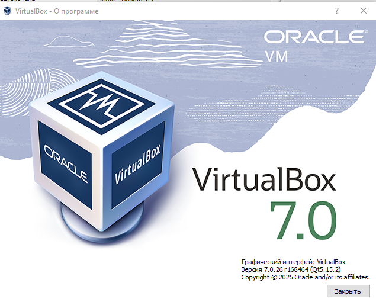
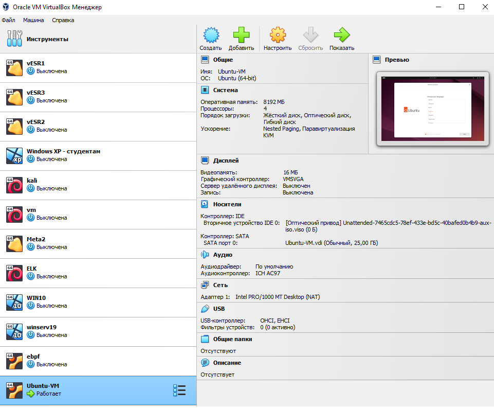
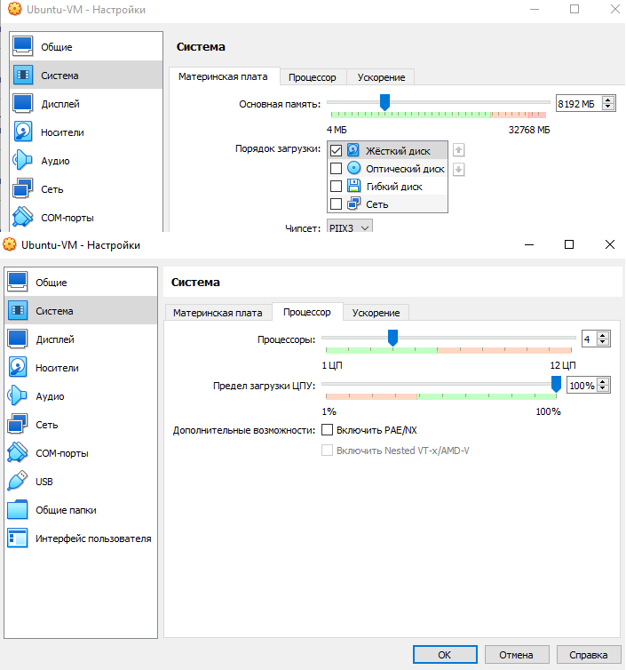
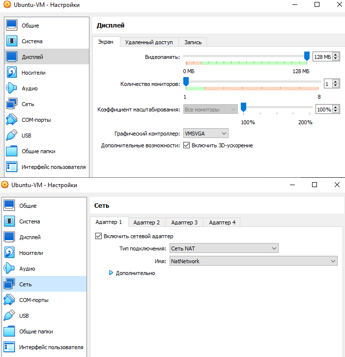
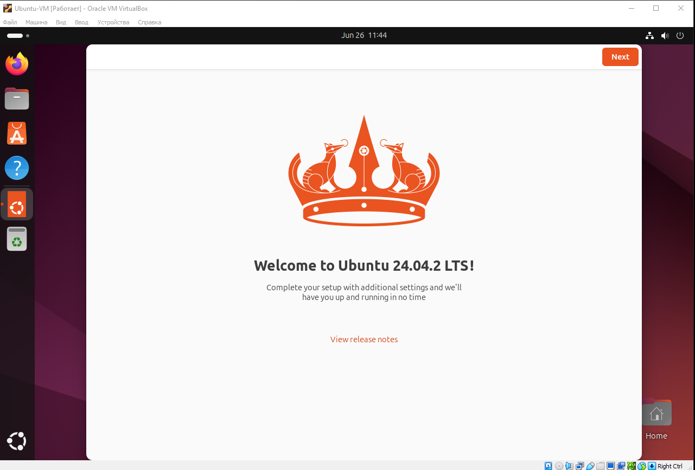
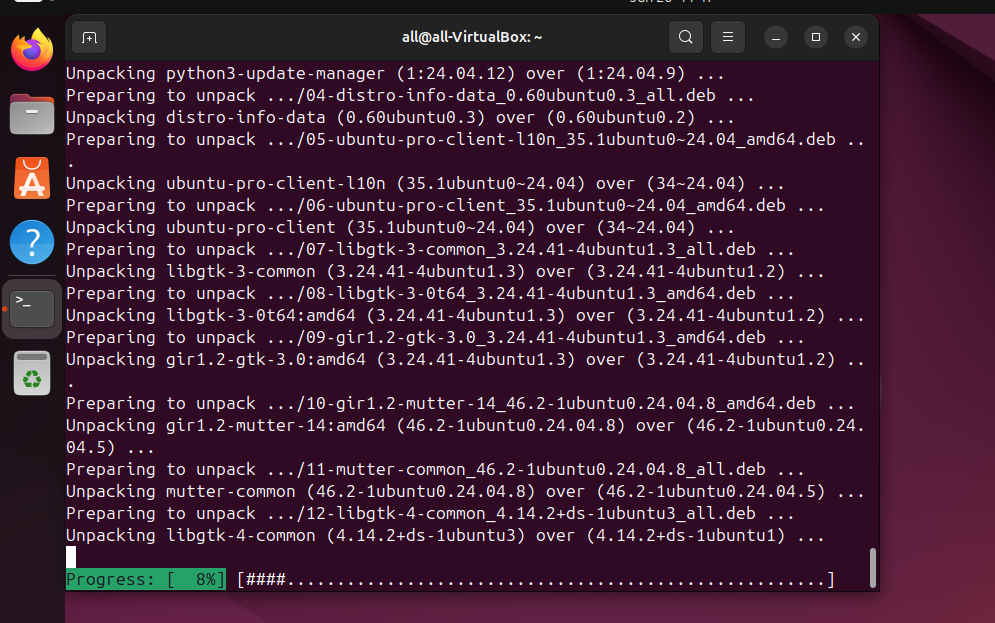
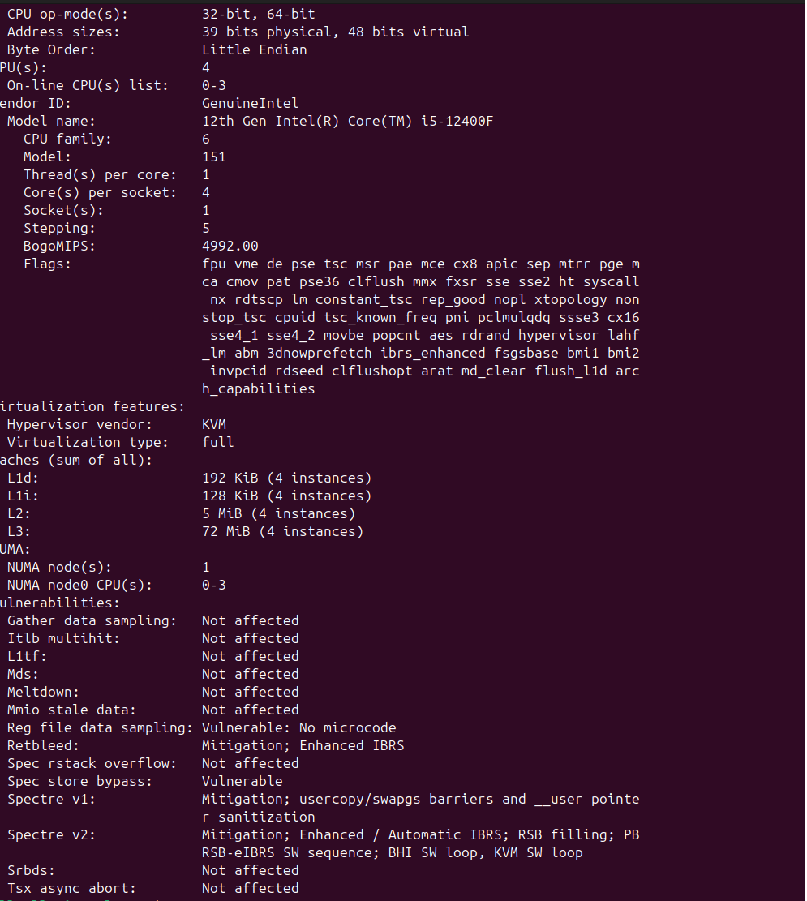
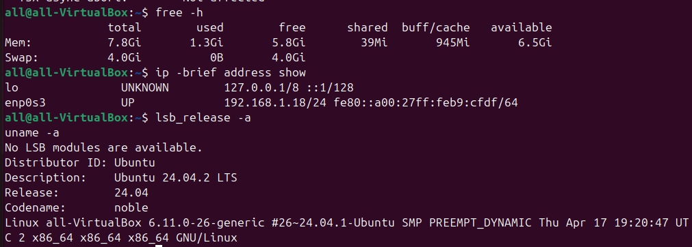

Lab 5: Virtualization
Task 1: Deploying a Virtual Machine

### 1. Installing VirtualBox

version VirtualBox: 7.0.26

### 2. Creating a Virtual Machine

### 3. Hardware Configuration

### 4. OS Installation

Task 2: System Information Tools

