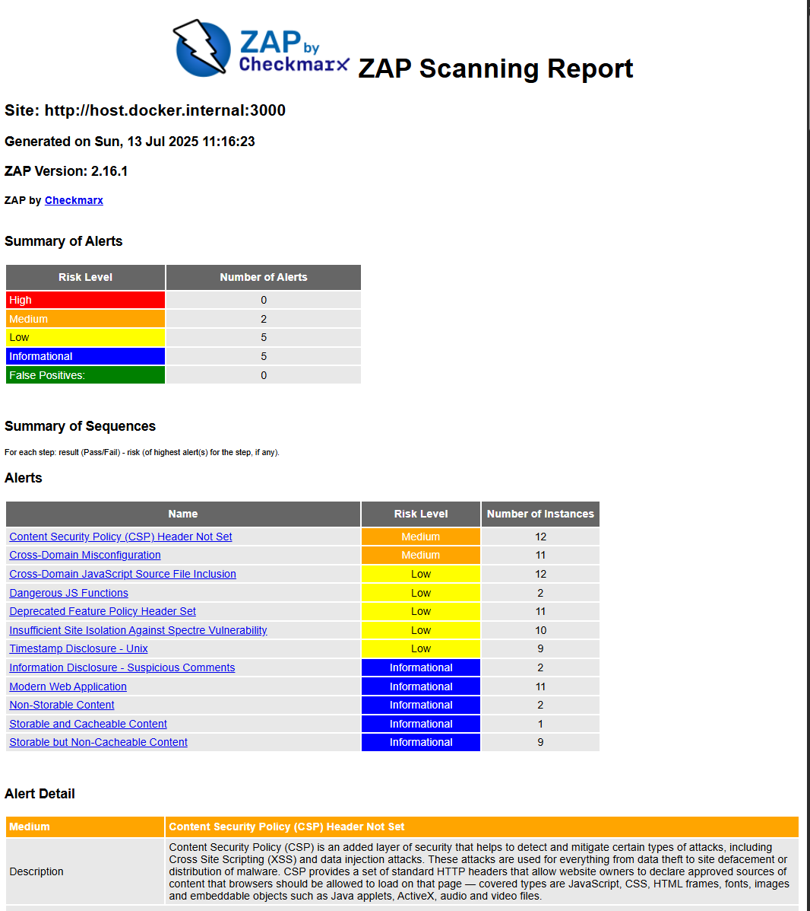
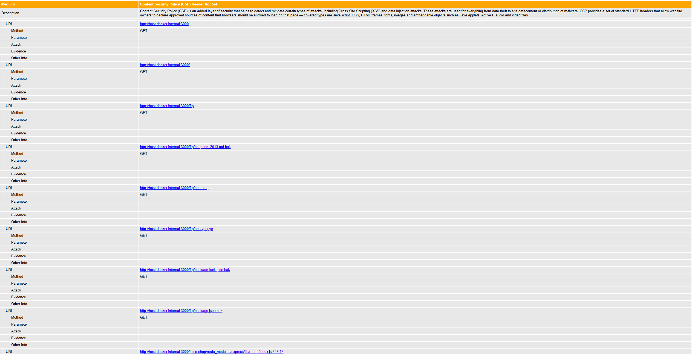
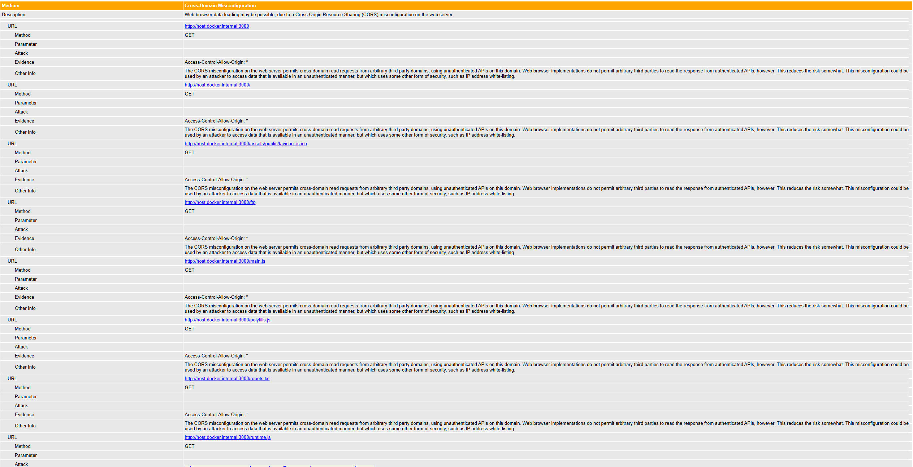
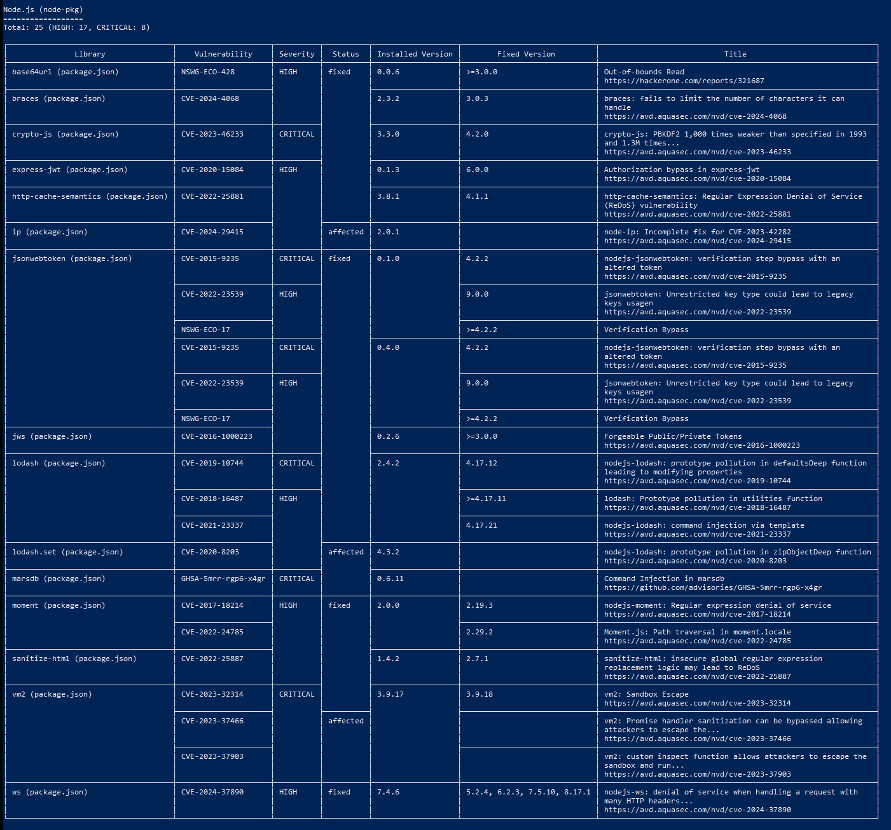
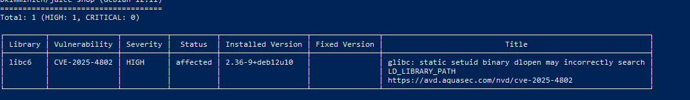

## Task 1 Results
- Juice Shop vulnerabilities found (Medium): 7
- Most interesting vulnerability found: Content Security Policy (CSP) Header Not Set
- Security headers present: Partial (Strict-Transport-Security present, CSP missing)

## Task 2 Results
- Critical vulnerabilities in Juice Shop image: 8
- Vulnerable packages: 
   1. jsonwebtoken
   2. vm2
- Dominant vulnerability type: ReDoS (Regular Expression Denial of Service)

