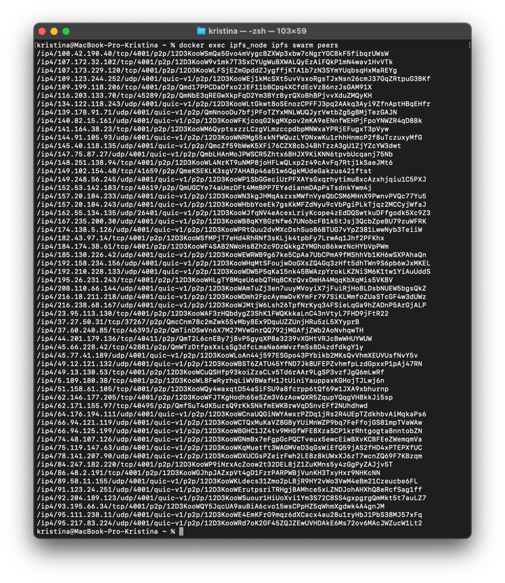
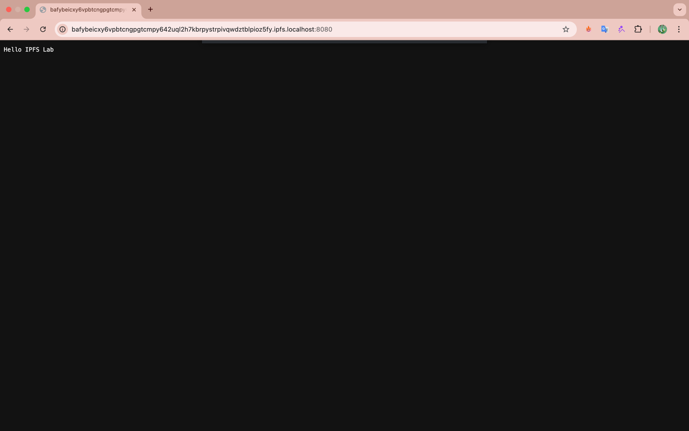
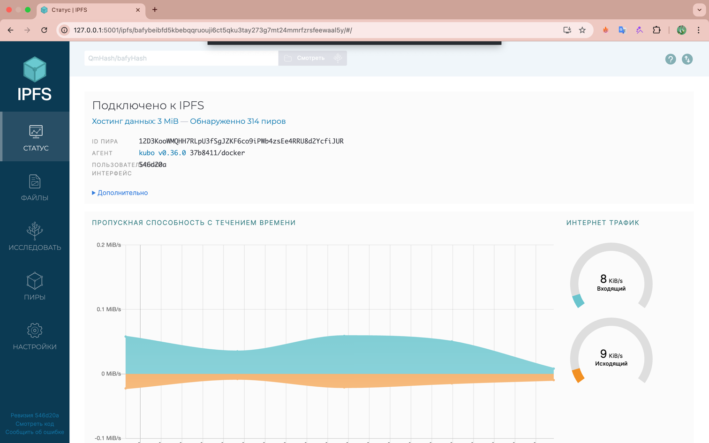
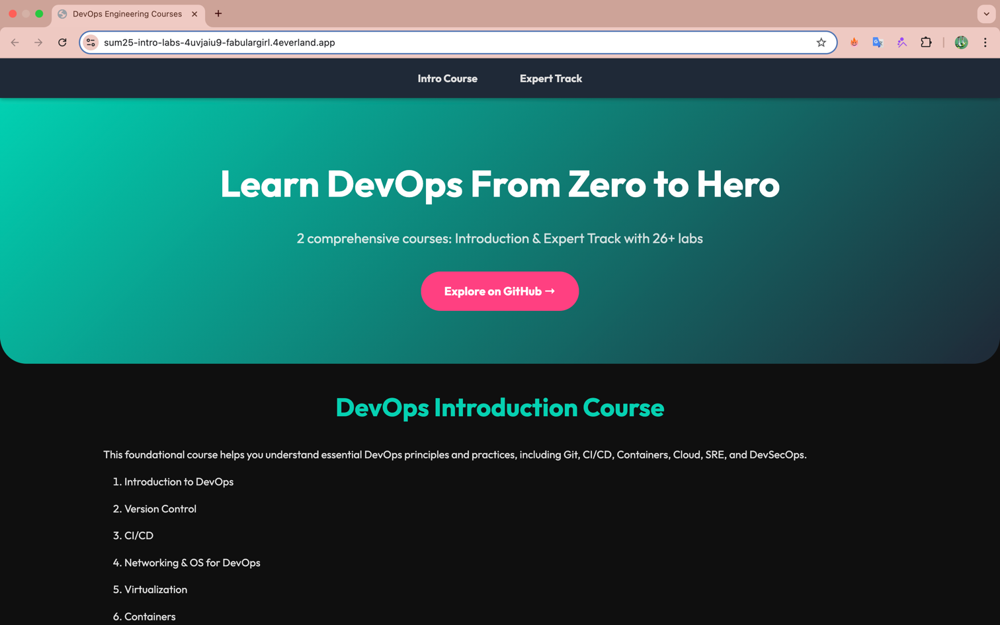

## Task 1 Results

1. Connected peers
    

- IPFS Node Peer Count: 8
- IPFS Node Bandwidth: 9
- Test File CID: QmUFJmQRosK4Amzcjwbip8kV3gkJ8jqCURjCNxuv3bWYS1
- Public Gateway URL: https://ipfs.io/ipfs/QmUFJmQRosK4Amzcjwbip8kV3gkJ8jqCURjCNxuv3bWYS1

Local:

Public:

Peer statictics:

## Task 2 Results
- 4EVERLAND Project URL: https://sum25-intro-labs-4uvjaiu9-fabulargirl.4everland.app/
- GitHub Repository (if you used your own app): [github.com/your/repo]
- IPFS CID from 4EVERLAND: bafybeihzarmfcsys5au2yx3mhemrowy2x4xg4pckz3s7rxbipa3etpsjzm

