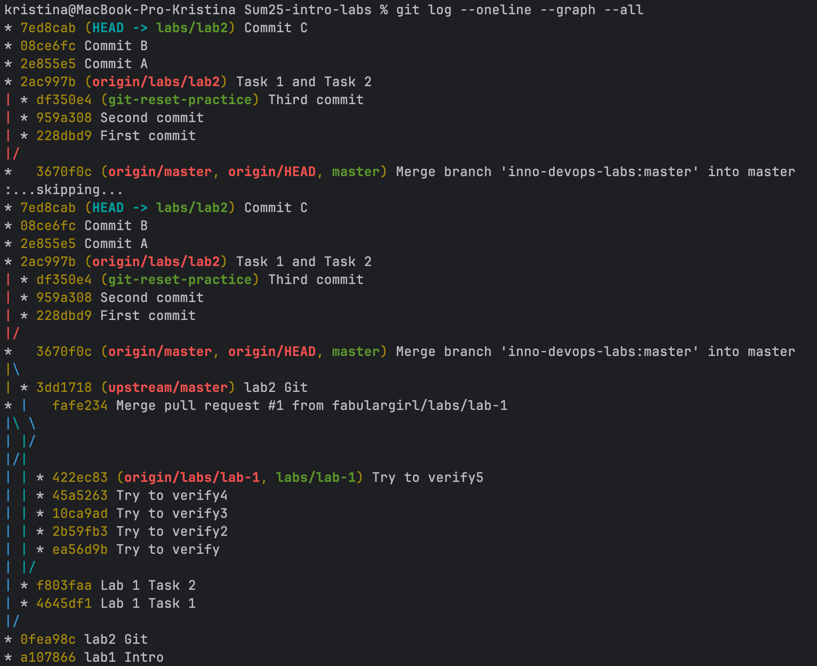
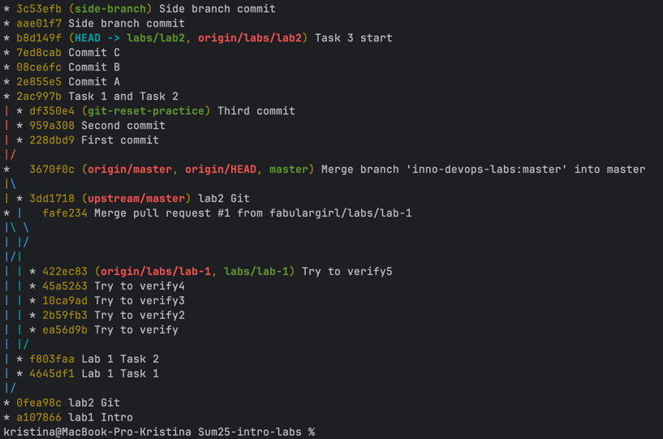

# Task 1

1. `git cat-file -p <blob_hash>`
    
    The command `echo 'test content' | git hash-object -w --stdin` created a blob file. The test information was written to the file.
    
    The command `git cat-file -p d670460b4b4aece5915caf5c68d12f560a9fe3e4` retrieves information from the blob file by hash.

2. `git cat-file -p <tree_hash>`

    The command `git cat-file -p master^{tree}` pulled all the information out of the `master` tree.
    
    output:
    ```commandline
    100644 blob af7fda8ea32b60578a1103ce061a50d7f6f09a35    README.md
    040000 tree 5a4a32162f6fbcbdad74ce3f2f6b37f28dc73568    Submissions
    100644 blob 7a94f7af59b8968be392288ea03179a24ffc9d9e    lab1.md
    100644 blob 77e299c4cdb01bc31607bef4e2036b56c3368515    lab2.md
    ```

3. `git cat-file -p <commit_hash>`

    The command `git log` found out the commit hash.
    
    The command `git cat-file -p a107866e91af12c22ef78d4c7ad53ae39135ef43` got the commit info.
    
    ```commandline
    tree d9f1fa38312ae16ca4276713e2d276a46d6993fd
    author Dmitriy Creed <creed@soramitsu.co.jp> 1748540938 +0300
    committer Dmitriy Creed <creed@soramitsu.co.jp> 1748540938 +0300
    
    lab1 Intro
    
    Signed-off-by: Dmitriy Creed <creed@soramitsu.co.jp>
    ```

# Task 2
1. Creating and switching to a new branch

    ```commandline
    git checkout -b git-reset-practice
    Switched to a new branch 'git-reset-practice'
    ```

2. Creating a new file and writing information to it

    ```commandline
    echo "First commit" > file.txt
    git add file.txt
    git commit -m "First commit"
    
    echo "Second commit" >> file.txt
    git add file.txt
    git commit -m "Second commit"
    
    echo "Third commit" >> file.txt
    git add file.txt
    git commit -m "Third commit"
    [git-reset-practice 228dbd9] First commit
     2 files changed, 1 insertion(+)
     create mode 100644 Submissions/submission2.md
     create mode 100644 file.txt
    [git-reset-practice 959a308] Second commit
     1 file changed, 1 insertion(+)
    [git-reset-practice df350e4] Third commit
     1 file changed, 1 insertion(+)
    ```

3. `git reset --soft HEAD~1`

    The HEAD pointer has moved one commit back (the last commit is now a Second commit).
    
    The changes from the "Third commit" remain in the index (staging area).

4. `git reset --hard HEAD~1`

    The HEAD pointer has moved back one commit (now only First commit remains).
    
    All changes from Second commit and Third commit are removed from the index and working directory.

5. `git reflog`

    The command  `git reflog` determines the hash of the desired commit.
    
    The command `git reset --hard df350e4` returns to the desired commit.

## Task 3

1. Creating commits

    ```commandline
    echo "Commit A" > history.txt
     git add history.txt
     git commit -m "Commit A"
    
     echo "Commit B" >> history.txt
     git add history.txt
     git commit -m "Commit B"
    
     echo "Commit C" >> history.txt
     git add history.txt
     git commit -m "Commit C"
    ```

    Three commits were created and the history was written to a file `history.txt`

2. Simple commit graph

    The command `git log --oneline --graph --all` был создан граф 
    
    

3. Optional Branching

    ```commandline
    git checkout -b side-branch
    echo "Branch commit" >> history.txt
    git add history.txt
    git commit -m "Side branch commit"
    git checkout main
    git log --oneline --graph --all
    ```

    The following graph was obtained:
    
    

This visualization clearly illustrates how multiple contributors can work on separate branches simultaneously, making independent changes without interfering with each other. It also highlights how branches eventually merge, demonstrating the flow of collaborative development and integration.

## Task 4

The commands:

```commandline
git tag v1.0.0
git push origin v1.0.0
```

The **v1.0.0.0** tag was created for the commit and sent to the remote repository.

Commit hash: ` 9c73b74 (HEAD -> labs/lab2, tag: v1.0.0, origin/labs/lab2) Task 3 finish`

Tagging in software development provides clear versioning, enabling reliable releases, automated CI/CD workflows, and easy reference for release notes and debugging.

## Task 5: GitHub Social Interactions

Social features on GitHub—like issues, pull requests, comments, and mentions—enable clear communication, collaboration, and feedback among team members or contributors. They help coordinate work, track progress, and build community around open source projects.