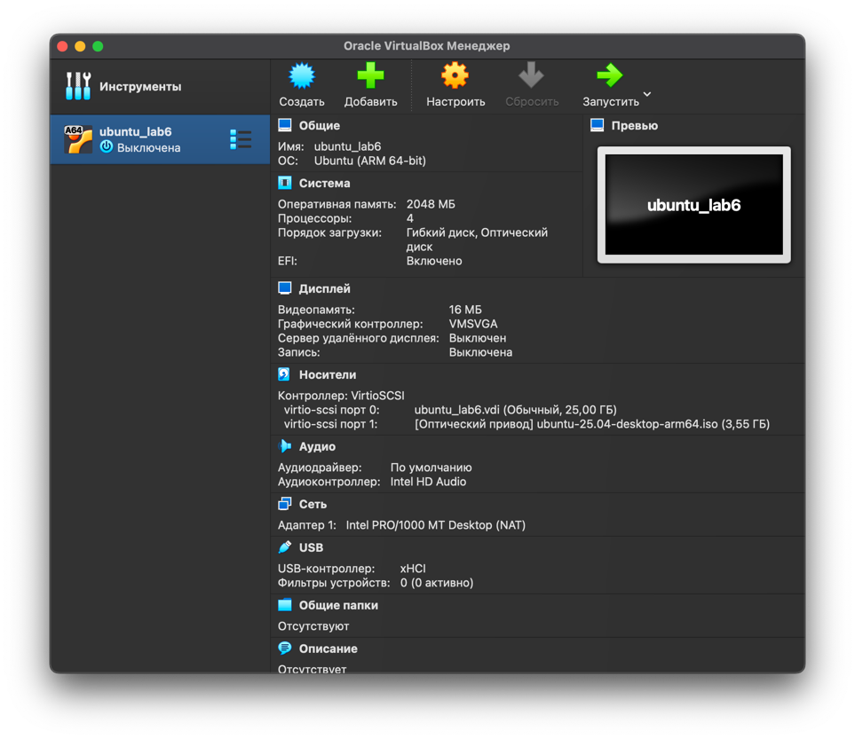
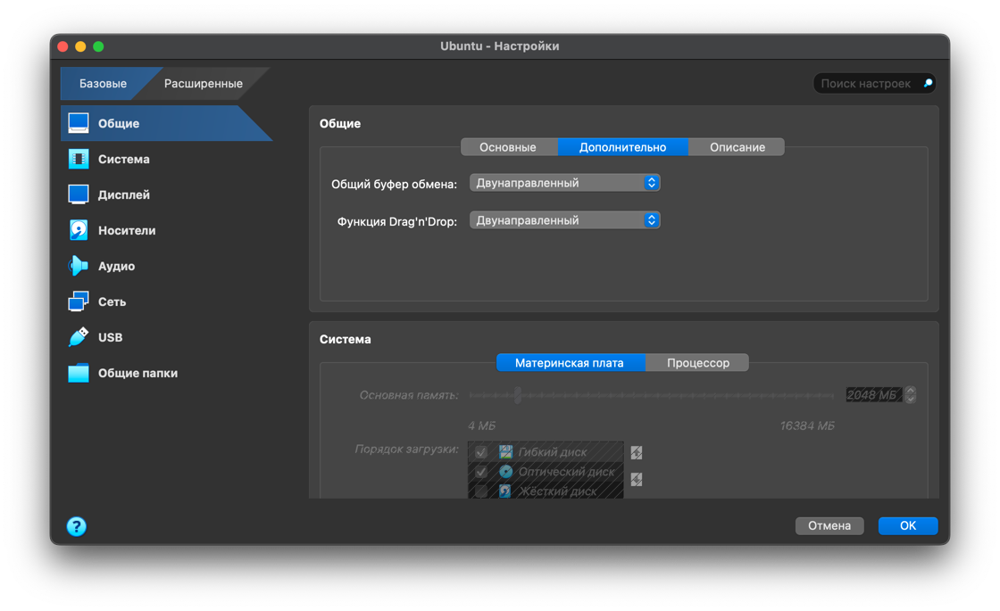
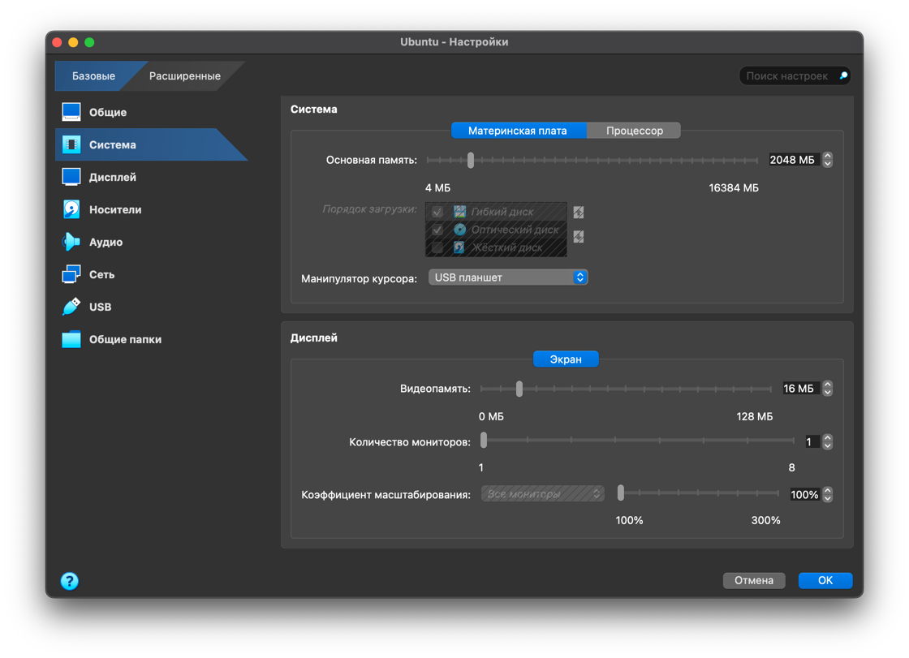
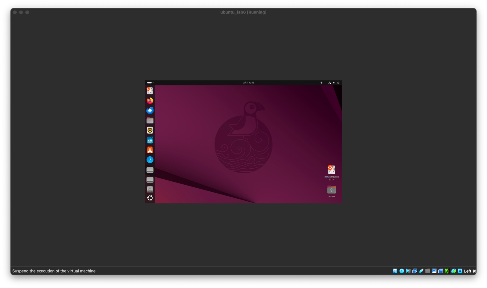
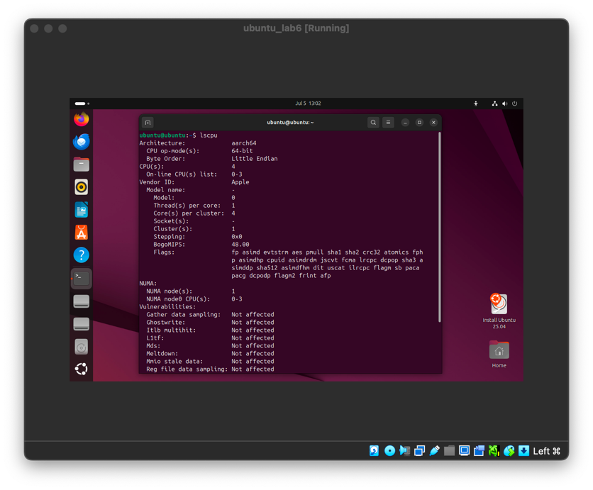
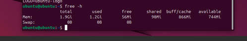
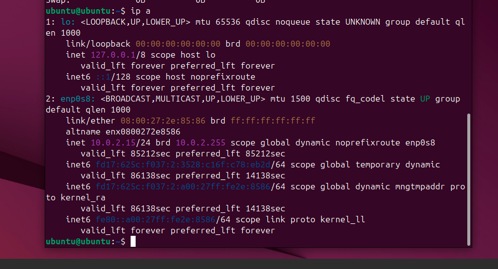
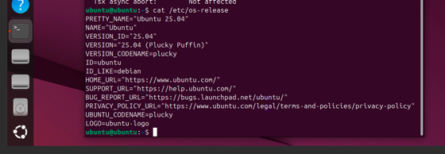

# Task 1: VM Deployment

1. **Install VirtualBox:**

    Version: VirtualBox 7.1.10 for macOS / Apple Silicon hosts

2. **Deploy a Virtual Machine:**

   - Downloaded [Ubuntu](https://ubuntu.com/download/desktop/thank-you?version=24.04.2&architecture=amd64&lts=true)
   - Create a new Virtual Machine (VM) using VirtualBox and choose the Ubuntu operating system.

   

   - Setting up clipboard and drag'n'drop

      

   - Customize the VM settings, such as the allocated memory, number of CPU cores, and network configuration.
   
     
   
   - Running VM
   
      

# Task 2: System Information Tools

1. **Processor, RAM, and Network Information:**

I used Ubuntu terminal.
- CPU information: 

   Command: `lscpu`

   Output: 

   

- RAM information:

   Command: `free -h`

   Output:

   

- Network information:

   Command: `ip a`

   Output: 

   

2. **Operating System Specifications:**

I used Ubuntu terminal.

Command: `cat /etc/os-release`

Output: 

