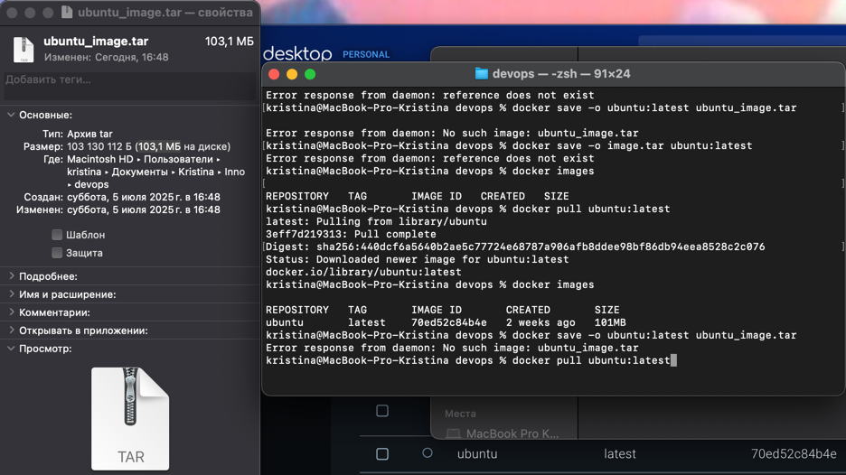

# Task 0: Image Exporting

1. Export Image
   - Install image.

    Command: `docker pull ubuntu:latest `

    - Image information: 

    Command: `docker images`

    Output: 
    ```commandline
    REPOSITORY   TAG       IMAGE ID       CREATED       SIZE
    ubuntu       latest    70ed52c84b4e   2 weeks ago   101MB
   ```
   
tar size = 103,1 МБ

Original size = 101MB



The original image is the size of the image in Docker storage.
The size in docker image ls shows the total amount of unique data in the image excluding common layers.

tar size is the size of the image packed in a .tar archive.
Includes all layers + metadata even if the layers are compressed, they may take up more space due to the archive structure.

# Task 1: Core Container Operations

1. **List Containers**

    Command: `docker ps -a`
    
    Output: 
    
    `CONTAINER ID   IMAGE     COMMAND   CREATED   STATUS    PORTS     NAMES`

2. **Pull Ubuntu Image**

    Command: `docker pull ubuntu:latest`
    
    Original size = 101MB

3. **Run Interactive Container**

Command: `docker run -it --name ubuntu_container ubuntu:latest`

Output:
```commandline
root@a847291fdb82:/# exit
exit
```

4. **Remove Image**

Command: `docker rmi ubuntu:latest`

Output:
```commandline
Error response from daemon: conflict: unable to remove repository reference "ubuntu:latest" (must force) - container a847291fdb82 is using its referenced image 70ed52c84b4e
```

The command is fails because ubuntu:latest image is used by the container. Docker does not allow you to delete an image if containers depend on it.

# Task 2: Image Customization

1. **Deploy Nginx**

    Command: `docker run -d -p 80:80 --name nginx_container nginx`
    
    Verification with `curl localhost`:
    
    ```html
    <!DOCTYPE html>
    <html>
    <head>
    <title>Welcome to nginx!</title>
    <style>
    html { color-scheme: light dark; }
    body { width: 35em; margin: 0 auto;
    font-family: Tahoma, Verdana, Arial, sans-serif; }
    </style>
    </head>
    <body>
    <h1>Welcome to nginx!</h1>
    <p>If you see this page, the nginx web server is successfully installed and
    working. Further configuration is required.</p>
    
    <p>For online documentation and support please refer to
    <a href="http://nginx.org/">nginx.org</a>.<br/>
    Commercial support is available at
    <a href="http://nginx.com/">nginx.com</a>.</p>
    
    <p><em>Thank you for using nginx.</em></p>
    </body>
    </html>
    ```

2. **Customize Website**

   - Create an HTML file with the specified content:

    .png)

   - Copy the HTML file to the container:

    Command: `docker cp index.html nginx_container:/usr/share/nginx/html/`
    
    Output: `Successfully copied 2.05kB to nginx_container:/usr/share/nginx/html/`


3. **Create Custom Image**

    Command: `docker commit nginx_container my_website:latest`
    
    Result: 
    
    .png)

4. **Remove Original Container**

    Command: `docker rm -f nginx_container`
    
    Result:
    
    .png)

5. **Create New Container**

    Command: `docker run -d -p 80:80 --name my_website_container my_website:latest`
    
    Result:
    
    .png)

6. **Test Web Server:**

    Command: `curl http://127.0.0.1:80`
    
    Result:
    
    .png)

7. **Analyze Image Changes:**

    Command: `docker diff my_website_container`
    
    Rsult: 
    ```commandline
    C /etc
    C /etc/nginx
    C /etc/nginx/conf.d
    C /etc/nginx/conf.d/default.conf
    C /run
    C /run/nginx.pid
    ```
    
    This means that the following files and directories have changed in the container:
    
    If the container runs Nginx, when it starts:
    
    1. Generates settings in /etc/nginx/conf.d/default.conf.
    
    2. Creates a PID file (/run/nginx.pid) to control the process.
    
    3. These changes are normal for a running container with a web server./nginx.pid - Nginx Process ID (PID) file changed when the web server was restarted.

# Task 3: Container Networking

1. **Create Network:**

    Create a bridge network named `lab_network`
    
    Command: `docker network create lab_network`
    
    Result:
    
    .png)

2. **Run Connected Containers:**

    Start two Alpine containers attached to the network:
    
    Commands:
    
    ```commandline
    docker run -dit --network lab_network --name container1 alpine ash
    docker run -dit --network lab_network --name container2 alpine ash
    ```
    Result: 
    
    .png)

3. **Test Connectivity:**

    From container1, ping container2 by name
    
    Command: `docker exec container1 ping -c 3 container2`
    
    Result: 
    
    .png)

4. **Explain how Docker's internal DNS resolution works**

    Docker's built-in DNS allows containers to communicate with each other by name while on the same network. But DNS only works within the user's network.

# Task 4: Volume Persistence

1. **Create Volume:**

    Command: `docker volume create app_data`

2. **Run Container with Volume:**

    Command: `docker run -d -v app_data:/usr/share/nginx/html --name web nginx`
    
    Result: 
    
    .png)

3. **Modify Content:**

    Command: `docker cp index.html web:/usr/share/nginx/html/`
    
    Result:
    
    .png)

4. **Verify Persistence:**

   - Stop and remove container:

       Command: `docker stop web && docker rm web`
   - Create new container with same volume:

       Command: `docker run -d -v app_data:/usr/share/nginx/html --name web_new nginx`

    Result: 
    
    .png)

# Task 5: Container Inspection

1. **Run Redis Container:**

    Command: `docker run -d --name redis_container redis`
    
    Result: 
    
    .png)

2. **Inspect Processes:**

    Find Redis server process:
    
    Command: `docker exec redis_container ps aux`

3. **Network Inspection:**

    Get container IP address:
    
    Command: `docker inspect -f '{{range.NetworkSettings.Networks}}{{.IPAddress}}{{end}}' redis_container`
    
    Result:
    
    .png)

4. **Compare `docker exec` vs `docker attach`**

    `docker exec`:
    
    1. Runs a new command inside an already-running container.
    2. Creates a new process alongside the container’s main process.
    
    Key Use Cases:
    1. Run one-off commands 
    2. Debugging
    3. Modify files or install tools without interrupting the main process
    
    `docker attach`:
    
    1. Attaches your terminal to the container’s primary process.
    2. Connects to the exact same input/output streams as the original process.
    
    Key Use Cases:
    
    1. Interact with foreground processes
    2. View real-time output of the main process

# Task 6: Cleanup Operations

1. **Verify Cleanup:**

    Check disk usage:
    
    Command: `docker system df`
    
    Output: 
    .png)

2. **Create Test Objects:**

   - Create 3 stopped containers:
    
       Command: `for i in {1..3}; do docker run --name temp$i alpine echo "hello"; done`

       Result:

       .png)

   - Create 2 dangling images:

       Command: `docker build -t temp-Images . && docker rmi temp-images`
    
       Result:
    
       .png)

3. **Remove Stopped Containers:**
    
    Command: `docker container prune -f`
    
    Result: 
    
    .png)

4. **Remove Unused Images:**

    Command: `docker Images prune -a -f`

5. **Verify Cleanup:**
    
    Command: `docker system df`
    
    Result: 
    
    .png)