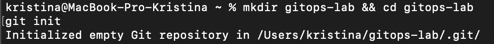
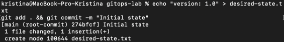
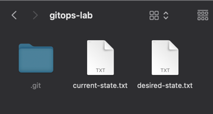
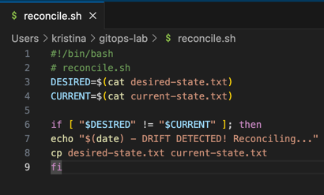
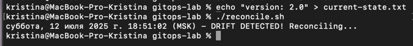
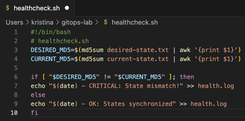
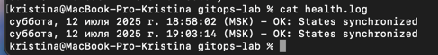
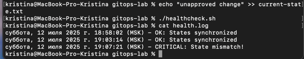

# Task 1: Git State Reconciliation

1. **Initialize repository:**
    
    Command:
    ```commandline
    mkdir gitops-lab && cd gitops-lab
    git init
    ```
   
    Output:
    

2. **Create desired state:**

    Command:
    ```commandline
    echo "version: 1.0" > desired-state.txt
    git add . && git commit -m "Initial state"
    ```
   
    Output:
        

3. **Simulate live cluster:**

    Command:
    ```commandline
    cp desired-state.txt current-state.txt
    ```
    
    Output:
    
    

4. **Create reconciliation script:**
    
    Result: 
    

5. **Trigger manual drift and** 6. **Run reconciliation:**

    

7. **Automate reconciliation:**

    Command: `watch -n 5 ./reconcile.sh # Runs every 5 seconds`

# Task 2: GitOps Health Monitoring

1. Create health check script:

    Result: 
    
2. **Make executable and Simulate healthy state:**

    Command:
    ```commandline
    chmod +x healthcheck.sh
    ./healthcheck.sh
    cat health.log# Should show "OK"
    ```

    Result: 
    
3. **Create drift and Run health check:**

    Command: 
    ```commandline
    echo "unapproved change" >> current-state.
    ./healthcheck.sh
    cat health.log# Now shows "CRITICAL"
    ```
    
    Result:
    
