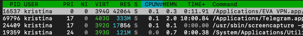
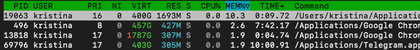
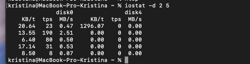
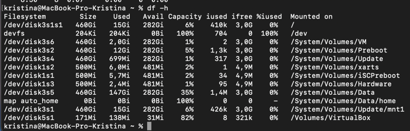
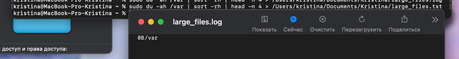
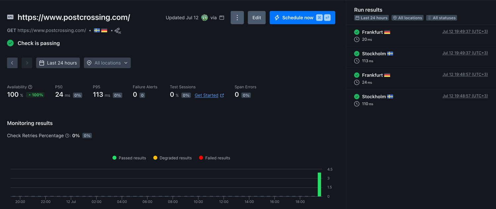
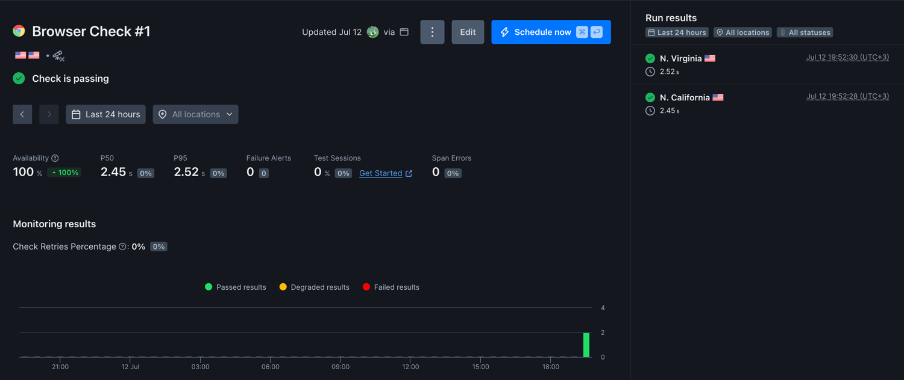
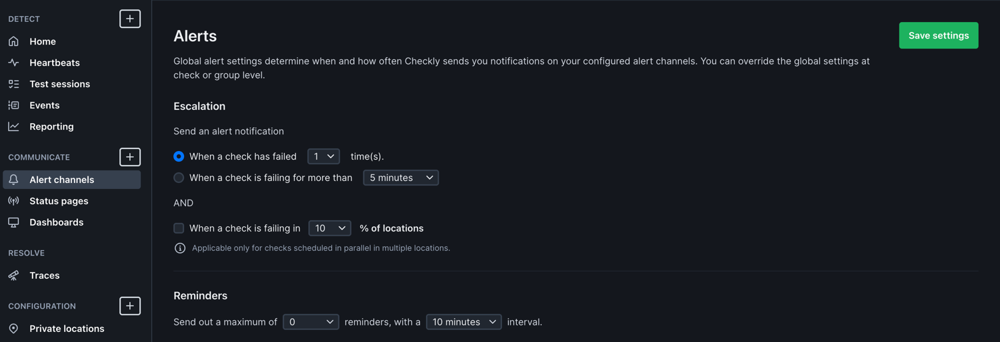

# Task 1: Key Metrics for SRE and SLAs

1. **Monitor System Resources:**

    Top-3 CPU:
    
    
    Top-3 memory:
    
    
    I/O usage:
    

2. **Disk Space Management:**

    Checking the available space: 
    

    Files in the `/var` directory 

    Command: 
    ```commandline
    sudo du -ah /var | sort -rh | head -n 4 > /Users/kristina/Documents/Kristina/large_files.txt
    ```
   
    Result:
    

# Task 2: Practical Website Monitoring Setup

1. Choose Your Website

    https://www.postcrossing.com/

2. Create Checks in Checkly

    Create API Check for basic availability

    

    Create Browser Check for content & interactions

    


3. Set Up Alerts

    