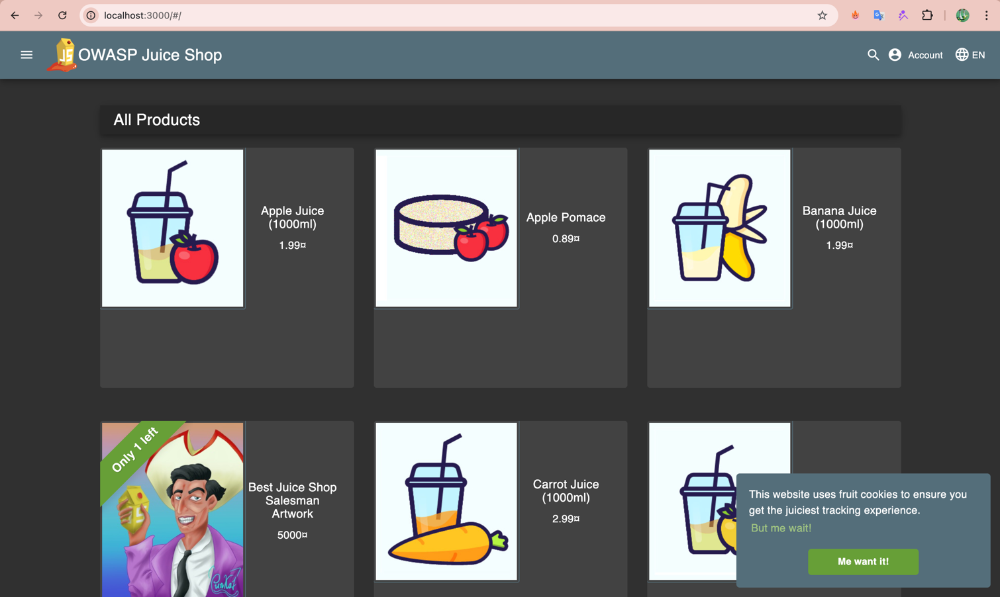
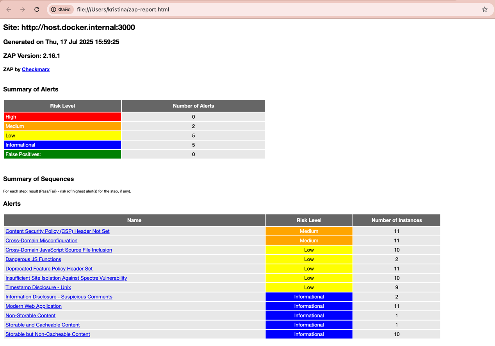
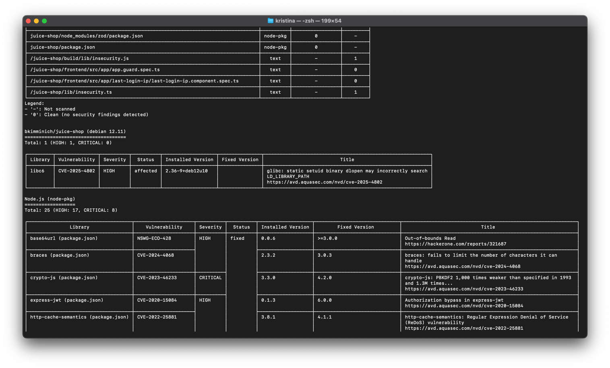

## Task 1: Web Application Scanning with OWASP ZAP

1. Start the vulnerable target application (Juice Shop):

  

2. Scan with OWASP ZAP:

  

- Juice Shop vulnerabilities found (Medium): 2
  - Content Security Policy (CSP) Header Not Set: 11 Instances
  - Cross-Domain Misconfiguration: 11 Instances

- Most interesting vulnerability found: Content Security Policy (CSP) Header Not Set
  This omission makes the site vulnerable to a number of sophisticated attacks, despite the seemingly low level of risk.

- Security headers present: No
    - Content-Security-Policy: missing 
    - Feature-Policy: is outdated 
    - Access-Control-Allow-Origin: insecurely configured

## Task 2: Container Vulnerability Scanning with Trivy

1. Scan using Trivy in Docker:

  

- Critical vulnerabilities in Juice Shop image: 8
- Vulnerable packages: 
   1. CVE-2023-46233 
   2. CVE-2015-9235
   3. CVE-2015-9235
   4. CVE-2019-10744
   5. GHSA-5mrr-rgp6-x4gr
   6. CVE-2023-32314
   7. CVE-2023-37466
   8. CVE-2023-37903
- Dominant vulnerability type: Sandbox Escape / Remote Code Execution (RCE)
  Of the 8 points, 3 vulnerabilities (CVE‑2023‑32314, CVE‑2023‑37466, CVE‑2023‑37903) are related to sandbox and RCE release.
