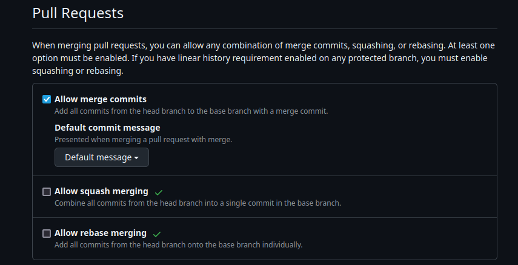

# Lab 1

## Benefits of Signing Commits

Signing commits is an important security practice that helps ensure the integrity and authenticity of source code contributions. When a commit is signed using a cryptographic key, it proves that the commit was made by the author and has not been made by an outsider.

[What are the advantages and disadvantages of cryptographically signing commits and tags in Git?](https://softwareengineering.stackexchange.com/questions/212192/what-are-the-advantages-and-disadvantages-of-cryptographically-signing-commits-a)

## Comparing Git Merge Strategies

### 1. Standard Merge

- **What it does**: Creates a merge commit combining branch histories.
- **Pros**:
  - Preserves full commit details and branch context.
  - Simplifies debugging and reverting.
- **Cons**:
  - Can add extra merge commits in active repos, making it hard to navigate the commit history in big projects with multiple branches.

### 2. Squash and Merge

- **What it does**: Combines feature branch commits into one before merging.
- **Pros**:
  - Gives a cleaner main-branch history.
  - Great for branches made for small features/adjustments.
- **Cons**:
  - Loses individual commit records.
  - Can complicate merge histories in long-lived branches.

### 3. Rebase and Merge

- **What it does**: Reapplies commits onto the main branch for a linear history.
- **Pros**:
  - Clean, linear history without merge commits.
- **Cons**:
  - Risky for shared branches since it rewrites history.
  - Loses information about the merge request.

---

### Why Standard Merge is Often Preferred

Standard merges preserve complete history and context, avoid risky rewriting, and support traceability, debugging, and clean reversions making them well-suited for collaborative environments.

---

### Disabling Squash and Rebase Merge

In the repo **Settings** in **General** under **Pull Requests**:

