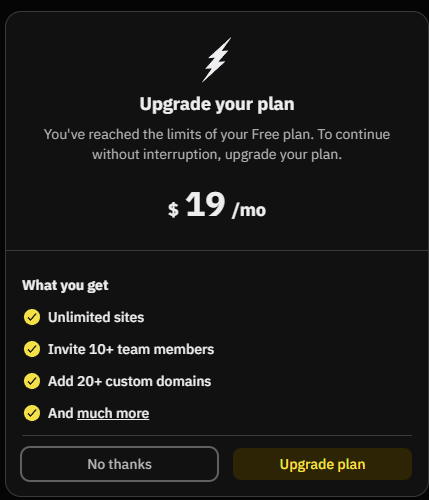

# Task 1

Uploaded using Fleek, because ipfs.io took too long for me to bother

## Task 1 Results
- IPFS Node Peer Count: `476`
- IPFS Node Bandwidth: `98MB` in, `21MB` out
- Test File CID: `QmUFJmQRosK4Amzcjwbip8kV3gkJ8jqCURjCNxuv3bWYS1`
- Public Gateway URL: https://bafkreihx4h33qjbjlhelnnnfklaaqnfvkpw2j6txwt774lx3qv22lrpeim.ipfs.w3s.link
- Public Gateway URL (ipfs.io, if it bothers to do its job): https://ipfs.io/ipfs/QmUFJmQRosK4Amzcjwbip8kV3gkJ8jqCURjCNxuv3bWYS1

# Task 2

I am not spending money to do this task :>

## Task 2 Results

  I do not understand how I am supposed to do this task

- Fleek Project URL: [your-site.on.fleek.co]
- GitHub Repository: [github.com/your/repo]
- IPFS CID from Fleek: [CID shown in dashboard]