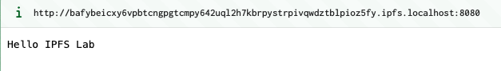
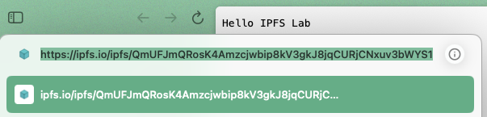
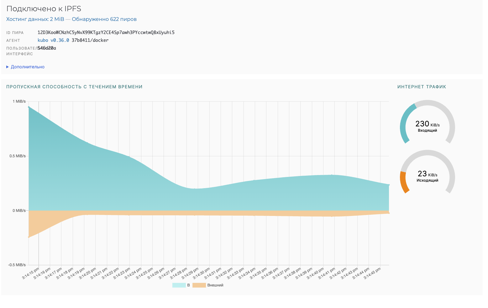
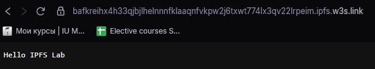
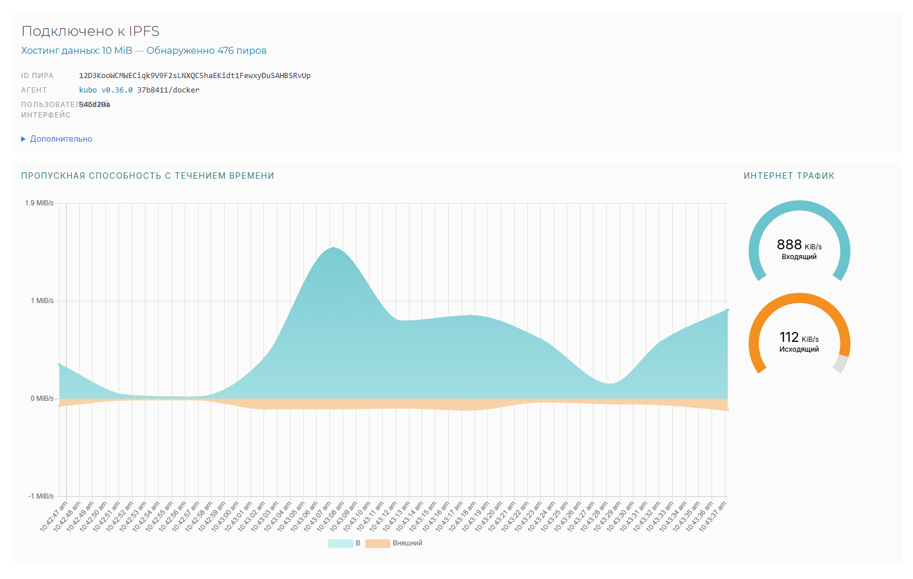
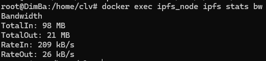
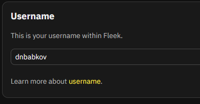
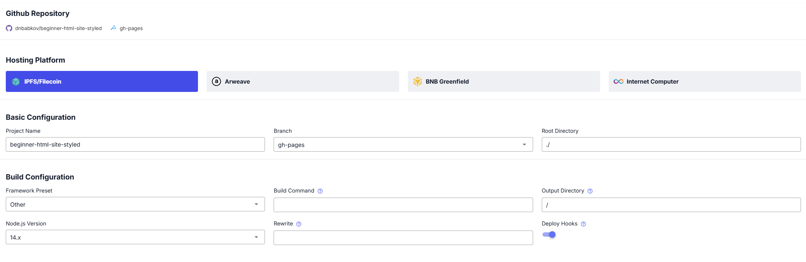
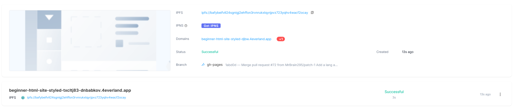

# Task 1

Uploaded using Fleek, because ipfs.io took too long for me to bother

## Task 1 Results
- IPFS Node Peer Count: `476`
- IPFS Node Bandwidth: `98MB` in, `21MB` out
- Test File CID: `QmUFJmQRosK4Amzcjwbip8kV3gkJ8jqCURjCNxuv3bWYS1`
- Public Gateway URL: https://ipfs.io/ipfs/QmUFJmQRosK4Amzcjwbip8kV3gkJ8jqCURjCNxuv3bWYS1

# Task 2

## Task 2 Results

- 4EVERLAND Project URL: https://beginner-html-site-styled-djbw.4everland.app
- GitHub Repository: https://github.com/dnbabkov/beginner-html-site-styled (Someone else's forked repo)
- IPFS CID from 4EVERLAND: bafybeifvll24sgnigj2ehffon3rvnrukxlqyrjpvz723yqhv4wacf2ocay