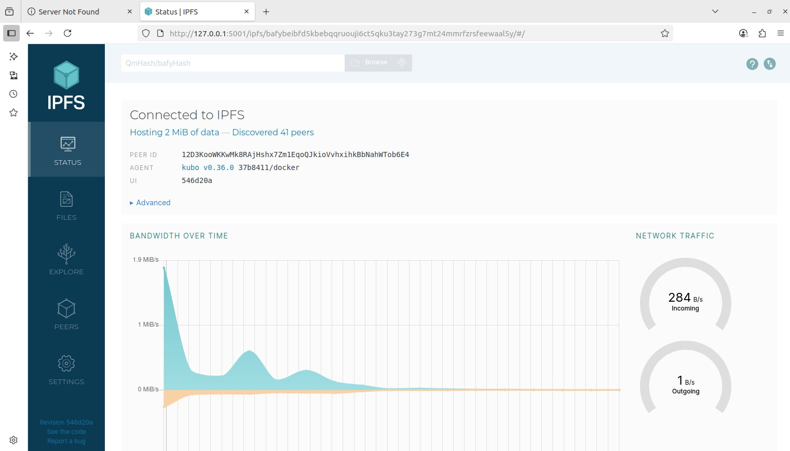
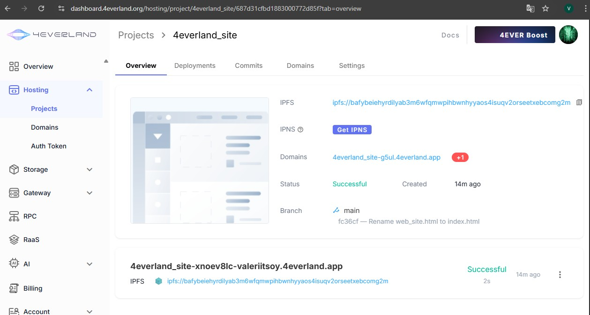
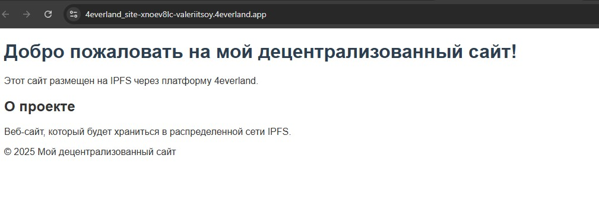


# Decentralized Web Hosting with IPFS & Fleek

## Task 1: Local IPFS Node Setup and File Publishing

### Results

- IPFS Node Peer Count: 677
- IPFS Node Bandwidth: 
	- 580KiB/s Incoming
	- 53KiB/s Outgoing
- Test File CID: QmUFJmQRosK4Amzcjwbip8kV3gkJ8jqCURjCNxuv3bWYS1
- Public Gateway URL: 
	- https://ipfs.io/ipfs/QmUFJmQRosK4Amzcjwbip8kV3gkJ8jqCURjCNxuv3bWYS1
	- https://cloudflare-ipfs.com/ipfs/QmUFJmQRosK4Amzcjwbip8kV3gkJ8jqCURjCNxuv3bWYS1

---

---

## Task 2: Static Site Deployment with 4EVERLAND

### Results
- 4EVERLAND Project URL: https://4everland_site-xnoev8lc-valeriitsoy.4everland.app/
- GitHub Repository: https://github.com/Valeriitsoy/4everland_site
- IPFS CID from 4EVERLAND: bafybeiehyrdilyab3m6wfqmwpihbwnhyyaos4isuqv2orseetxebcomg2m

---

---