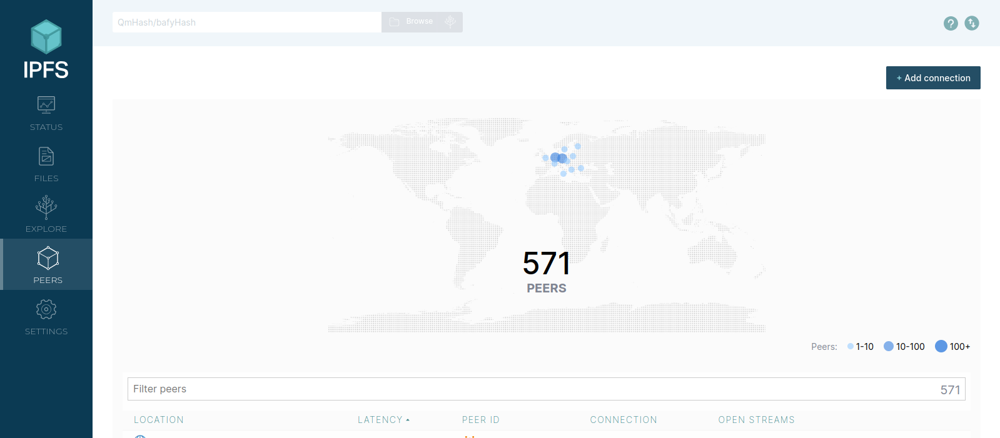
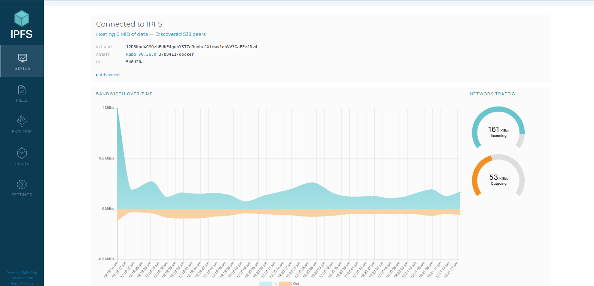
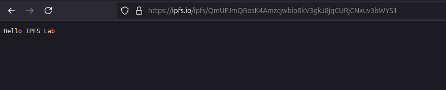
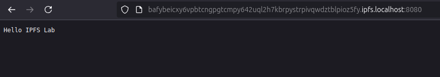
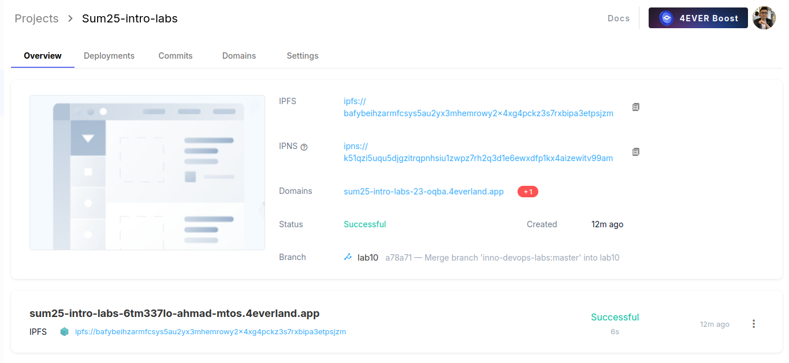
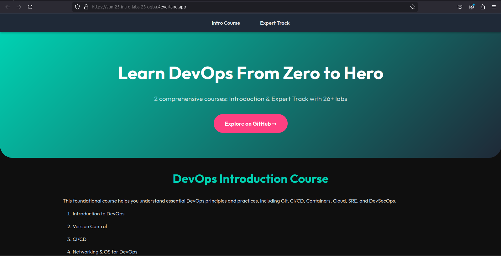

# Decentralized Web Hosting with IPFS & 4EVERLAND

## Task 1 Results

- IPFS Node Peer Count:

    

- IPFS Node Bandwidth:

    

- Test File CID: `QmUFJmQRosK4Amzcjwbip8kV3gkJ8jqCURjCNxuv3bWYS1`
- Public Gateway URL: [Public Gateway](https://ipfs.io/ipfs/QmUFJmQRosK4Amzcjwbip8kV3gkJ8jqCURjCNxuv3bWYS1)

    

    

## Task 2 Results

- 4EVERLAND Project URL: [4EVERLAND Project](https://sum25-intro-labs-6tm337lo-ahmad-mtos.4everland.app/)

    

- IPFS CID from 4EVERLAND: `bafybeihzarmfcsys5au2yx3mhemrowy2x4xg4pckz3s7rxbipa3etpsjzm`
