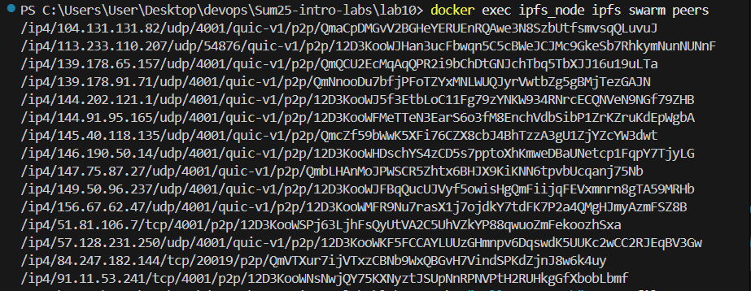
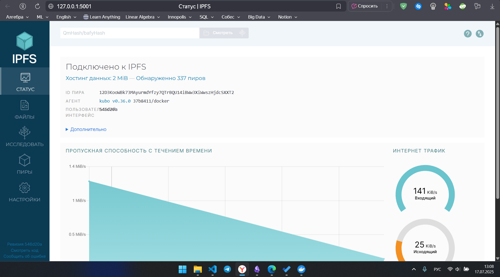
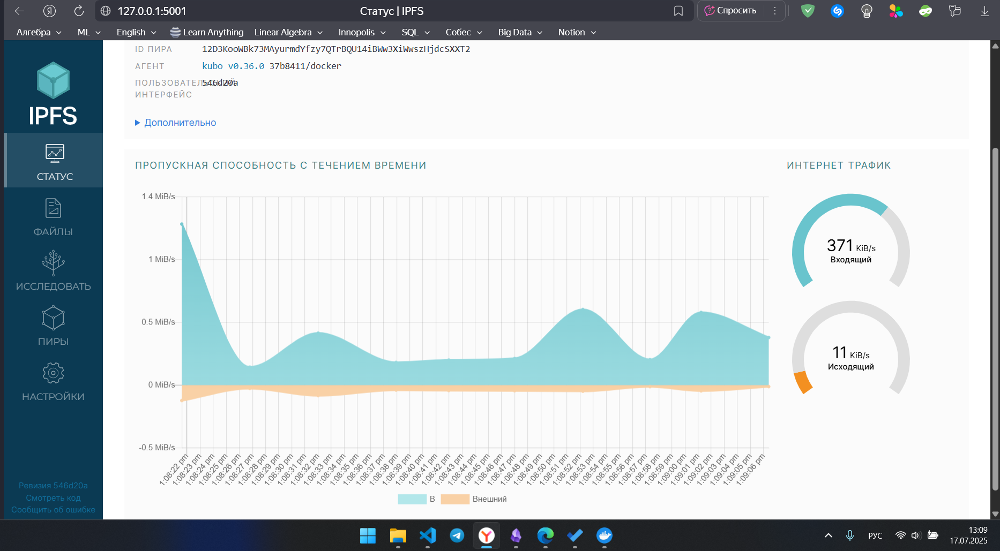
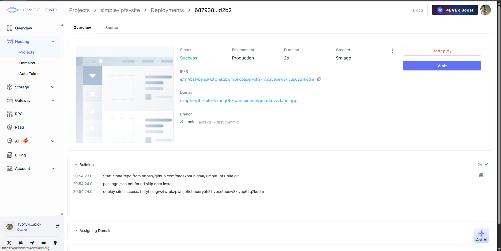
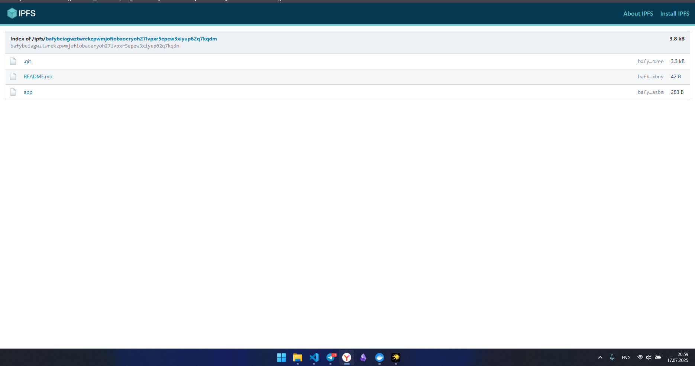
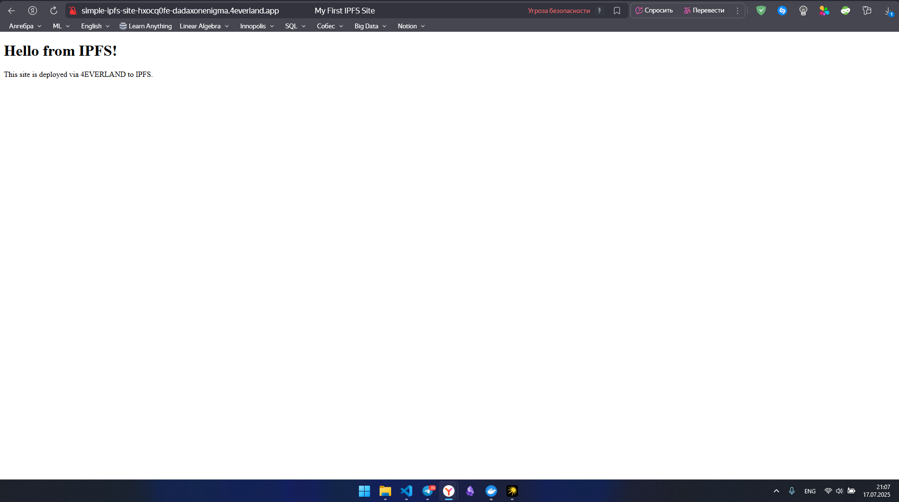

# Solution to Lab 10

by Dadakhon Turgunboev <d.turgunboev@innopolis.university>

## Task 1 Results
- IPFS Node Peer Count: 15 (confirmed by peer list output)
- IPFS Node Bandwidth: Data unavailable (not displayed in web UI)
- Test File CID: QmNyiQsY3bKDLinnBWghYS6xz1gTV3W1hYiJ5j4CDfkBSw
- Public Gateway URL: https://ipfs.io/ipfs/QmNyiQsY3bKDLinnBWghYS6xz1gTV3W1hYiJ5j4CDfkBSw

  
*Screenshot 1: Output of IPFS node peer list*

  
*Screenshot 2: Overview of IPFS Web UI (local gateway)*

  
*Screenshot 3: Overview of IPFS Web UI (local gateway)*

---

## Task 2 Results
- 4EVERLAND Project URL: https://simple-ipfs-site-hxocq0fe-dadaxonenigma.4everland.app
- GitHub Repository: https://github.com/dadaxonEnigma/simple-ipfs-site
- IPFS CID from 4EVERLAND: bafybeiagwztwrekzpwmjofiobaoeryoh27lvpxr5epew3xiyup62q7kqdm

### 4EVERLAND Deployment Steps
1. Signed up at using GitHub
2. Created new project:
   - Platform: IPFS/Filecoin
   - Framework: Other
   - Publish Directory: `./`
3. Connected GitHub repo and deployed website
4. Verified CID in dashboard:  
   `ipfs://bafybeiagwztwrekzpwmjofiobaoeryoh27lvpxr5epew3xiyup62q7kqdm`
5. Accessed deployed site at:
   - https://simple-ipfs-site-hxocq0fe-dadaxonenigma.4everland.app
   - https://ipfs.io/ipfs/bafybeiagwztwrekzpwmjofiobaoeryoh27lvpxr5epew3xiyup62q7kqdm
   - https://cloudflare-ipfs.com/ipfs/bafybeiagwztwrekzpwmjofiobaoeryoh27lvpxr5epew3xiyup62q7kqdm

  
*Screenshot: 4EVERLAND project deployment overview*

  
*Screenshot: Site running from IPFS via 4everland*

  
*Screenshot: Opened web_site*