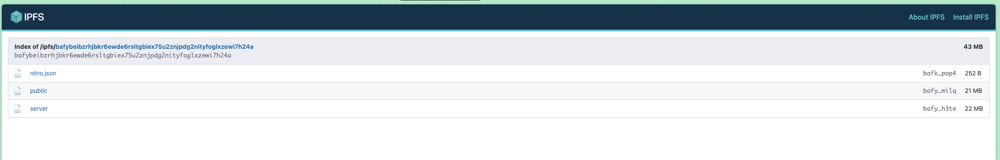

# Task 1

Uploaded using Fleek, because ipfs.io took too long for me to bother

## Task 1 Results
- IPFS Node Peer Count: `476`
- IPFS Node Bandwidth: `98MB` in, `21MB` out
- Test File CID: `QmUFJmQRosK4Amzcjwbip8kV3gkJ8jqCURjCNxuv3bWYS1`
- Public Gateway URL: https://ipfs.io/ipfs/QmUFJmQRosK4Amzcjwbip8kV3gkJ8jqCURjCNxuv3bWYS1

# Task 2

## Task 2 Results

- 4EVERLAND Project URL: [your-site.on..4everland.app]
- GitHub Repository: [github.com/your/repo]
- IPFS CID from Fleek: [CID shown in dashboard]