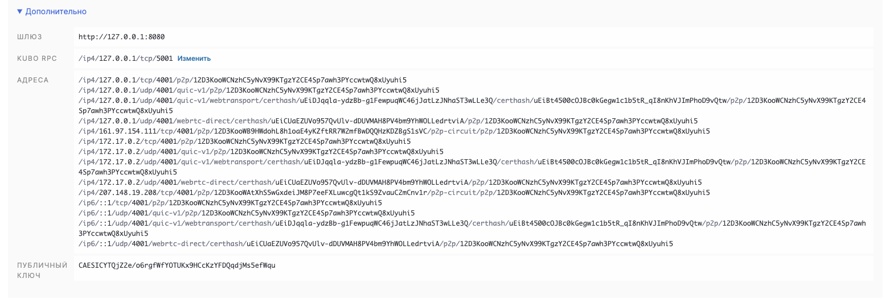
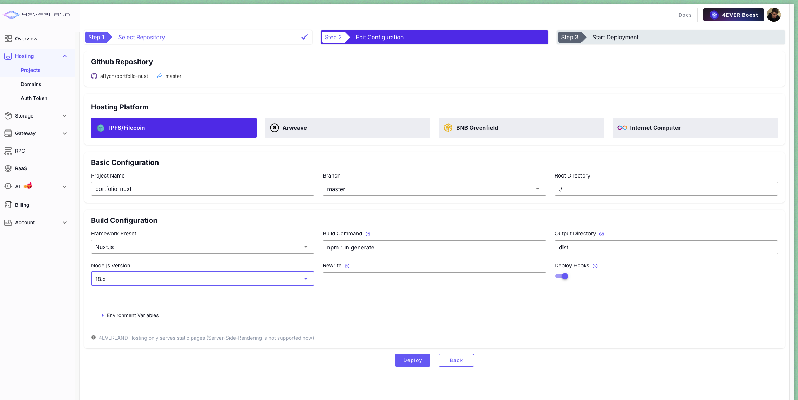
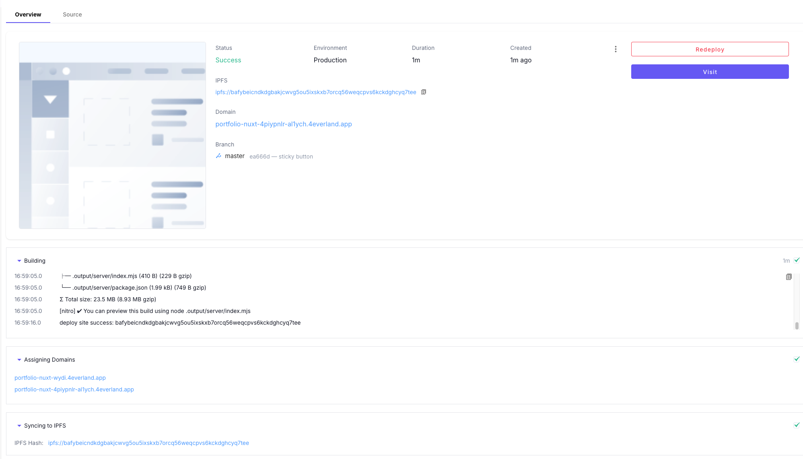

# Lab 10 - IPFS & 4EVERLAND

---

Timur Nugaev

---

I'm using Mac Silicon for this lab

---

## Task 1

### 1

```bash

aladdinych@MacBook-Pro-Timur lab10 % docker run -d --name ipfs_node \
  -v ipfs_staging:/export \
  -v ipfs_data:/data/ipfs \
  -p 4001:4001 -p 8080:8080 -p 5001:5001 \
  ipfs/kubo:latest
Unable to find image 'ipfs/kubo:latest' locally
latest: Pulling from ipfs/kubo
d8cd077c1d1c: Pull complete 
e3fcbbfc1d8c: Pull complete 
3c5219c83cfa: Pull complete 
b971de49973b: Pull complete 
8a248cdae65c: Pull complete 
a94a7032c40c: Pull complete 
492ef60fb2ee: Pull complete 
4f4fb700ef54: Pull complete 
be0735d78022: Pull complete 
052e21e0be3a: Pull complete 
def5dd004564: Pull complete 
160de00d05aa: Pull complete 
a2798e190096: Pull complete 
Digest: sha256:51dd374d5a6a7e1a7c77358701d65bbf558a2e76802d65d4f81b125877811ee1
Status: Downloaded newer image for ipfs/kubo:latest
eceb5ec98149a78f44b714797e084e771a93b669a6233deadbc7acc34b7bc844

```

### 2 

```bash
aladdinych@MacBook-Pro-Timur lab10 % docker exec ipfs_node ipfs swarm peers
/ip4/101.100.164.148/udp/23200/quic-v1/p2p/12D3KooWHvnwVCKqA8pZtrUhK656yP1tMkz98dALpgyTysy9tC9U
/ip4/101.47.182.169/tcp/37541/p2p/QmQByeZj2VfXPBZGysxKvPkqVdFHtvundGnDvE4xKCWRrb
/ip4/103.42.58.177/udp/4001/quic-v1/p2p/12D3KooWBmBJsDpyNLauewDH18fotyaxG7waEC3GqW5qnjnTfuqG
/ip4/104.168.100.31/tcp/4001/p2p/12D3KooWErzdZ9CWHeXPn5Dqq8QMuZCu3ucsTrSK5A1V6xZNapGR
/ip4/104.238.150.33/tcp/4001/p2p/12D3KooWKST1XbdqPyg2MbWXeovXcSuMuFqGpSgVDoij2t1BSfqw
/ip4/107.172.143.238/tcp/4001/p2p/12D3KooWRqxhaPM4LNC2tQeHCxF35i2dYmhDY5q1rcNZdWvJvdjA
/ip4/107.172.80.55/udp/4001/quic-v1/p2p/12D3KooWQCxfYh3PXZKCcjwCDiKzjTFrnxaPS3NatxxadEyfnqBj
/ip4/107.172.98.212/tcp/4001/p2p/12D3KooWGdq2ESDNCuZBk3zcp4ZBss9riTxpNtJD9UHGczPvwy4o
/ip4/107.174.147.51/tcp/4001/p2p/12D3KooWJBfMUkV3FeMxJg1S6ZYSs1bJu1baUf46Y7jxBTZa9Nt2
/ip4/109.123.248.43/tcp/4001/p2p/12D3KooWSmpipKgw94pn2wQJqth8ti4WG6nAWv6scCF3N3rqR9ip
/ip4/121.229.96.143/tcp/4001/p2p/12D3KooWBc1MsgUsU5ArjVVngwAndQ2sfAoacA1HxRnkE7UxfnCe
/ip4/129.13.152.60/tcp/4001/p2p/12D3KooWSSVMYqUVBhdkdwpaE4Qf3y7XSxV42e4YMVij7YTU6H7M
/ip4/13.251.171.33/tcp/4001/p2p/12D3KooWNzWm4CnuyUkFb1tmf2L4VaXNtyk4cQqY2mPnXpu9zcTW
/ip4/135.180.142.172/tcp/4001/p2p/12D3KooWKyBr5F5jzyLuJM3vuBgwmKS2STtmRcAoEyudGrsoCtMM
/ip4/136.243.40.163/tcp/4001/p2p/12D3KooWPuS7Mj9Xu6MZGf2tucmuzgr27FWQ3fYtFVoyZKFYPHLV
/ip4/136.243.93.113/tcp/9000/p2p/QmWJtKMAFooXB5KAoZazDdsebuLuPmJ2noVqG1CrGYRCwb
/ip4/137.184.229.130/udp/4001/quic-v1/p2p/12D3KooWDw6Qzu489sommhvsTydugyoyJedYTuiZAFCFLhSU6Yrn
/ip4/139.178.91.71/udp/4001/quic-v1/p2p/QmNnooDu7bfjPFoTZYxMNLWUQJyrVwtbZg5gBMjTezGAJN
/ip4/142.93.176.220/tcp/39461/p2p/QmXWrTRu6aqoGHWCTnB7ovzn3uAp8HXr4YDSwPahACCAdR
/ip4/144.126.148.204/udp/4001/quic-v1/p2p/12D3KooWRbJZDxwaC7iw6WdYCJoRQEzQdnnU6HUqFVdXb1hDSNw2
/ip4/144.202.5.0/udp/4001/quic-v1/p2p/12D3KooWNDomooTbT7jrxthYVeXeViRx8AdfBJF9sqRSzdSz9jae
/ip4/144.91.113.6/udp/4001/quic-v1/p2p/12D3KooWL7WUo5gucxZ3guUWtVnpwhGHvZW6YGvatAAmQ83Lzfb1
/ip4/144.91.116.143/udp/4001/quic-v1/p2p/12D3KooW9u9YS9z41NbuWCqG3UUTX9X78byFx6WQppzbHvLkqQVM
/ip4/145.40.118.135/udp/4001/quic-v1/p2p/QmcZf59bWwK5XFi76CZX8cbJ4BhTzzA3gU1ZjYZcYW3dwt
/ip4/147.75.87.27/udp/4001/quic-v1/p2p/QmbLHAnMoJPWSCR5Zhtx6BHJX9KiKNN6tpvbUcqanj75Nb
/ip4/148.113.165.152/udp/4001/quic-v1/p2p/12D3KooWJv8dunx6vXccRvXoAVpLBtUXTMJWkqcjrhZbLQRuAiRm
/ip4/149.28.73.133/tcp/4001/p2p/12D3KooWFe3N1nP4g5R8qztwFKf6yviayeL43M7bJPT7uVG6djMY
/ip4/149.28.78.156/udp/4001/quic-v1/p2p/12D3KooWNpMoKRFVk2uqhU2pL8yG7UkyTJcVHFyAcDx8ha6C8F2g
/ip4/149.50.96.155/udp/4001/quic-v1/p2p/12D3KooWQ1QYJx2AY8jAYcXDRRdGRMRdpNDmrVpLxNCuNLdsLAQt
/ip4/150.109.252.238/tcp/38307/p2p/QmeWLovTJq3xEBGwck5PjTngeFByWhaeUoU2ttnz8ehXtq
/ip4/152.53.142.32/tcp/1881/p2p/QmP79UMxLBYJFtxiF1yECCgB3M6TSrQqrBkkWfybs9Wjxq
/ip4/152.53.66.109/udp/4001/quic-v1/p2p/12D3KooWH2Bpyo8hrxecCW5NRrSTtD6xEKkWwE5bH5ECAQZkWNbY
/ip4/154.38.189.204/tcp/4001/p2p/12D3KooWN5mP2weYycLuVsp5U15YY3a95kp6e7y2vayZ1isa5SBM
/ip4/155.138.243.99/udp/4001/quic-v1/p2p/12D3KooWLEnk3NY7sCTKnV5VfJdWBh6WcDd9CRa1DzJkhqh69XDb
/ip4/157.90.181.211/udp/4001/quic-v1/p2p/12D3KooWGaxbu3g9Zhp3B78JtYXPXrUZPwhkLmeaKexrJk4KDFMD
/ip4/158.247.198.180/udp/4001/quic-v1/p2p/12D3KooWPoEdwHUbtXwR1xGanwnBkw2QA7K2oqE6QkX7fgzVcC5M
/ip4/161.97.162.24/tcp/35627/p2p/QmaAF1VTQZCFQjH5ro5zXXG5Em2a7q4pR9A3ZtucYBkEPo
/ip4/161.97.65.28/udp/4001/quic-v1/p2p/12D3KooWRx7shgw7JmwnpyF58kgRet5tz881yJB78292RYbJMJhW
/ip4/164.68.113.243/tcp/43089/p2p/QmRvcJuXeWxiyiWsSKvMLuFyqoSAxaHMVbgH5AaYeDuM8B
/ip4/165.22.3.8/tcp/44079/p2p/QmRu6y7i4hbQS5CFktjT1j1NmqjnxFGMZmtC5TTyqjbZnH
/ip4/165.232.116.128/udp/4001/quic-v1/p2p/12D3KooWKG6QSKjL5QFeEcZPFT2ytU4614UHEn8iHmuqpjGEHz2i
/ip4/167.235.172.10/tcp/46361/p2p/QmXPkggAdXg44LojEVTM3AvkdKnCCZhGActNvj1d5swkck
/ip4/168.119.147.225/tcp/41849/p2p/QmX4ctVGFXWvxamDb4hd1UMY4VFfERkQcq3hxHMMJVwxa2
/ip4/172.245.171.10/tcp/4001/p2p/12D3KooWNX5MEcniZZZvd6GBJhZ4ENP9ruYLSKr9pKA2FnrH2yzU
/ip4/173.212.232.248/udp/4001/quic-v1/p2p/12D3KooWGbU9AuHWUFPL93YE9Cn37NdqdS2YRSQ9L3GvhmiqD4Ab
/ip4/175.126.37.236/udp/4001/quic-v1/p2p/12D3KooWE6GJjxZA73iC5rEsZ8FGZ3jqEHZfUYFXAEKwvRXfSZDs
/ip4/178.63.84.121/udp/4001/quic-v1/p2p/12D3KooWGJjtKvqD1EqXoEfCT2yBU6Lj9FRCJTpe26WXMWBnvSCK
/ip4/18.143.158.33/tcp/4001/p2p/12D3KooWC158XeGx1fQ2djmgcARiB25JJg61t41VwahSn6u5RnWR
/ip4/182.43.100.105/tcp/4001/p2p/12D3KooWSvPAHyaGdwvQmLTzKNoYnvGwNdbX1Ybi8v7gvdyVDbZ2
/ip4/182.43.98.94/tcp/4001/p2p/12D3KooWJS5ftsFexNBLKxTuD5kofiyomAezqnTnUowZNRCKDBEk
/ip4/183.162.224.47/tcp/37552/p2p/QmcFxRWKYaKMk7QHiscWjq4UogshLR1ENJSYwdvVfob3J5
/ip4/183.230.248.85/tcp/48870/p2p/QmQzLZNfAjtUri4o5GJfB9AGdf3qJKZq1pVPEPQdDVAiyx
/ip4/185.130.226.49/udp/4001/quic-v1/p2p/12D3KooWLNzAeuyHemXJjQDBxsQyhbwgz4bhVi6NH8D49zbPFVDq
/ip4/185.183.33.82/udp/4001/quic-v1/p2p/12D3KooWKnLiNHsP4YtrgpkMRc6oDN1MTw8qZbaMgKirNpUrHgqh
/ip4/185.238.191.46/tcp/4001/p2p/12D3KooWCua1xBtDVaiioLyAAYMRcdvim4phZG37aYWVxc3Ln93S
/ip4/188.163.81.132/tcp/15596/p2p/QmbVHF4oMeddvZ5xVjiDDscVvt7X65oHfiqPmHfSV8Zn1P
/ip4/188.227.87.41/udp/4001/quic-v1/p2p/12D3KooWHEYmQiW6dhp1pkTMwsZLLnv4rDH63HoV8F1Vp3UXsktP
/ip4/192.248.167.44/udp/4001/quic-v1/p2p/12D3KooWB7hRSSYaXXSmChUioeLj3hfktWZn2HH9m3Vuz1CoC9Fc
/ip4/192.3.117.147/udp/4001/quic-v1/p2p/12D3KooWHft7hdmniWiS9wwTDWbPnY5chz3PU2fCNF4tRYghdazB
/ip4/193.8.130.157/udp/4001/quic-v1/p2p/12D3KooWHNn6NsLP6nYCSQkBNvrLf6TBg1yFYKxoCFzmhxZGnhJT
/ip4/193.84.3.55/udp/4001/quic-v1/p2p/12D3KooWJkEHWgDsXByduwt8SsCXuxk776tpU8PXQw2FbVL2jibK
/ip4/195.26.230.238/udp/4001/quic-v1/p2p/12D3KooWDTPkqQuqSYRqHYwEV7RY6jq6GtLTcG81Srv8jK2vZqeN
/ip4/195.26.244.255/tcp/4001/p2p/12D3KooWCgUy8jt2eQ5HHJy4uCV8JQw38eJJY5FRo58ujQzL4fYD
/ip4/195.26.249.132/tcp/4001/p2p/12D3KooWHnpcJMkpAxMev29eTggCG5RobaTumtHMTx2NM3F5ssjZ
/ip4/207.148.19.208/tcp/4001/p2p/12D3KooWAtXhS5wGxdeiJM8P7eeFXLuwcgQt1kS9ZvauC2mCnv1r
/ip4/207.148.66.29/udp/4001/quic-v1/p2p/12D3KooWSzML6nDqScqarSFroqjeYoAZCb75HMkLtXifVxnv8bXf
/ip4/207.148.92.78/udp/4001/quic-v1/p2p/12D3KooWHBZ1zR2VvQ5KQfXc6kYt7yUwvejj9rUXVbkAqGEBE8S1
/ip4/207.154.224.45/tcp/2853/p2p/QmTJ3MvegvLNynTCMBkYaqYBujofLsm8mXqfbw7Dn1o56Q
/ip4/209.209.10.241/tcp/4001/p2p/12D3KooWDKHsMj25N1eHHmL9DWbkUn274e7Upspz62jJeqDc2Q7D
/ip4/212.237.216.46/udp/4001/quic-v1/p2p/12D3KooWNUqCE218U3DhjuAFAwyc3irAcm3Vo2mMHMNgLAk8uJkS
/ip4/213.199.61.136/tcp/4001/p2p/12D3KooWGhAnRtABxL1rRB6VpeeMkdWb68bLKMzV5T9AiKu6Pmqt
/ip4/213.238.231.159/tcp/57109/p2p/Qmc3rWxDeYRzfHNCXHJBK7nysFFGNBiHU2YzxhxkVwQg3z
/ip4/221.144.149.121/tcp/39449/p2p/QmcxdpmwXJAjehG4XoHbYVxHLwNEGzspkSsCshPssojhG6
/ip4/23.227.150.229/tcp/4001/p2p/12D3KooWEEDRzvN2dxPtjrYQHmFk9EyK9qRsCUnmQuJMRtWLkXQo
/ip4/23.94.131.198/tcp/4001/p2p/12D3KooWFvAGquDHvHbRhULGeBDfSaHQTgW5LkpaJ93oZogsPds8
/ip4/3.101.18.164/tcp/4001/p2p/12D3KooWKADkeX8XLd5XFo14koHYBaKHPVN43zjfFsgdXY7y7MUu
/ip4/3.17.96.116/tcp/4001/p2p/12D3KooWFqe9cszLwzqs2CppjjwXMFWe66J1CfaLoCrQB2Snw6sK
/ip4/31.207.47.54/udp/4001/quic-v1/p2p/12D3KooWPvXnDGbQyRva4eQUBizMJZRVvUkKwnqJv5ZWEUCrXuKb
/ip4/35.222.253.185/udp/4002/quic-v1/p2p/12D3KooWKkNbFid8WReWRVPZ8S8Hx22uWu9XSZkng8owEsJuihRy
/ip4/36.189.234.236/tcp/61760/p2p/QmaysneenGMgFLABmq7aKYJxRtaRYsKnC3ZwngH3wzupwU
/ip4/36.189.234.236/tcp/61987/p2p/QmfGxssz1QzXNKoPoTX8WJSsYDE4GXeha6CLot9MUkMeYq
/ip4/38.242.206.208/udp/4001/quic-v1/p2p/12D3KooWKtEUsc4Mgo1XzVVFXsrc3WUWo2TFsC1YgPsi7b2aukdD
/ip4/38.242.225.153/tcp/4001/p2p/12D3KooWFKuWfK49ZPnR52atEDabUQddGoc5QndBippZreNzL4hS
/ip4/43.133.71.253/tcp/43877/p2p/QmdXyZ9qZ4N6fNjpzwref11cGFSYqq4VTKdoabnDtqMwLu
/ip4/43.155.156.46/tcp/41921/p2p/QmfEevin19vrg6v77HdKrBsxP88uf4GnksR15rXPd8kPug
/ip4/43.250.54.16/udp/4001/quic-v1/p2p/12D3KooWBkFyxfKRu5CJ1XkTR1jek3XdS1ETMBHcuBTX6juKyT3C
/ip4/45.32.8.111/tcp/4001/p2p/12D3KooWKmHhPruj6EsmHqgsLd2decyAHSirsquc5H8meoei65X5
/ip4/45.63.27.7/tcp/4001/p2p/12D3KooWEXYYEKtbJ285qVott4djchRPCqPULfqWR6zh1UuhpbXN
/ip4/45.66.228.117/tcp/41723/p2p/QmePY5wmNRV29nr4fGui1Bmk3peJXwA7GapDGLvZc8cC1T
/ip4/45.76.216.135/udp/4001/quic-v1/p2p/12D3KooWAGP7oe9DoxNrxWiSFwDxgrQ6FpRYYJaepfYttdKodEHc
/ip4/45.77.118.139/udp/4001/quic-v1/p2p/12D3KooWBWcVEDzngDc6EkpRiZpUoSS89tAQXJdoPNwPZfBLi4QS
/ip4/45.77.118.151/udp/4001/quic-v1/p2p/12D3KooWRKohNq4MbkuVnjLWMAfy7FroMA2PcTHQvEY4X3uh1bfe
/ip4/45.77.118.153/udp/4001/quic-v1/p2p/12D3KooWCkaLVuVNJgouKHTWJZ2EqJVZS5kFmyZCgMnHee4ziDeh
/ip4/45.77.135.73/tcp/4001/p2p/12D3KooWCLRBbqSuwW3vhGycv9PTaQdQbUmYetcJgmsnTGNQGgwz
/ip4/45.77.184.224/tcp/4001/p2p/12D3KooWEyTkgrehJD9YXERaApvjGRCsZLNh94uckBirYHvgbqHW
/ip4/45.86.153.40/udp/4001/quic-v1/p2p/12D3KooWEBaJd7msGiDjA5ATyMpVSEgja4xc6FXkxddaSM9DtHCT
/ip4/47.129.62.92/tcp/4001/p2p/12D3KooWN7KtKAYQTHLAAsESd4E5R6LNUEa9oZvPN5q4YdCEimCF
/ip4/49.12.68.105/tcp/4003/p2p/QmQVPbfxcYwDCegXDr5kw7KU6kCxCMV6JFeVPyhJe9BNh1
/ip4/5.180.151.130/tcp/4001/p2p/12D3KooWLLTS5d8WrL9zpKUJTdiJz8h1QsVTaoxFx2irsyDSC4vq
/ip4/51.159.38.50/udp/4001/quic-v1/p2p/12D3KooWAndhhiJT1anUBaRMPKbnHLMUt5baRPZJ9JmjEtEo6bB3
/ip4/51.38.230.60/udp/4001/quic-v1/p2p/12D3KooWQMq2JgNM9x2HD8ufx6BkmdcWifWcFJGERUCLeLbJhjDL
/ip4/51.91.19.102/udp/4001/quic-v1/p2p/12D3KooWJzZWP8xXDxoDMEcNj9zJsvgYBa5oQTxGQfJX6tKkvQPw
/ip4/52.200.107.103/tcp/4001/p2p/12D3KooWPMtghcfUfHhzZtanXdXWKQQp9zR42ypv39w56CWf9mb1
/ip4/62.171.154.224/udp/4001/quic-v1/p2p/12D3KooW9pRdTLt6PDKAFT7qZoc2EwUHYnKtwKpRko8s35EN7jq2
/ip4/62.171.170.38/udp/4001/quic-v1/p2p/12D3KooWBSkuaDMDzLLZoppTRR12hXTmgqXDdrgWzS39q3khuEua
/ip4/62.171.178.128/udp/4001/quic-v1/p2p/12D3KooWBX5jr2GEa9YxmRpFEkNeHcto1BFgAj4cMLvfcPr8fdrd
/ip4/62.210.92.122/udp/4001/quic-v1/p2p/12D3KooWKTL4jeKX7PgegqcQpwwfvhFYne5cBPtGXiFonpBAC2hD
/ip4/62.84.180.105/tcp/4001/p2p/12D3KooWQLoepeQwqvaTnG2pjdtxmjptUV8pNsjAvriseT171eSW
/ip4/64.176.201.232/tcp/4001/p2p/12D3KooWJ3Y57nJwi9voXBVELRMfmTFUusuzm4JbeExb22H9axKW
/ip4/65.108.204.120/udp/4001/quic-v1/p2p/12D3KooWBKuuRrmigk7qroztq6zm6WZA62yDmHF4RrvPe1vTkEbU
/ip4/65.21.188.140/tcp/4001/p2p/12D3KooWSzfap2jq3e75cCtdM9hoS2SJStUnv4QhZx6EYGRHqfLZ
/ip4/65.21.83.37/tcp/38417/p2p/Qma4etGDUnHf4ood372iZG8n8LPvLQ7PLo6J8knFDSBxES
/ip4/66.248.204.164/udp/4001/quic-v1/p2p/12D3KooWBe9463p39A4ZydH3qwmjW8HPxpXhz5p18D9g9bEjhebm
/ip4/66.42.75.249/udp/4001/quic-v1/p2p/12D3KooWLS3qckC8UmXgtuLzKuuarFDaDQMcus6tJ6r5HkkTWezq
/ip4/66.94.120.54/udp/4001/quic-v1/p2p/12D3KooWP514iikCtq2ZXoEqYBR8ZPcPQsLbY3xkhTSAHraYt892
/ip4/67.22.44.67/tcp/4001/p2p/12D3KooWE6116J1W3aMvMrDihRb2nAMRrXbdnTLJv2R7493boCza
/ip4/69.67.149.25/tcp/9000/p2p/QmbP3uP5fBKbtqXvDYtrGHpAcF4aTFCrLxbNEfhmTHSsj9
/ip4/70.34.245.31/udp/4001/quic-v1/p2p/12D3KooWAfeRkYfK5TwFMzPkjGvYGMQtwBTTtb6MoNuZ6jCwZVzd
/ip4/70.58.22.104/tcp/24176/p2p/12D3KooWSFxSnm1aEJDLTKjb7jFTnkX6wbJCZZc6fytKKSka22HD
/ip4/72.239.62.212/tcp/62859/p2p/12D3KooWAjBwjgN4ofFMkimHQ3EZ9qcSNHTGSgo4vLbUnDzBgY6e
/ip4/74.119.54.11/tcp/4001/p2p/12D3KooWHqfFUkU5Q4JNWGT8Zscgq8ivTP1G8BYnoJP2ZjhoZu6R
/ip4/74.50.83.214/udp/4001/quic-v1/p2p/12D3KooWKA5dgZCSKo3DMiLKEhQ3ui8ANVjcrBKDttgWNGjFB6dH
/ip4/79.137.239.187/udp/4001/quic-v1/p2p/12D3KooWRWdLLHQCC7RzMYARAMYj7zhjkz2PNUC6ZznxKn8gLnAo
/ip4/80.240.27.115/udp/4001/quic-v1/p2p/12D3KooWJcsasdgmvfgzfHUDUah2H4p72EvcLtCBF6Yjzm4g9yoZ
/ip4/81.0.219.195/tcp/4001/p2p/12D3KooWP7P3KNKJNpgtBpVH7fi9DNajk24YrM1tfVJ25YMwRJ7H
/ip4/84.247.173.40/tcp/4001/p2p/12D3KooWCtdquJG7aQwxngGnH9RvgyUySydhF8JhHNkAbM6kkjgT
/ip4/85.192.41.246/udp/4001/quic-v1/p2p/12D3KooW9qSJTpRE6Mm4csZCXbNboD1yeteVVbD317vA3Kt2WPXR
/ip4/85.89.183.195/udp/4001/quic-v1/p2p/12D3KooWJq18PiFFd4W2rZSE287CDw1TEZ8pkKe9LBHU5K3Y1yYa
/ip4/86.49.225.169/udp/58449/quic-v1/p2p/12D3KooWJrxkExHev4WhxR1NHjz3ggoGjZnQVSVwDEEVyzDnvZB7
/ip4/88.211.220.244/tcp/9000/p2p/QmdJMh7j1rFWpbfRrv8g27ERSa7mRrk37bNn3Z8D9RAjsG
/ip4/88.99.67.42/udp/4001/quic-v1/p2p/12D3KooWDad7arFEwyXpGbjUwGEQB55S5h224N8xyumMwZPem8KG
/ip4/88.99.97.98/udp/4001/quic-v1/p2p/12D3KooWHoDmhEmam4rizDWvBrmtETC44gUVLwdDXeqBFCXRRnJb
/ip4/89.117.78.7/udp/4001/quic-v1/p2p/12D3KooWPvLomSABtpmsekQAM7pgD7ECdS2XSyJr3sCWQNT6k88Y
/ip4/89.17.139.86/tcp/4001/p2p/12D3KooWNfMsb1mfYtiapU7PsyaWNkMGfrexMc4ypRRatTo6zVJ2
/ip4/91.105.13.202/tcp/36568/p2p/QmZZmfwwFpADFG758mACvS8Qrk2oyz7AsDBjvvNV33vFPB
/ip4/91.235.142.52/udp/4001/quic-v1/p2p/12D3KooWCjymUXkb49ymYJQZZGZ8bs8fRmbu5ywkXNMhXF4ZAunr
/ip4/94.141.161.146/tcp/43571/p2p/QmZrrD1anL6S4T3oSkNm1ZYzs9ePre947Hpb9k9SMArGk8
/ip4/94.156.114.32/tcp/19307/p2p/QmZnyazz4PFFraEqDpcUsMVjkkMebjE7iCuzpikKJzbUiz
/ip4/94.156.115.36/tcp/43191/p2p/QmYwxTUhrsLxD56jt9BH8EAxBFhShxyivsT8T41mMDTym3
/ip4/94.231.205.214/tcp/4001/p2p/12D3KooWKGZuEARGJ21E4eAsyViU89469jT2U6EaMHARfmVedeYi
/ip4/95.111.255.119/udp/4001/quic-v1/p2p/12D3KooWEap85GqY93pkLHaBaViewCqyiYYby7Mx8QP8XUzT7XDX
/ip4/95.214.52.152/udp/4001/quic-v1/p2p/12D3KooWN6hydnfV5pmZR7z7KwMn4ZsG14bVP28XKy98qiVkEDbk
/ip4/95.217.10.117/tcp/4001/p2p/12D3KooWG2GnowbiRiVMy3zQ2L5VYFzKM9x9N1z1zGy3udPyqVWp
/ip4/95.217.122.182/udp/4001/quic-v1/p2p/12D3KooWQcZxEhpe6PMguEqWuXzesoq4dn76gou6aiZ3fprqNc8j
/ip4/95.248.33.64/tcp/4001/p2p/12D3KooWCq5Sb8t5U47tkH5ZRztFNXsKy8nPfiMzcMtffaFFACiR
/ip4/96.30.198.190/tcp/4001/p2p/12D3KooWPM28KgjaRs37VG4SW6Ns9o1LDbjScmEsXTwwvoaSuM2P
```

### 3

```bash
aladdinych@MacBook-Pro-Timur lab10 % echo "Hello IPFS Lab" > testfile.txt
docker cp testfile.txt ipfs_node:/export/
docker exec ipfs_node ipfs add /export/testfile.txt
Successfully copied 2.05kB to ipfs_node:/export/
 15 B / 15 B  100.00%added QmUFJmQRosK4Amzcjwbip8kV3gkJ8jqCURjCNxuv3bWYS1 testfile.txt
```

### 4 - access

local:


public:

https://ipfs.io/ipfs/QmUFJmQRosK4Amzcjwbip8kV3gkJ8jqCURjCNxuv3bWYS1
https://cloudflare-ipfs.com/ipfs/QmUFJmQRosK4Amzcjwbip8kV3gkJ8jqCURjCNxuv3bWYS1


share info on connected peers and bandwitdth:




45 peers, 230 KiB/s incoming bandwidth, 23 KiB/s coming out.

CID: `QmUFJmQRosK4Amzcjwbip8kV3gkJ8jqCURjCNxuv3bWYS1`


## Task 2

i chose to deploy my portfolio website's private repo (portfolio-nuxt)





domain on 4ever: portfolio-nuxt-0gf8p7zl-al1ych.4everland.app

github repo (private): https://github.com/al1ych/portfolio-nuxt

text me on telegram if you need access to the repo: t.me/aladdinych

screenshot of the deployed app:


i expected it to show the actual application but i couldn't get it to do that. maybe it's meant to just store and show the files? 

IPFS CID from 4everland: bafybeibzrhjbkr6ewde6rsltgbiex75u2znjpdg2nityfoglxzewi7h24a