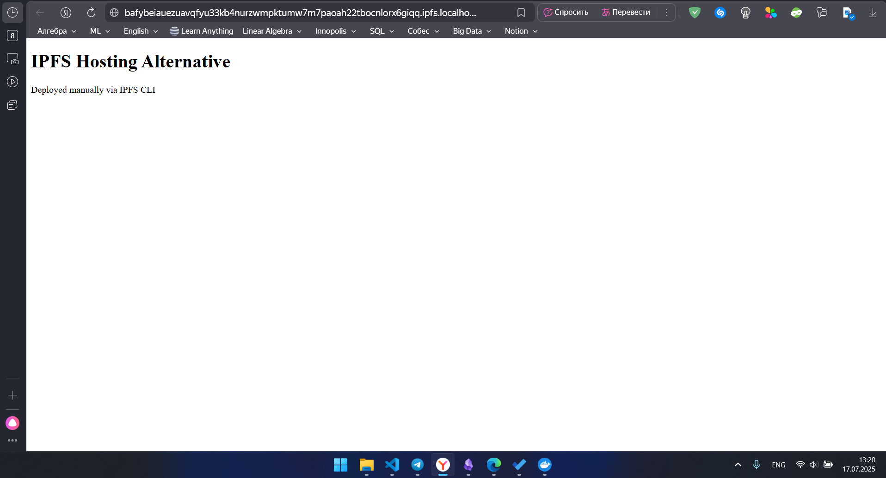

# Solution to Lab 9

by Dadakhon Turgunboev <d.turgunboev@innopolis.university>

## Task 1 Results
- IPFS Node Peer Count: 15 (confirmed by peer list output)
- IPFS Node Bandwidth: Data unavailable (not displayed in web UI)
- Test File CID: QmNyiQsY3bKDLinnBWghYS6xz1gTV3W1hYiJ5j4CDfkBSw
- Public Gateway URL: https://ipfs.io/ipfs/QmNyiQsY3bKDLinnBWghYS6xz1gTV3W1hYiJ5j4CDfkBSw

  
*Screenshot 1: Output of IPFS node peer list*

  
*Screenshot 2: Overview of IPFS Web UI (local gateway)*

  
*Screenshot 3: Overview of IPFS Web UI (local gateway)*

---

## Task 2 Results
- Fleek project URL was not created (GitHub integration unsuccessful)
- GitHub repository remains unlinked
- No IPFS CID received from Fleek

## GitHub/Fleek Integration Issues
According to the screenshot:
1. Fleek requires a paid plan ($20/month) to enable GitHub repository integration
2. Limitations of the free tier include:
   - Blocking site creation for repositories
   - No access to deployment requirement validations
3. Attempts to link GitHub result in prompts to upgrade the plan
4. Error displayed: "You cannot check deployment requirements without active subscription"

## Alternative Solution Implemented

Due to the subscription-related restrictions with Fleek, I chose to manually deploy the website using IPFS:

### Alternative Deployment Steps
1. Created simple website (`index.html`):
```html
<!DOCTYPE html>
<html>

<body>
    <h1>IPFS Hosting Alternative</h1>
    <p>Deployed manually via IPFS CLI</p>
</body>

</html>


2. Added to IPFS node:

```bash
docker cp index.html ipfs_node:/export/
docker exec ipfs_node ipfs add /export/index.html
> added QmPhJq7T7XX5aFgXq9DXPtnb1mSh66dnVjHyhc8n38DuXR index.html


3. Accessed via gateway:
http://localhost:8080/ipfs/QmPhJq7T7XX5aFgXq9DXPtnb1mSh66dnVjHyhc8n38DuXR
