# Decentralized Web Hosting with IPFS & 4EVERLAND

In this lab, you'll explore decentralized web technologies by setting up a local IPFS node, publishing content to the distributed web, and deploying a static site using 4EVERLAND's automation platform.

---

## Task 1: Local IPFS Node Setup and File Publishing

**Objective**: Run a personal IPFS node using Docker, publish files to the IPFS network, and verify decentralized access through public gateways.

IPFS (InterPlanetary File System) enables decentralized, content-addressed storage that's resilient to single-point failures. Understanding IPFS helps prepare for Web3 development and decentralized application hosting.

1. **Start IPFS container**:

    ```bash
        docker run -d --name ipfs_node \
            -v ipfs_staging:/export \
            -v ipfs_data:/data/ipfs \
            -p 4001:4001 -p 8080:8080 -p 5001:5001 \
            ipfs/kubo:latest
    ```

    `ipfs_node` is personal IPFS node inside Docker

    `ipfs_staging` and `ipfs_data` are Docker volumes (persistent storage)

    Ports exposed:
    - `4001`: Peer-to-peer communication
    - `8080`: Local HTTP gateway (file access)
    - `5001`: Web UI & API

    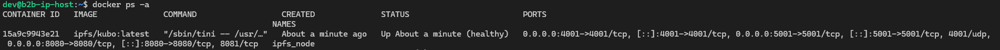

2. **Verify node operation**:

    ```bash
        docker exec ipfs_node ipfs swarm peers
    ```

    

    Here 5 peer hashes.

3. **Add file to IPFS**:

    ```bash
        echo "Hello IPFS Lab" > testfile.txt
        docker cp testfile.txt ipfs_node:/export/
        docker exec ipfs_node ipfs add /export/testfile.txt
    ```

    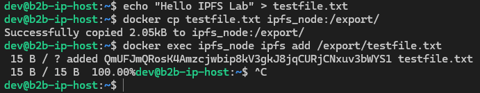

    - Note the generated CID (e.g., QmXgZAUWd8yo4tvjBETqzUy3wLx5YRzuDwUQnBwRGrAmAo)

    > QmUFJmQRosK4Amzcjwbip8kV3gkJ8jqCURjCNxuv3bWYS1

4. **Access content**:
    - Via local gateway: `http://localhost:8080/ipfs/<CID>`

    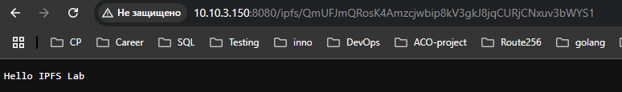

    - Via public gateways:
        - `https://ipfs.io/ipfs/<CID>`
        - `https://cloudflare-ipfs.com/ipfs/<CID>`

    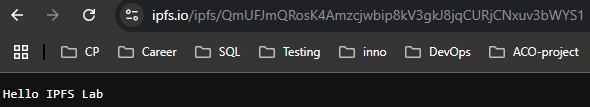

    - *Note: Public access may take 2-5 minutes*
    - Open a browser and access the IPFS web UI:

    ```sh
        http://127.0.0.1:5001/webui/
    ```

    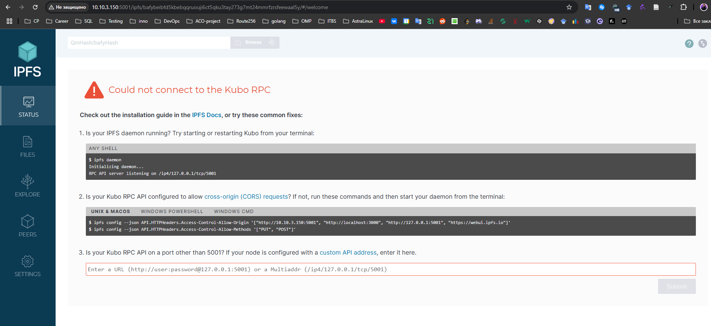

    I fixed that:

    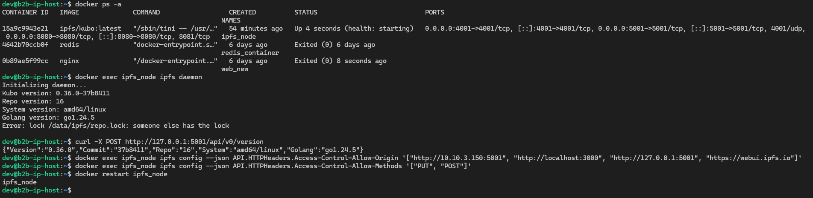

    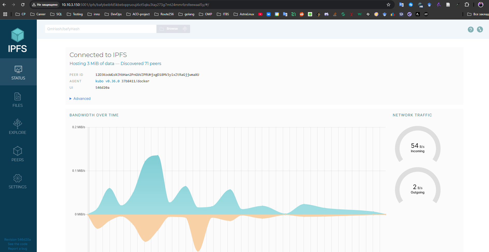

---

## Task 2: Static Site Deployment with 4EVERLAND

**Objective**: Deploy a website to IPFS using 4EVERLAND's automation platform and manage continuous deployment workflows. 4EVERLAND simplifies deploying and managing websites on decentralized infrastructure, providing CI/CD-like workflows for Web3 hosting with automatic IPFS publishing.

1. **Set up 4EVERLAND project**:
    1. Sign up at [4EVERLAND.org](https://www.4everland.org/) (use GitHub or any wallet like Metamask auth)
    2. Click "Create New Project" → "Connect GitHub repository"
    3. Select your current repository and branch or any real pet web app/site
    4. Configure build settings for this repo (if you use your own repo adjust configs):
        - Platform: IPFS/Filecoin
        - Framework: Other
        - Publish directory: `/app`
    5. Deploy!

    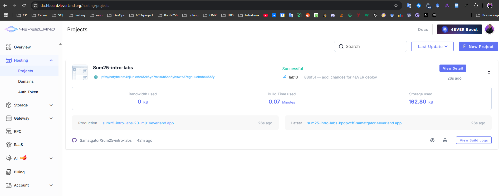

2. **Verify deployment**:
    - In 4EVERLAND dashboard:
        - Note IPFS CID under "Site Info"
        - Access site via *.4everland.app subdomain

    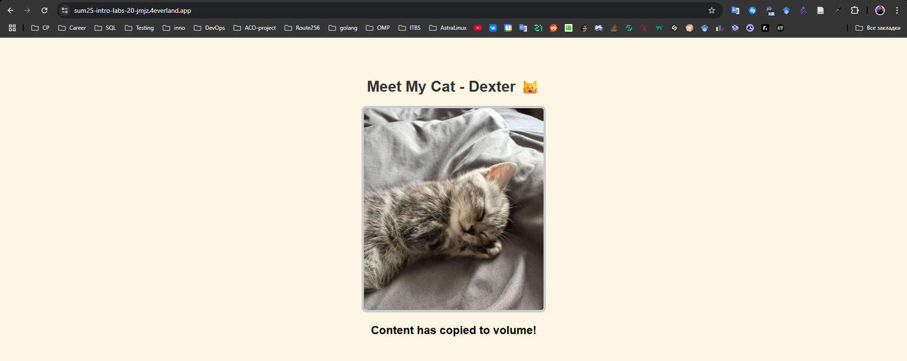

    - Verify on public gateway:
        `https://ipfs.io/ipfs/<CID-from-4EVERLAND>`

---

## Task 1 Results

- IPFS Node Peer Count:

    
- IPFS Node Bandwidth: [Number from web UI]

    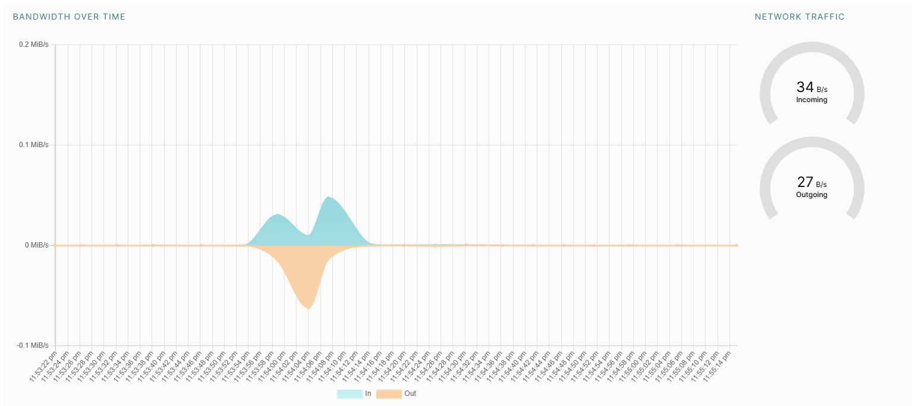
- Test File CID: `QmUFJmQRosK4Amzcjwbip8kV3gkJ8jqCURjCNxuv3bWYS1`
- Public Gateway URL: `https://ipfs.io/ipfs/QmUFJmQRosK4Amzcjwbip8kV3gkJ8jqCURjCNxuv3bWYS1`

## Task 2 Results

- 4EVERLAND Project URL: `https://sum25-intro-labs-20-jmjz.4everland.app/`
- GitHub Repository (if you used your own app): `https://github.com/Samatgator/Sum25-intro-labs`
- IPFS CID from 4EVERLAND: `bafybeibm4hjiuhxxhr65rk5yn7mss6b5no6ybswtz37eghuucbob4455fy`

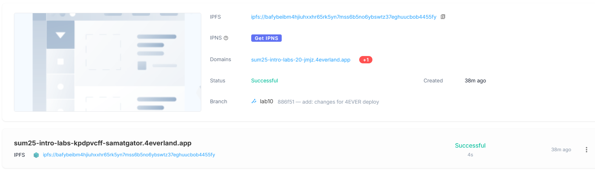

---

> **Note**: IPFS propagation delays are normal. If public gateways don't work immediately, try on a next day.
