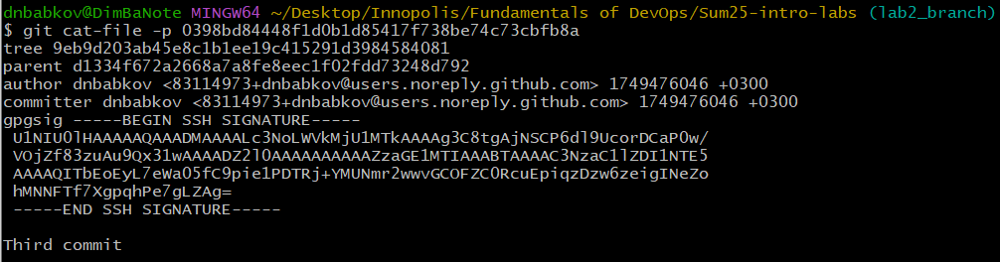
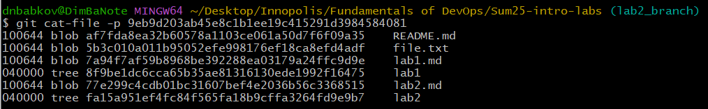
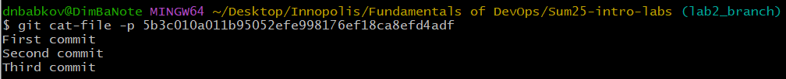
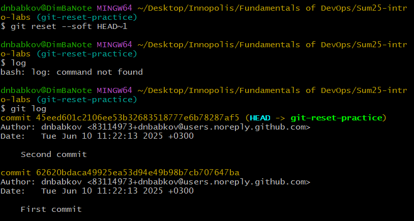
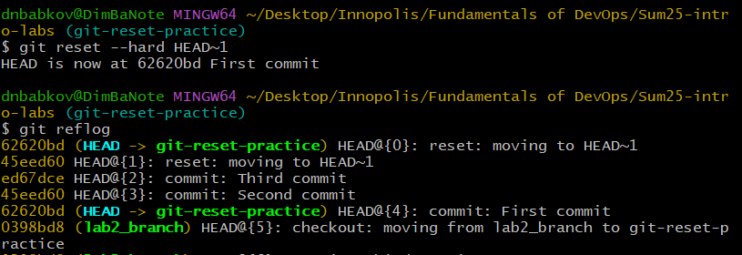
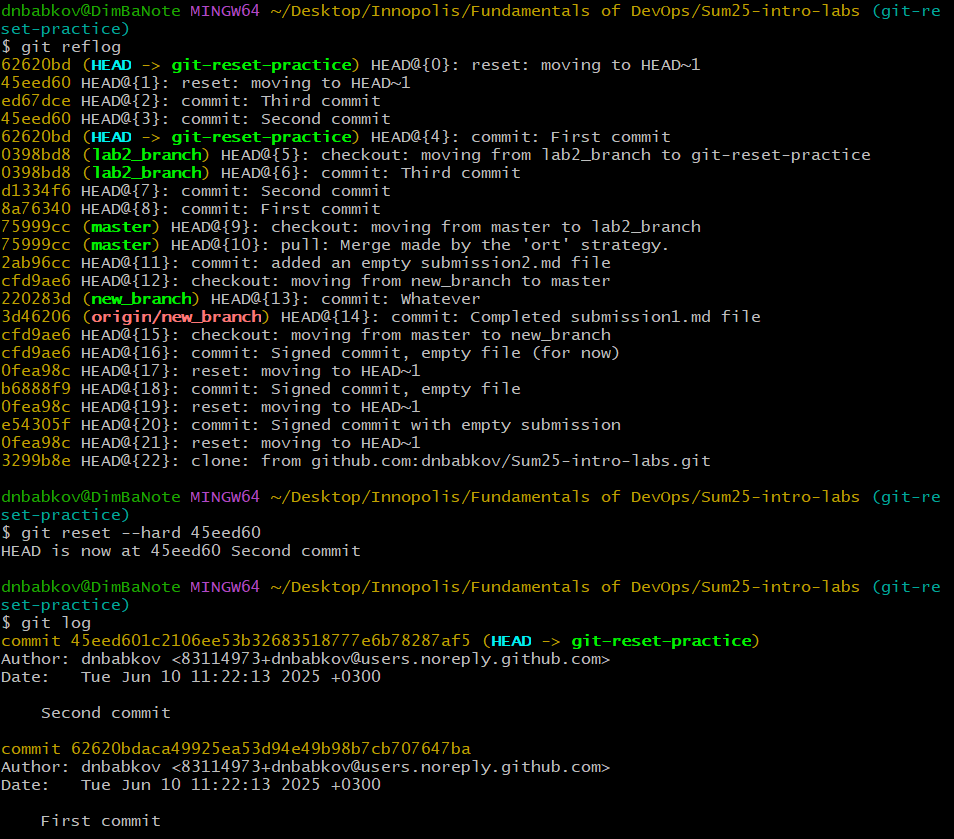

# Task 1

### Commit object

Commit object contains:

- tree link
- parent commit
- author and committer information
- SSH signature
- commit message

### Tree object

Tree object contains:

- access rights
- object types (blob is a file, tree is a directory)
- object hash
- file or directory name

### Blob object

Blob object contains the raw representation of the file's contents.

# Task 2

Using `git checkout -b git-reset-practice` a new branch was created

Then a `file.txt` was created and modified through three commits

### git reset --soft HEAD~1

This command put the HEAD one commit behind while keeping the changes in the staging area, so that they can be commited again with or without change.

### git reset --hard HEAD~1

This command put the head one commit behind and also removed all the changes from the staging area and the working directory.

### git reset --hard <reflog_hash>

After finding a commit hash in a reflog, the state of the branch was reset to the second commit:

# Task 3

# Task 4