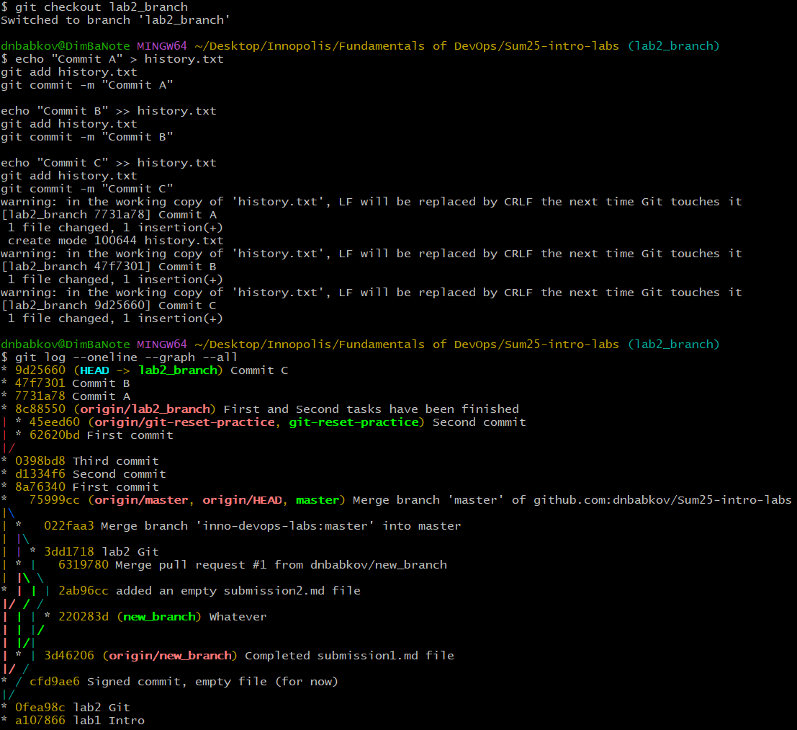
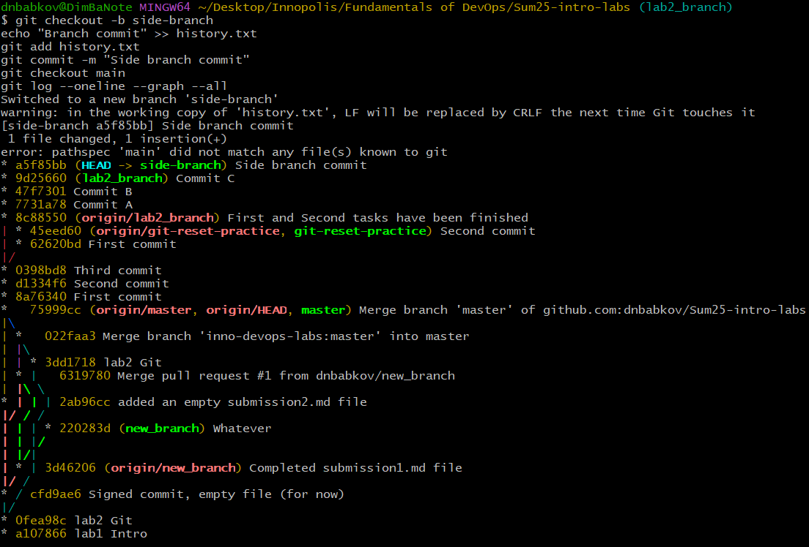

# Task 1

### Commit object

Commit object contains:

- tree link
- parent commit
- author and committer information
- SSH signature
- commit message

### Tree object

Tree object contains:

- access rights
- object types (blob is a file, tree is a directory)
- object hash
- file or directory name

### Blob object

Blob object contains the raw representation of the file's contents.

# Task 2

Using `git checkout -b git-reset-practice` a new branch was created

Then a `file.txt` was created and modified through three commits

### git reset --soft HEAD~1

This command put the HEAD one commit behind while keeping the changes in the staging area, so that they can be commited again with or without change.

### git reset --hard HEAD~1

This command put the head one commit behind and also removed all the changes from the staging area and the working directory.

### git reset --hard <reflog_hash>

After finding a commit hash in a reflog, the state of the branch was reset to the second commit:

# Task 3

`git log --graph`'s visualization of the commit and branching history helps one understand how repository branches and how these branches later merge together, which can be helpful for a collaborative project. It helps seeing repository's structure and to understand the commit history more clearly.

# Task 4

## Git tag name(s) created:

v0.9.0 — commit with the third task
v1.0.0 — current commit

## Commands used:

- git tag v0.9.0
- git push origin v0.9.0
- git log # to get the hash for the commit

- <git add and git commit>
- git tag v1.0.0
- git push origin v1.0.0
- git log # to get the hash for the commit

## Commit hashes

- 9f42659cb042e495fd39c241a63c2d77cddf930b
- dunno yet, because this commit has not been committed yet :>