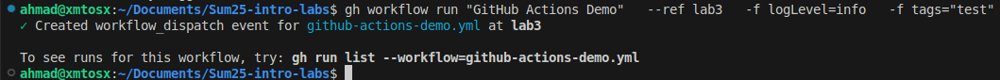
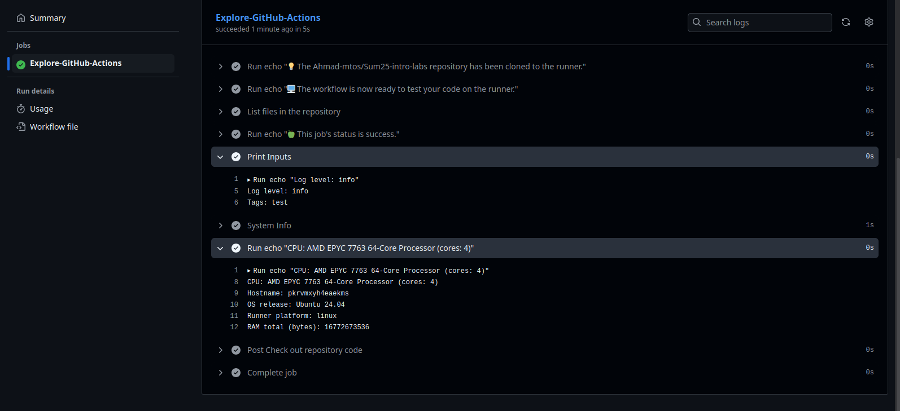

# CI/CD Lab - GitHub Actions

## Creating the first GitHub Actions Pipeline

### Observations & Findings

After going through the guide and reading it, here is what I found:

* To start a workflow we need to define it inside a specific directory, which is `.github/workflows`.
* Workflows are written in `YAML`.
* Inside the workflow we can control when a workflow triggers, alongside other things.
* GitHub Actions come with [context](https://docs.github.com/en/actions/writing-workflows/choosing-what-your-workflow-does/accessing-contextual-information-about-workflow-runs) that can be used to get information about our workflow runs, variables, runner environment, ...
* In the example used, the workflow triggers whenever we push something to the repository, and here are the results of our first workflow:

    

## Gathering System Information and Manual Triggering

### Manual Triggering

To run a workflow manually we must configure it to run on `workflow_dispatch`. I added some input to show that it's working.

```yaml
on: 
  workflow_dispatch:
    inputs:
      logLevel:
        description: 'Log level'     
        required: true
        default: 'warning'
      tags:
        description: 'Test scenario tags'
```

[`workflow_dispatch`](https://docs.github.com/en/actions/writing-workflows/choosing-when-your-workflow-runs/events-that-trigger-workflows#workflow_dispatch) triggers when we make changes to the workflow file on the default branch, if we want to trigger it on other branches we have to do that manually by using `gh workflow run` and specifying the branch and the input there.



### Gathering System Information

To gather system information I used the action [kenchan0130/actions-system-info](https://github.com/kenchan0130/actions-system-info)

```yaml
- name: System Info
    uses: kenchan0130/actions-system-info@master
    id: system-info
- run: |
    echo "CPU: ${{ steps.system-info.outputs.cpu-model }} (cores: ${{ steps.system-info.outputs.cpu-core }})"
    echo "Hostname: ${{ steps.system-info.outputs.hostname }}"
    echo "OS release: ${{ steps.system-info.outputs.name }} ${{ steps.system-info.outputs.release }}"
    echo "Runner platform: ${{ steps.system-info.outputs.platform }}"
    echo "RAM total (bytes): ${{ steps.system-info.outputs.totalmem }}"
```

### Results


