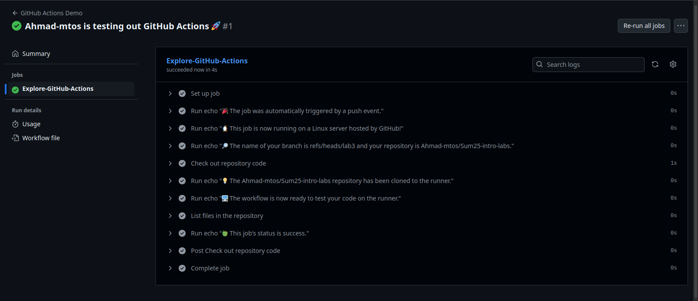

# CI/CD Lab - GitHub Actions

## Creating the first GitHub Actions Pipeline

### Observations & Findings

After going through the guide and reading it, here is what I found:

* To start a workflow we need to define it inside a specific directory, which is `.github/workflows`.
* Workflows are written in `YAML`.
* Inside the workflow we can control when a workflow triggers, alongside other things.
* GitHub Actions come with [context](https://docs.github.com/en/actions/writing-workflows/choosing-what-your-workflow-does/accessing-contextual-information-about-workflow-runs) that can be used to get information about our workflow runs, variables, runner environment, ...
* In the example used, the workflow triggers whenever we push something to the repository, and here are the results of our first workflow:

    

