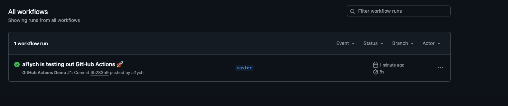
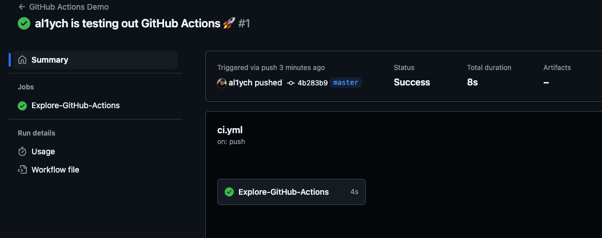
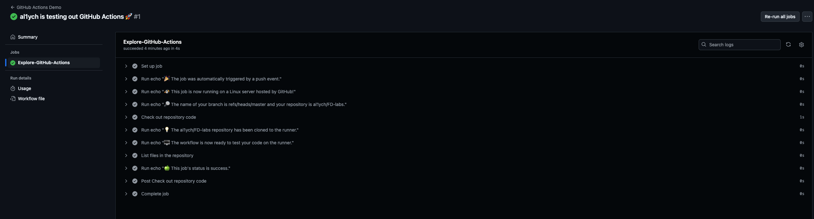
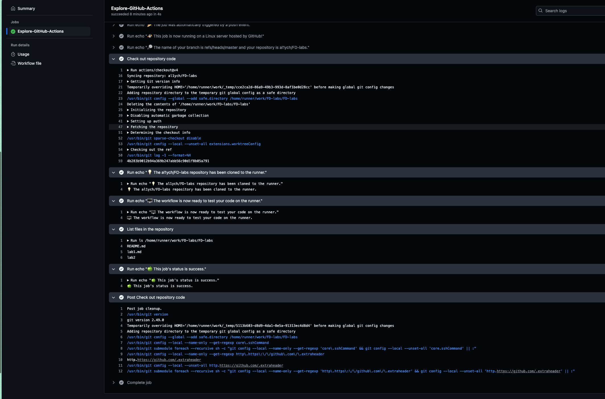

# CI/CD Lab – GitHub Actions

## Task 1: Create Your First GitHub Actions Pipeline

### 1.1 Set Up the Workflow

1. Copy CI from GitHub (the example)

```bash
mkdir -p .github/workflows
cat > .github/workflows/ci.yml << 'EOF'
name: GitHub Actions Demo
run-name: ${{ github.actor }} is testing out GitHub Actions 🚀
on: [push]
jobs:
 Explore-GitHub-Actions:
   runs-on: ubuntu-latest
   steps:
     - run: echo "🎉 The job was automatically triggered by a ${{ github.event_name }} event."
     - run: echo "🐧 This job is now running on a ${{ runner.os }} server hosted by GitHub!"
     - run: echo "🔎 The name of your branch is ${{ github.ref }} and your repository is ${{ github.repository }}."
     - name: Check out repository code
       uses: actions/checkout@v4
     - run: echo "💡 The ${{ github.repository }} repository has been cloned to the runner."
     - run: echo "🖥️ The workflow is now ready to test your code on the runner."
     - name: List files in the repository
       run: |
         ls ${{ github.workspace }}
     - run: echo "🍏 This job's status is ${{ job.status }}."
EOF
```

2. Commit & push

```bash
git add .github/workflows/ci.yml
git commit -m "add CI from example from github"
git push origin main
```

### 1.2 Observe the Workflow Execution

When I pushed to master, GH ran the CI job automatically.



As it's an example CI, it worked fine, without errors.



Here's the jobs it did in ~ under 8 second:



The outputs that we expect in the jobs execution log:



I hope this reflects the core concepts and steps I followed
