# Operating Systems & Networking

## Operating System Analysis

### 1.1: Boot Performance

1. **Analyze System Boot Time:**

    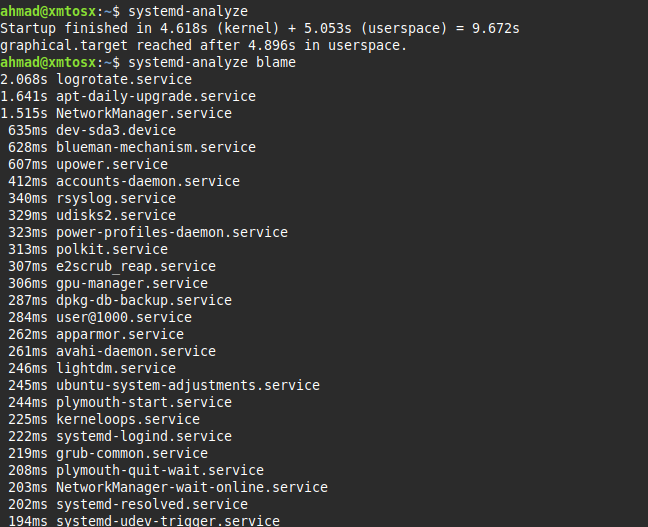

    * **Observations:**
        * Total boot time: ~9.7s (Kernel: 4.6s,  Userspace: 5.0s).
        * Graphical interface (graphical.target) reached in ~4.9s.

    * **Top Time-Consuming Services:**

        * `logrotate.service`: 2.1s
        * `apt-daily-upgrade.service`: 1.6s
        * `NetworkManager.service`: 1.5s

        These three services account for over 50% of the userspace boot time.\
        We can use this information to help understand who is affecting boot time in the system so we can optimize it.

2. **Check System Load:**

    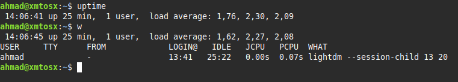

    * **Observations:**
      * **System uptime:** 25 minutes
      * **Load average (over the last 1, 5, 15 min):** (`1.76`, `2.30`, `2.09`)
      * **Logged-in users:** 1 user (ahmad)
      * **CPU time used by the user's current process:** 0.07 seconds.

    * **Utilization Patterns:**
      * The load on the system is sustained over time.
      * There is only one user active.

### 1.2: Process Forensics

1. **Identify Resource-Intensive Processes:**

    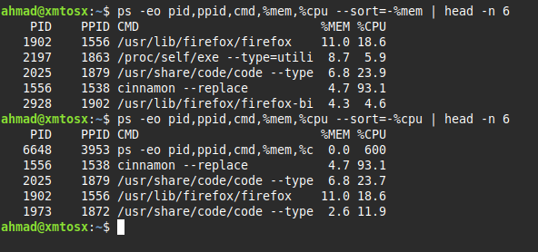

    * **Observations:**
      * **Top Memory consumer:**
        * firefox `11%`
        * exe `8.7%`
        * code `6.8%`
        * cinnamon & firefox-bi `4.7%` & `4.3%`
      * **Top CPU consumer:**
        * cinnamon `93.1%` (nearly utilizing a whole core)
        * code `23%`
        * firefox `18%`
        * code `2.6%`

        *Note: Usage of the CPU can go over `100%` depending on the number of cores in the system*

### 1.3: Service Dependencies

1. **Map Service Relationships:**

    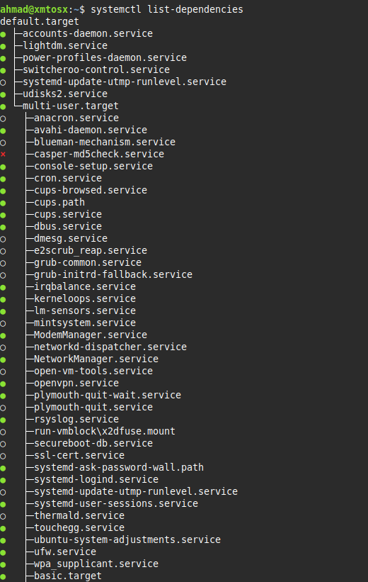

    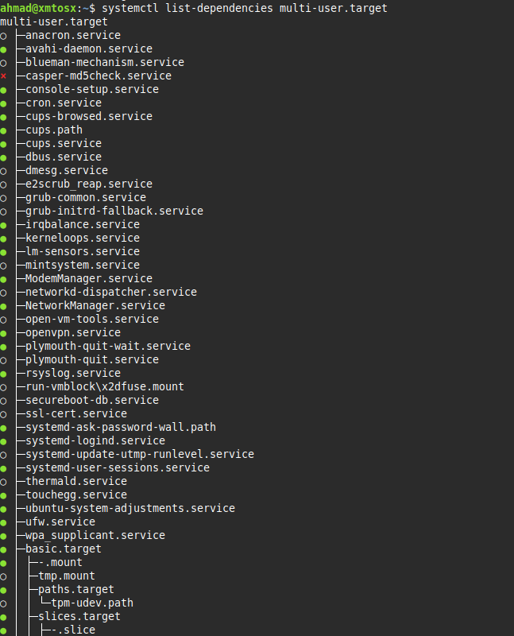

    * **Observations:**
      * Services are organized hierarchically:

        `default.target` → `multi-user.target` → essential services (`ModemManager`, `ufw`, `cron`, etc.)

      * The [multi-user.target](https://www.baeldung.com/linux/systemd-target-multi-user#the-multi-user-target) is the state where the system can accept multiple non-graphical user sessions.

      * Services are marked:
        * `●` Active/enabled
        * `○` Inactive or not enabled
        * `×` Missing or failed

        We can check services by running:

        ```bash
        systemctl status <SERVICE>
        ```

### 1.4: User Sessions

1. **Audit Login Activity:**

    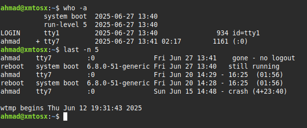

    * **Observations:**
      * **System booted:** Jun 27, 13:40
      * **Current user:** ahmad (active on GUI session tty7)
      * **Recent activity:** Only ahmad has logged in; no remote or multiple users
      * **Past sessions:** Normal usage with one crash on Jun 15

### 1.5: Memory Analysis

1. **Inspect Memory Allocation:**

    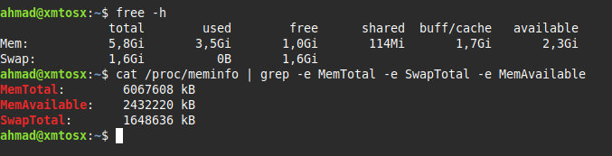

    * **Memory usage summery:**
      * **Total RAM:** 5.8 GiB
      * **Used RAM:** 3.5 GiB
      * **Free RAM:** 1.0 GiB
      * **Available RAM:** 2.3 GiB (includes reclaimable memory in buffers/cache)
      * **Swap:** 1.6 GiB total, unused

    * **Observations:**
      * Memory is moderately used; buffers/cache are actively helping.
      * No swap usage indicates RAM is currently sufficient.
      * System has about 40% RAM still available.

## Networking Analysis

### 2.1: Network Path Tracing

1. **Traceroute Execution:**

    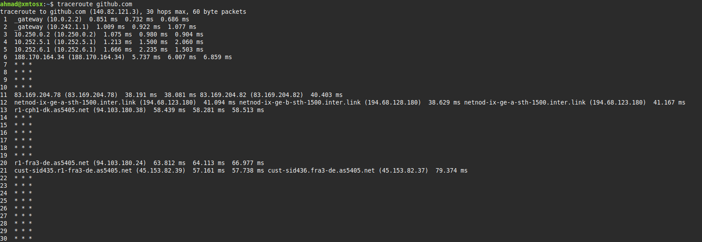

    * **Observations:**
      * We start in a private network, in that network the latency is low (`<2 ms`)
      * Once we get outside of the private network we notice a spike in latency
      * We can see the IPs of the nodes that our packets are going through, and we can investigate more about them.
      * The packets go through nodes in (`Russia`, `Sweden`, `Denmark` and `Germany`)

2. **DNS Resolution Check:**

    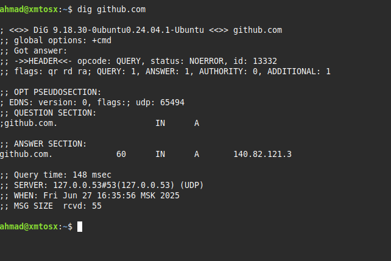

    * **Observations:**
      * In the `HEADER` section we have information about the query, we see that its a standard query with status `NOERROR` meaning that we received a response successfully.
      * In the `QUESTION` section we see the query data that we sent, which is a `A` record (address).
      * In the `ANSWER` section we see the query's response which is the IP of the address we requested.

### 2.2: Packet Capture

1. **Capture DNS Traffic:**

    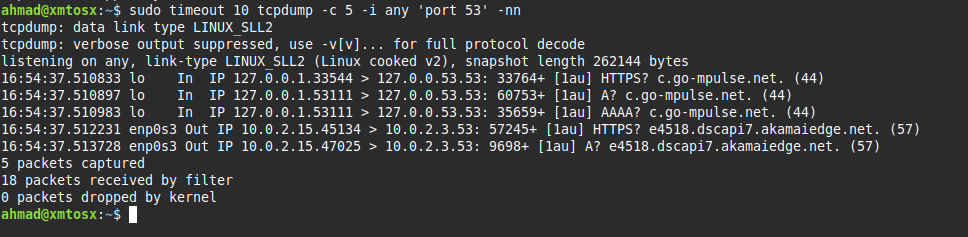

    * **Observations:**
      * All 5 packets are DNS queries (port 53), captured across loopback (lo) and external (enp0s3) interfaces.
      * Queries include record types: A, AAAA, and HTTPS.

    * **DNS query example:**
      * **Timestamp:** 16:54:37.513728
      * **Interface:** enp0s3
      * **Source:** 10.0.2.15
      * **Destination:** 10.0.2.3
      * **Protocol:** DNS (UDP)
      * **Query:**
        * Transaction ID: 9698
        * Query Type: A (IPv4 address)
        * Query Name: e4518.dscapi7.akamaiedge.net
        * Flags: [1au] (EDNS0 options present)

### 2.3: Reverse DNS

1. **Perform PTR Lookups:**

    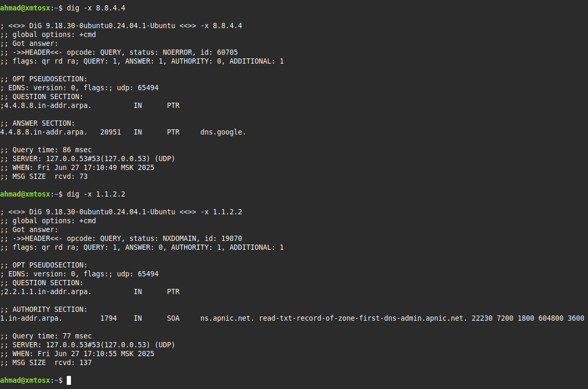

    | IP Address | PTR Record      | Status   | Notes                                                              |
    |------------|------------------|----------|--------------------------------------------------------------------|
    | 8.8.4.4    | dns.google.      | Success (`NOERROR`)  | IP owned by Google           |
    | 1.1.2.2    | (none)           | Failure (`NXDOMAIN`) | No reverse DNS name is set for that IP, and APNIC is in charge of it     |
