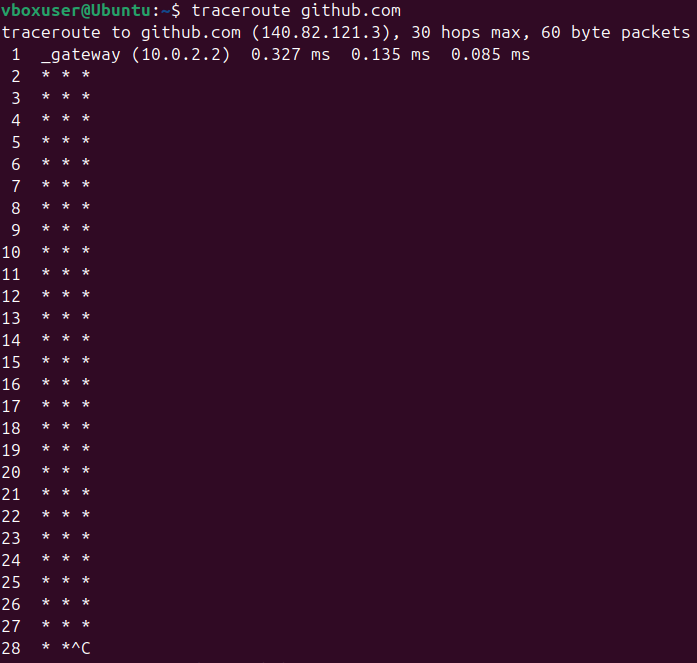

# Task 1

## Boot performance

1. System Boot Time

    `systemd-analyze` showed the overall startup time, while `systemd-analyze blame` showed what constituted the overall startup time

    

2. System load

    `uptime` and `w` show the system load. `w` provides more detailed information

    

## Process Forensics

```bash
ps -eo pid,ppid,cmd,%mem,%cpu --sort=-%mem | head -n 6
ps -eo pid,ppid,cmd,%mem,%cpu --sort=-%cpu | head -n 6
```

The above commands are used to show processes sorted by the amount of memory and cpu power they take up. 

`/usr/bin/gnome-shell` is the most memory and cpu intensive process


## Service Dependencies

```bash
systemctl list-dependencies
```

The above command lists dependencies (shocking)


```bash
systemctl list-dependencies multi-user.target
```

The above command does the same but for a multi-user.target and not a default one


## User Sessions

```bash
who -a
last -n 5
```

The first command shows the current login information and the last command shows the last 5 logins


## Memory Analysis

```bash
free -h
cat /proc/meminfo | grep -e MemTotal -e SwapTotal -e MemAvailable
```

The first command shows general information about RAM, while the last one shows specific information from the /proc/meminfo file


# Task 2

## Network Path Tracing

1. Traceroute Execution:
    
    Command:
    ```bash
    traceroute github.com
    ```

    Output:

    

    - Only the first hop was successfully displayed
    - The rest of the hops are unavailable

2. DNS Resolution Check

    Command:

    ```bash
    dig github.com
    ```

    Output:

    

    - DNS request successfully allowed domain github.com for IP of 140.82.121.3
    - Got a response from the local DNS-server 127.0.0.53

## Packet Capture

```bash
sudo timeout 10 tcpdump -c 5 -i any 'port 53' -nn
```


- There were no DNS requests during the execution of this command :>

## Reverse DNS

Command:

```bash
dig -x 8.8.4.4
```

Output:


- Successful reverse DNS lookup: IP `8.8.4.4` resolved to `dns.google`

Command:

```bash
dig -x 1.1.2.2
```

Output:


- Reverse DNS lookup for IP `1.1.2.2` failed — no PTR record found (NXDOMAIN).

## Summary

- ICMP-based path tracing (traceroute) appears restricted by the network or provider.
- DNS queries are functioning correctly via the local resolver.
- DNS packet capture showed no traffic due to lack of activity during capture.
- Reverse DNS lookups work selectively depending on IP address — 8.8.4.4 resolved, 1.1.2.2 did not.