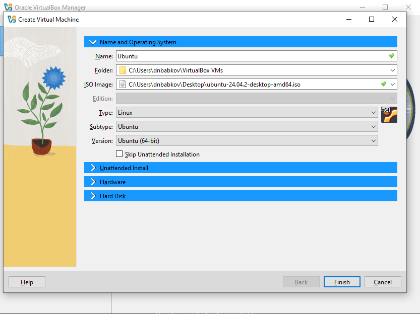
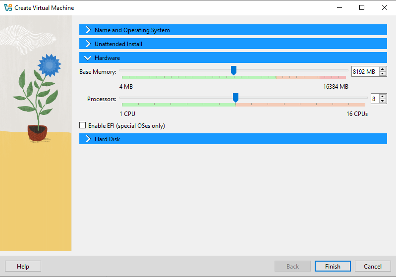
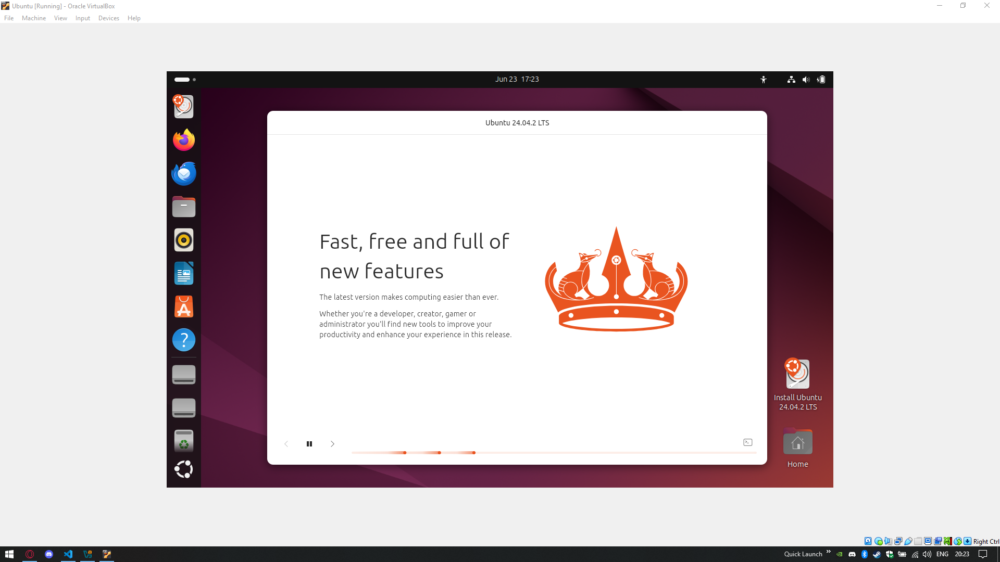
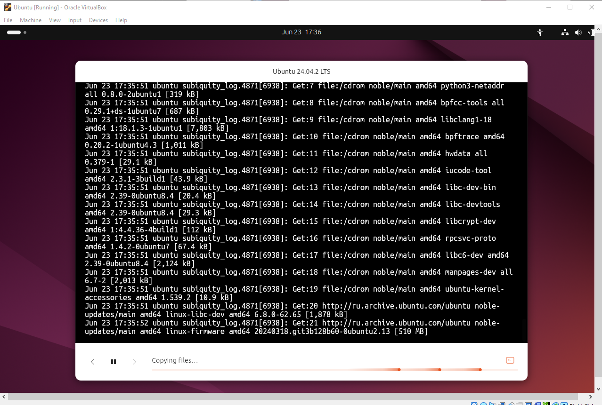
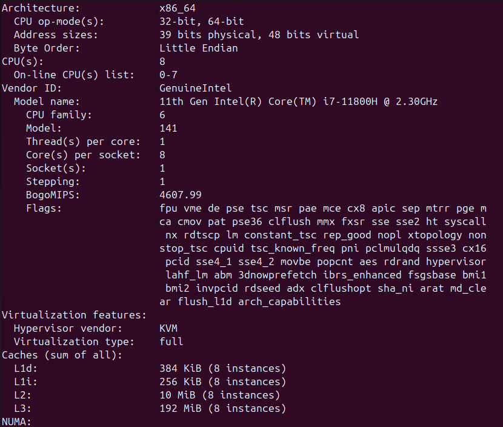
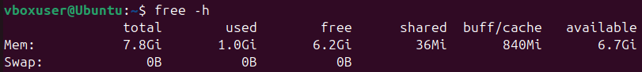
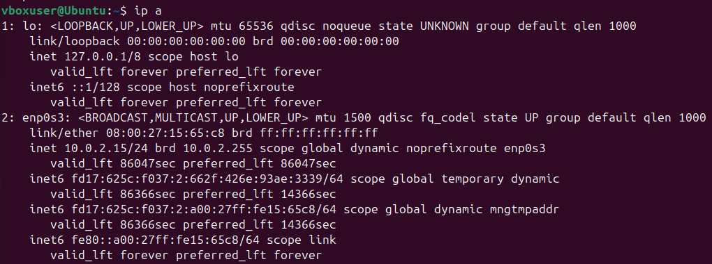
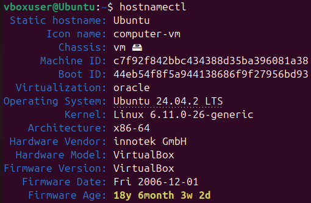

# Task 1

## VirtualBox

VirtualBox version: 7.1.10

## Installation process







## Installed VM


# Task 2

## Processor, RAM, and Network Information

### Processor

Command used:

```bash
lscpu
```

Output:



### RAM

Command used:

```bash
free -h
```

Output:



### Network

Command used:

```bash
ip a
```

Output:



## OS specifications

Command used:

```bash
hostnamectl
```

