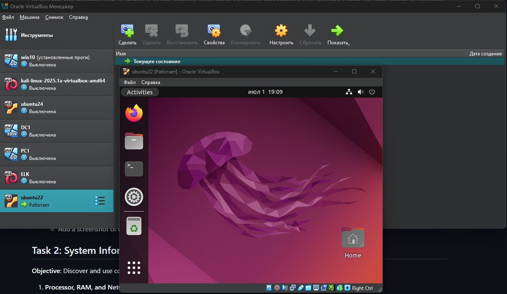

# Лабораторная работа по виртуализации

## Задание 1: Развертывание ВМ

### 1.Установка VirtualBox:

- Версия 7.1.8 r168469 (Qt6.5.3)

### 2.Развертывание виртуальной машины:

- Ubuntu 22.04
- Выделил 6000 мб оперативки
- 4 ЦПУ
- 20 гб памяти
- Включил первый сетевой адаптер в режиме сетевой мост
- Настроил общую папку
- Остальное дефолту



## Задание 2: Инструменты системной информации

### 1.Информация о процессоре, ОЗУ и сети

- neofetch - универсальный инструмент для отображения системной информации:
```
user@user-VirtualBox:~$ neofetch
            .-/+oossssoo+/-.               user@user-VirtualBox 
        `:+ssssssssssssssssss+:`           -------------------- 
      -+ssssssssssssssssssyyssss+-         OS: Ubuntu 22.04.5 LTS x86_64 
    .ossssssssssssssssssdMMMNysssso.       Host: VirtualBox 1.2 
   /ssssssssssshdmmNNmmyNMMMMhssssss/      Kernel: 6.8.0-60-generic 
  +ssssssssshmydMMMMMMMNddddyssssssss+     Uptime: 9 mins 
 /sssssssshNMMMyhhyyyyhmNMMMNhssssssss/    Packages: 1768 (dpkg), 9 (snap) 
.ssssssssdMMMNhsssssssssshNMMMdssssssss.   Shell: bash 5.1.16 
+sssshhhyNMMNyssssssssssssyNMMMysssssss+   Resolution: 1920x966 
ossyNMMMNyMMhsssssssssssssshmmmhssssssso   DE: GNOME 42.9 
ossyNMMMNyMMhsssssssssssssshmmmhssssssso   WM: Mutter 
+sssshhhyNMMNyssssssssssssyNMMMysssssss+   WM Theme: Adwaita 
.ssssssssdMMMNhsssssssssshNMMMdssssssss.   Theme: Yaru [GTK2/3] 
 /sssssssshNMMMyhhyyyyhdNMMMNhssssssss/    Icons: Yaru [GTK2/3] 
  +sssssssssdmydMMMMMMMMddddyssssssss+     Terminal: gnome-terminal 
   /ssssssssssshdmNNNNmyNMMMMhssssss/      CPU: 13th Gen Intel i5-13500 (4) @ 2.495GHz 
    .ossssssssssssssssssdMMMNysssso.       GPU: 00:02.0 VMware SVGA II Adapter 
      -+sssssssssssssssssyyyssss+-         Memory: 1011MiB / 5862MiB 
```

- lscpu  (CPU)
```
user@user-VirtualBox:~$ lscpu
Architecture:             x86_64
  CPU op-mode(s):         32-bit, 64-bit
  Address sizes:          46 bits physical, 48 bits virtual
  Byte Order:             Little Endian
CPU(s):                   4
  On-line CPU(s) list:    0-3
Vendor ID:                GenuineIntel
  Model name:             13th Gen Intel(R) Core(TM) i5-13500
    CPU family:           6
    Model:                191
    Thread(s) per core:   1
    Core(s) per socket:   4
    Socket(s):            1
    Stepping:             2
    BogoMIPS:             4991.99
    Flags:                fpu vme de pse tsc msr pae mce cx8 apic sep mtrr pge mca cmov pat pse36 clflush mmx fxsr sse sse2 ht syscall nx rdtscp lm constant_tsc rep_good nopl xtopology nonstop_tsc cpuid t
                          sc_known_freq pni pclmulqdq ssse3 cx16 sse4_1 sse4_2 movbe popcnt aes rdrand hypervisor lahf_lm abm 3dnowprefetch ibrs_enhanced fsgsbase bmi1 bmi2 invpcid rdseed adx clflushopt s
                          ha_ni arat md_clear flush_l1d arch_capabilities
Virtualization features:  
  Hypervisor vendor:      KVM
  Virtualization type:    full
Caches (sum of all):      
  L1d:                    192 KiB (4 instances)
  L1i:                    128 KiB (4 instances)
  L2:                     5 MiB (4 instances)
  L3:                     96 MiB (4 instances)
NUMA:                     
  NUMA node(s):           1
  NUMA node0 CPU(s):      0-3
Vulnerabilities:          
  Gather data sampling:   Not affected
  Itlb multihit:          Not affected
  L1tf:                   Not affected
  Mds:                    Not affected
  Meltdown:               Not affected
  Mmio stale data:        Not affected
  Reg file data sampling: Mitigation; Clear Register File
  Retbleed:               Mitigation; Enhanced IBRS
  Spec rstack overflow:   Not affected
  Spec store bypass:      Vulnerable
  Spectre v1:             Mitigation; usercopy/swapgs barriers and __user pointer sanitization
  Spectre v2:             Mitigation; Enhanced / Automatic IBRS; RSB filling; PBRSB-eIBRS SW sequence; BHI SW loop, KVM SW loop
  Srbds:                  Not affected
  Tsx async abort:        Not affected
```

- free -h  память
```
user@user-VirtualBox:~$ free -h
               total        used        free      shared  buff/cache   available
Mem:           5,7Gi       959Mi       3,5Gi        41Mi       1,3Gi       4,5Gi
Swap:          2,0Gi          0B       2,0Gi
```

- ip a (сеть)
```
user@user-VirtualBox:~$ ip a
1: lo: <LOOPBACK,UP,LOWER_UP> mtu 65536 qdisc noqueue state UNKNOWN group default qlen 1000
    link/loopback 00:00:00:00:00:00 brd 00:00:00:00:00:00
    inet 127.0.0.1/8 scope host lo
       valid_lft forever preferred_lft forever
    inet6 ::1/128 scope host 
       valid_lft forever preferred_lft forever
2: enp0s3: <BROADCAST,MULTICAST,UP,LOWER_UP> mtu 1500 qdisc fq_codel state UP group default qlen 1000
    link/ether 08:00:27:6a:72:ba brd ff:ff:ff:ff:ff:ff
    inet 192.168.110.157/24 brd 192.168.110.255 scope global dynamic noprefixroute enp0s3
       valid_lft 6352sec preferred_lft 6352sec
    inet6 fe80::5a1:438c:fb16:edb8/64 scope link noprefixroute 
       valid_lft forever preferred_lft forever
3: br-77c3b523bb1f: <BROADCAST,MULTICAST,UP,LOWER_UP> mtu 1500 qdisc noqueue state UP group default 
    link/ether 1e:65:88:2c:fe:b9 brd ff:ff:ff:ff:ff:ff
    inet 10.10.0.1/16 brd 10.10.255.255 scope global br-77c3b523bb1f
       valid_lft forever preferred_lft forever
    inet6 fe80::1c65:88ff:fe2c:feb9/64 scope link 
       valid_lft forever preferred_lft forever
4: docker0: <NO-CARRIER,BROADCAST,MULTICAST,UP> mtu 1500 qdisc noqueue state DOWN group default 
    link/ether 46:9e:28:48:a3:08 brd ff:ff:ff:ff:ff:ff
    inet 172.17.0.1/16 brd 172.17.255.255 scope global docker0
       valid_lft forever preferred_lft forever
5: vethcc9d51b@if2: <BROADCAST,MULTICAST,UP,LOWER_UP> mtu 1500 qdisc noqueue master br-77c3b523bb1f state UP group default 
    link/ether fe:51:f2:ff:98:04 brd ff:ff:ff:ff:ff:ff link-netnsid 0
    inet6 fe80::fc51:f2ff:feff:9804/64 scope link 
       valid_lft forever preferred_lft forever
```


### 2.Информация об операционной системе

- uname - базовая информация о системе:
```
user@user-VirtualBox:~$ uname -a
Linux user-VirtualBox 6.8.0-60-generic #63~22.04.1-Ubuntu SMP PREEMPT_DYNAMIC Tue Apr 22 19:00:15 UTC 2 x86_64 x86_64 x86_64 GNU/Linux
```

- lsb_release - информация о дистрибутиве:
```
user@user-VirtualBox:~$ lsb_release -a
No LSB modules are available.
Distributor ID:	Ubuntu
Description:	Ubuntu 22.04.5 LTS
Release:	22.04
Codename:	jammy

```

- hostnamectl - детальная информация о системе:
```
user@user-VirtualBox:~$ hostnamectl
 Static hostname: user-VirtualBox
       Icon name: computer-vm
         Chassis: vm
      Machine ID: 92880c1e46ce4f0bbaf7ae80fece4d0d
         Boot ID: 2a634a1ed6ce45e9b934f6b8b5613062
  Virtualization: oracle
Operating System: Ubuntu 22.04.5 LTS              
          Kernel: Linux 6.8.0-60-generic
    Architecture: x86-64
 Hardware Vendor: innotek GmbH
  Hardware Model: VirtualBox

```
