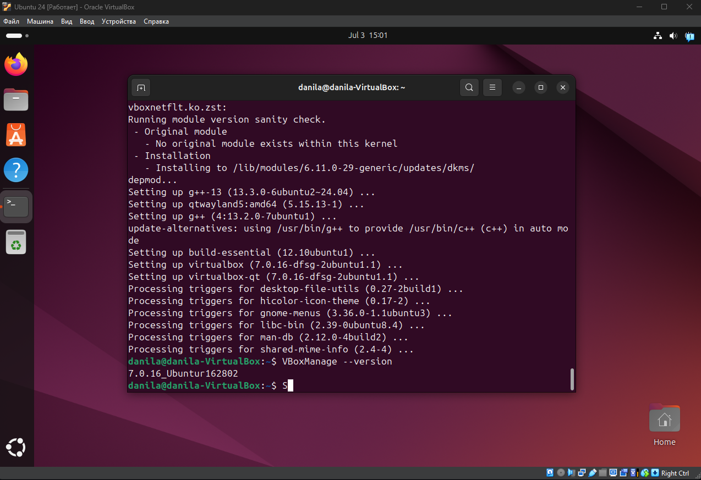

# Lab 5 Report: Virtualization Lab

## Task 1: VM Deployment

### VirtualBox Version

**Version VirtualBox:** 7.0.16_Ubuntu

### Steps for VM Deployment
1. Created new VM in VirtualBox: "Ubuntu 24"
2. Chose OS type: Linux, Ubuntu (64-bit)
3. Settings:
   - **RAM:** 8192 MB 
   - **CPU:** 12 cores
   - **Storage:** 100 GB (VDI, dynamic)
   - **Network:** NAT
4. ISO-file Ubuntu 24.04 LTS
5. Default installation

### VM Screenshot


---

## Task 2: System Information Tools

### Processor Information

**Tool:** `lscpu`  
**Command:**
```bash
lscpu
```
**Output (shortened for clarity):**
```bash
Architecture:             x86_64
  CPU op-mode(s):         32-bit, 64-bit
  Address sizes:          46 bits physical, 48 bits virtual
  Byte Order:             Little Endian
CPU(s):                   12
  On-line CPU(s) list:    0-11
Vendor ID:                GenuineIntel
  Model name:             13th Gen Intel(R) Core(TM) i7-13700K
    CPU family:           6
    Model:                183
    Thread(s) per core:   1
    Core(s) per socket:   12
    Socket(s):            1
    Stepping:             1
    BogoMIPS:             6835.19
   ...
```

### RAM Information

**Tool:** `free`  
**Command:**
```bash
free -h
```
**Output:**
```bash
               total        used        free      shared  buff/cache   available
Mem:           7.8Gi       2.0Gi       3.6Gi        82Mi       2.5Gi       5.7Gi
Swap:          4.0Gi          0B       4.0Gi
```

### Network Information

**Tool:** `ip` 

**Command:**
```bash
ip a
```
**Output:**
```bash
1: lo: <LOOPBACK,UP,LOWER_UP> mtu 65536 qdisc noqueue state UNKNOWN group default qlen 1000
    link/loopback 00:00:00:00:00:00 brd 00:00:00:00:00:00
    inet 127.0.0.1/8 scope host lo
       valid_lft forever preferred_lft forever
    inet6 ::1/128 scope host noprefixroute 
       valid_lft forever preferred_lft forever
2: enp0s3: <BROADCAST,MULTICAST,UP,LOWER_UP> mtu 1500 qdisc fq_codel state UP group default qlen 1000
    link/ether [MAC_ADDRESS_REDACTED] brd ff:ff:ff:ff:ff:ff
    inet [IP_ADDRESS_REDACTED]/24 brd 10.0.2.255 scope global dynamic noprefixroute enp0s3
       valid_lft 84250sec preferred_lft 84250sec
    inet6 [IPV6_ADDRESS_REDACTED]/64 scope global temporary dynamic 
       valid_lft 85910sec preferred_lft 13910sec
    inet6 fd17:625c:f037:2:a00:27ff:feea:be83/64 scope global dynamic mngtmpaddr 
       valid_lft 85910sec preferred_lft 13910sec
    inet6 fe80::a00:27ff:feea:be83/64 scope link 
       valid_lft forever preferred_lft forever
```

### OS Specifications

**Tool:** `lsb_release` 

**Command:**
```bash
lsb_release -a
```

**Output:**
```bash
No LSB modules are available.
Distributor ID: Ubuntu
Description: Ubuntu 24.04.2 LTS
Release: 24.04
Codename: noble
```