# Virtualization Lab

## VM Deployment

1. **VirtualBox version:**

    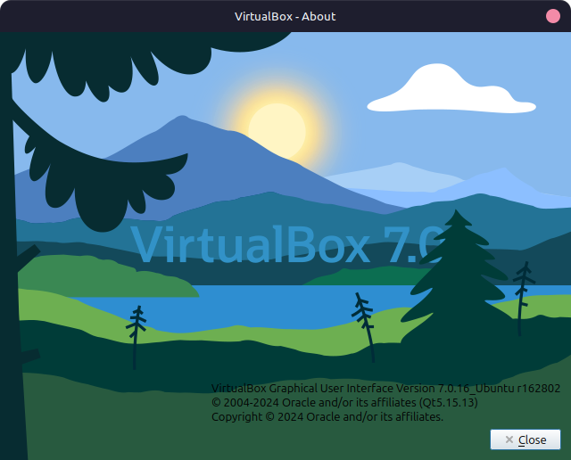

2. **Setting up the VM:**

    * We have to download an ISO file for the operating system we want to install on the VM. I chose **Ubuntu 24.04 LTS**.
    * Once we have the ISO file ready, we can start setting up the VM:
        * First, we choose the VM's specifications such as name, type, and version.

            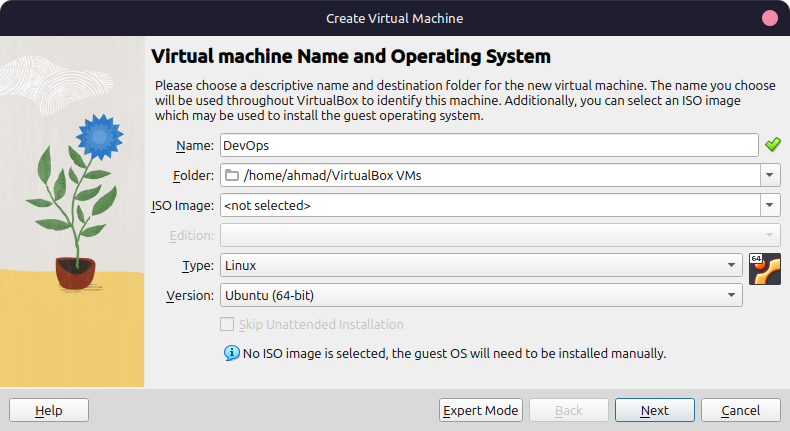

        * Next, we allocate memory to the VM and number of processors. I chose ~ 6GB of RAM and 4 processors.

            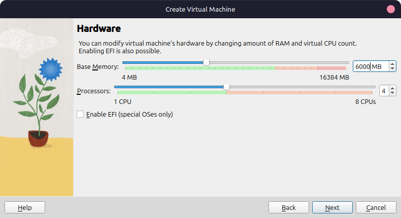

        * Then, we create a virtual hard disk. I chose a dynamically allocated disk with a size of 25GB. *(This will be used incase we want to install the OS on the VM)*

            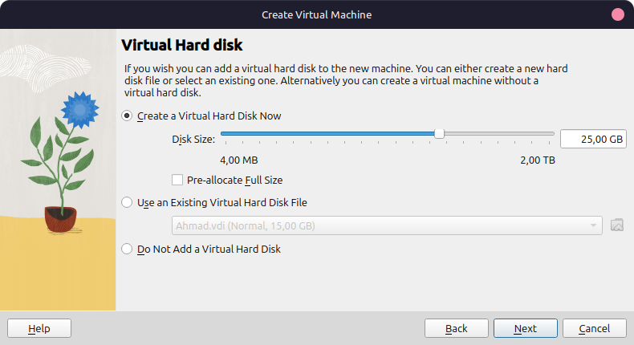

        * Once we are done we will see the summary of the VM configuration.

            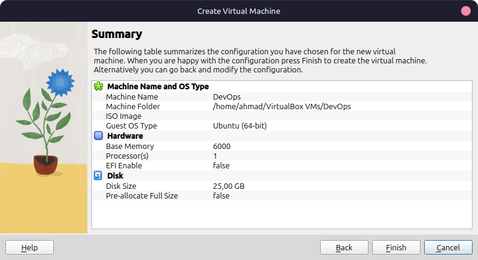

        * Finally, we start the VM and select the downloaded ISO file as the boot disk.

            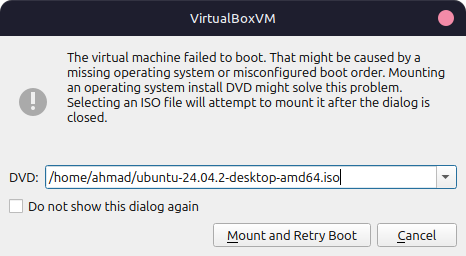

    * Once we restart, we can start using it, first we will see the boot screen (I am using Ubuntu so it's `grub`)

        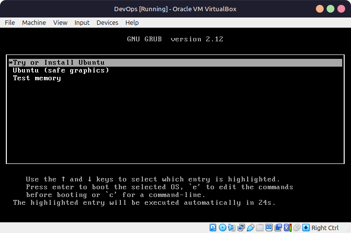

    * Finally, after booting into the VM, we can start using the operating system, either by installing it into the hard disk or running it live from the ISO. *(Installing it is recommended in case of long-term use)*

        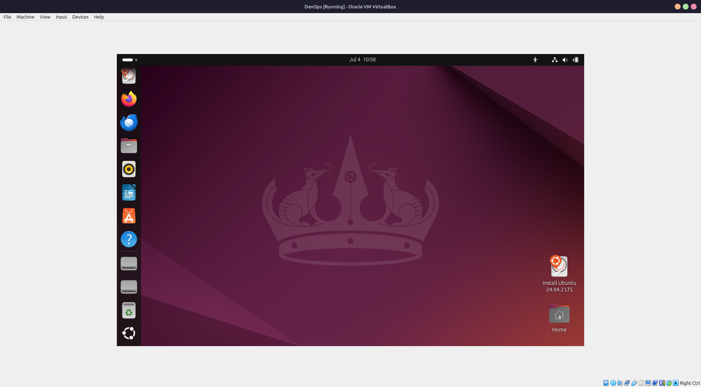

## System Information Tools

### Processor, RAM, and Network Information

#### `neofetch`

* **Installation:**

    ```bash
    sudo apt update
    sudo apt install neofetch
    ```

* **Command:**

    ```bash
    neofetch
    ```

* **Output:**

    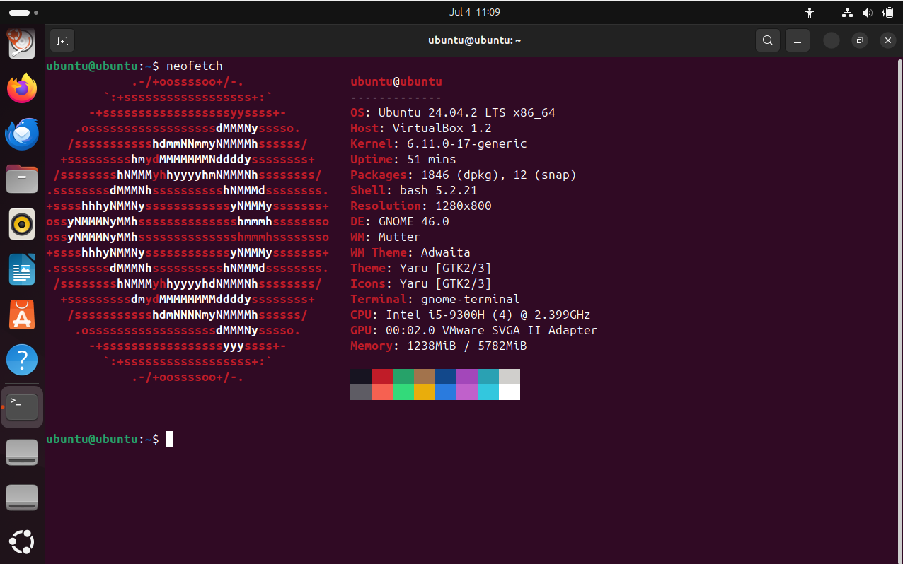

#### Alternative Built-in Commands for Specific Information

* **Processor Information:**
  * Command: `lscpu`
  * Output:

    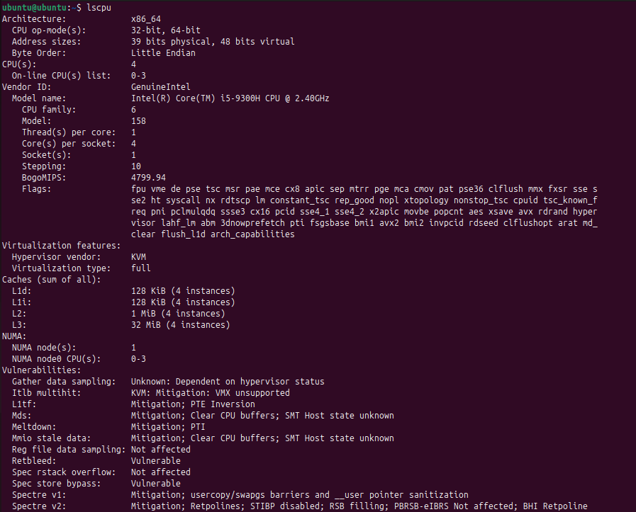

* **RAM Information:**
  * Command: `free -h`
  * Output:

    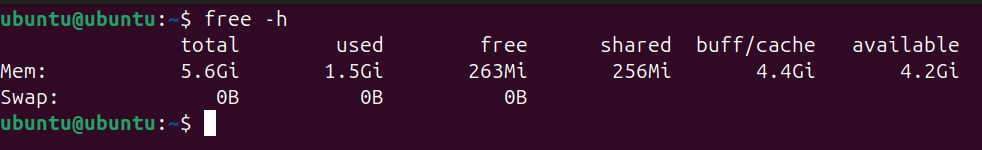

* **Network Information:**
  * Command: `ip addr show`
  * Output:

    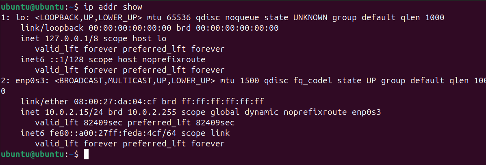

### Operating System Specifications

#### `hostnamectl`

* **Command:**

    ```bash
    hostnamectl
    ```

* **Output:**

    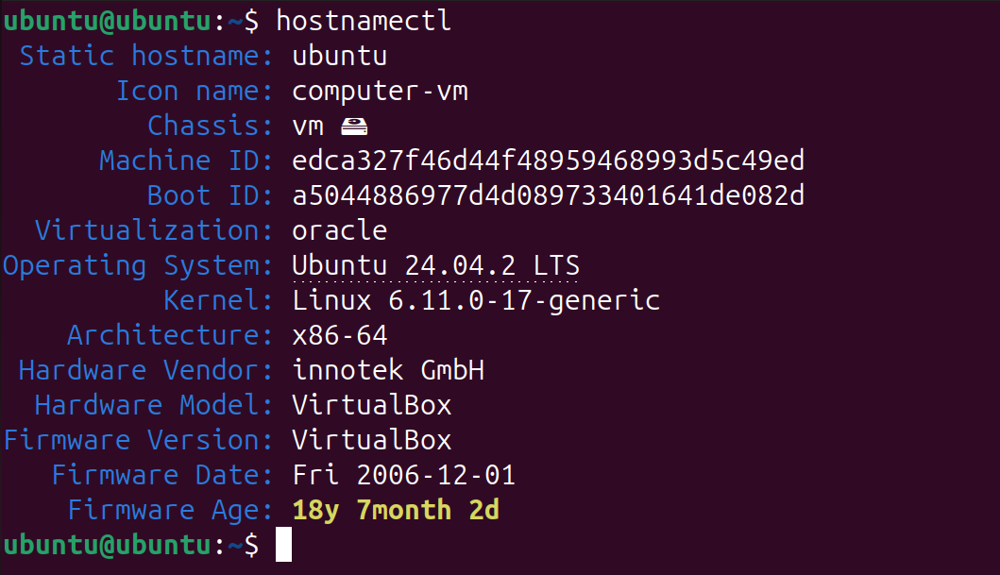

#### `uname`

* **Command:**

    ```bash
    uname -a
    ```

* **Output:**

    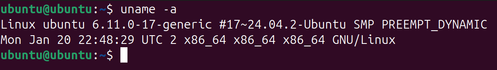
