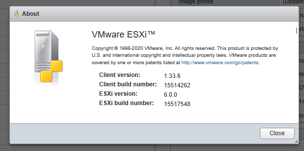
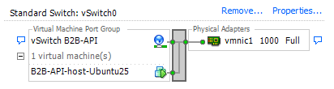
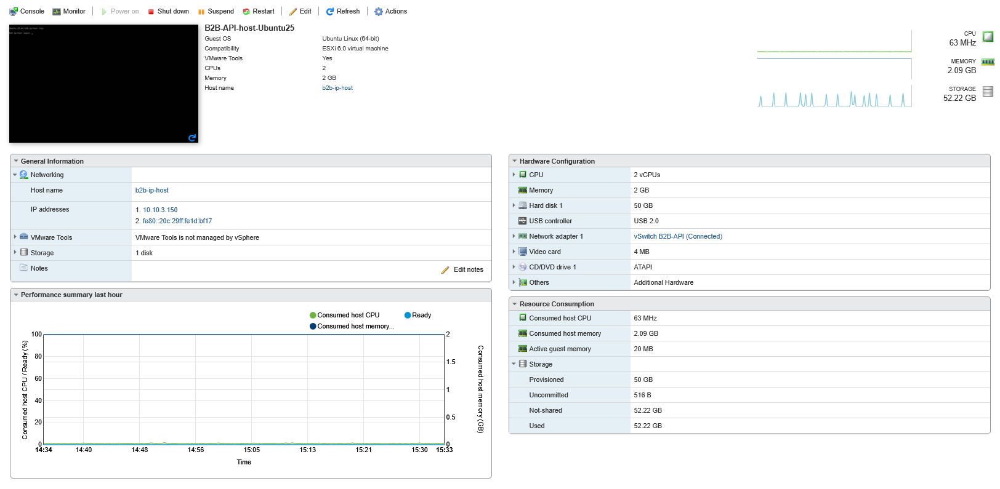

# Virtualization Lab

In this lab, you will learn how to deploy a Virtual Machine (VM) using VirtualBox and customize its settings. Follow the tasks below to complete the lab assignment.

## Task 1: VM Deployment

### 1. **Install hypervisor**

I've got predeployed **Type 1** (bare-metal) hypervisor - ESXi 6.0.0



I can accessing the ESXi Host:

- Using VMware vSphere Client (Windows application)
- Using VMware Host Client (Web interface)

### 2. **Deploy a Virtual Machine**

I needed a host for my B2B-API scrapper project.

I deployed **Ubuntu Server 25.04** - [download link](https://ubuntu.com/download/server/thank-you?version=25.04&architecture=amd64)

#### Step 1. Creating a Virtual Switch (vSwitch) in VMware ESXi

To enable VM networking, I first created a vSwitch on the ESXi host:

- Logged into the ESXi Host Client web interface.
- Navigated to Networking > Virtual switches.
- Clicked Add standard virtual switch.
- Assigned a name (e.g., vSwitch1).
- Added physical NICs (vmnics) to the vSwitch to connect it to the physical network.
- Saved the configuration.



This vSwitch acts as a virtual network bridge between VMs and the physical network.

#### Step 2. Configuring a Network (Port Group) on the vSwitch

After creating the vSwitch, I set up a Port Group to manage VM network connections:

- In Networking > Port groups, clicked Add port group.
- Named it (e.g., VM_Network).
- Selected the previously created vSwitch (vSwitch1).
- Set VLAN ID if required (left default for no VLAN).
- Applied and saved.

This port group defines how VMs connect to the network via the vSwitch.

> I do not need a port group setup

#### Step 3. Creating a Virtual Machine (VM) in VirtualBox with Ubuntu OS

Creating a VM is simple process that I've done in Web interface with VM Creation Wizard.

```txt
Configuration:

CPU: 2vCPUs
Memory: 2 GB
Hard disk: 50 GB
NIC: 1 × VMXNET3
OS: Ubuntu Server 25.04 (64-bit)
```



> *Screenshot of the running VM*

## Task 2: System Information Tools
