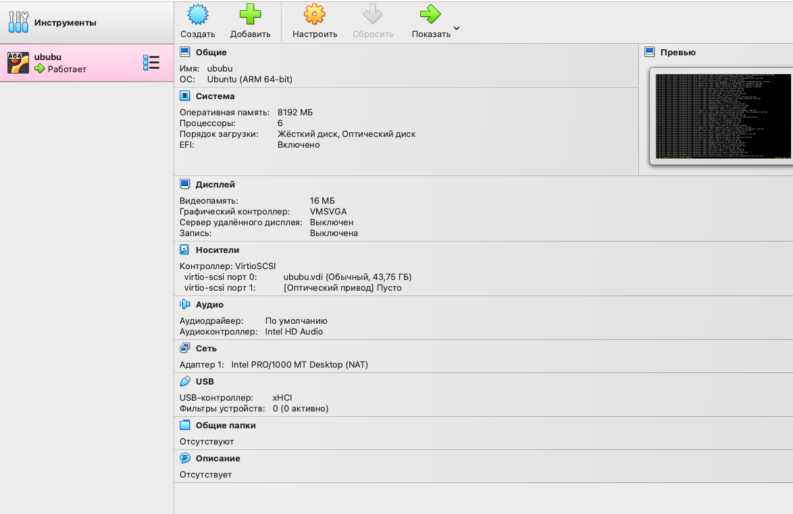
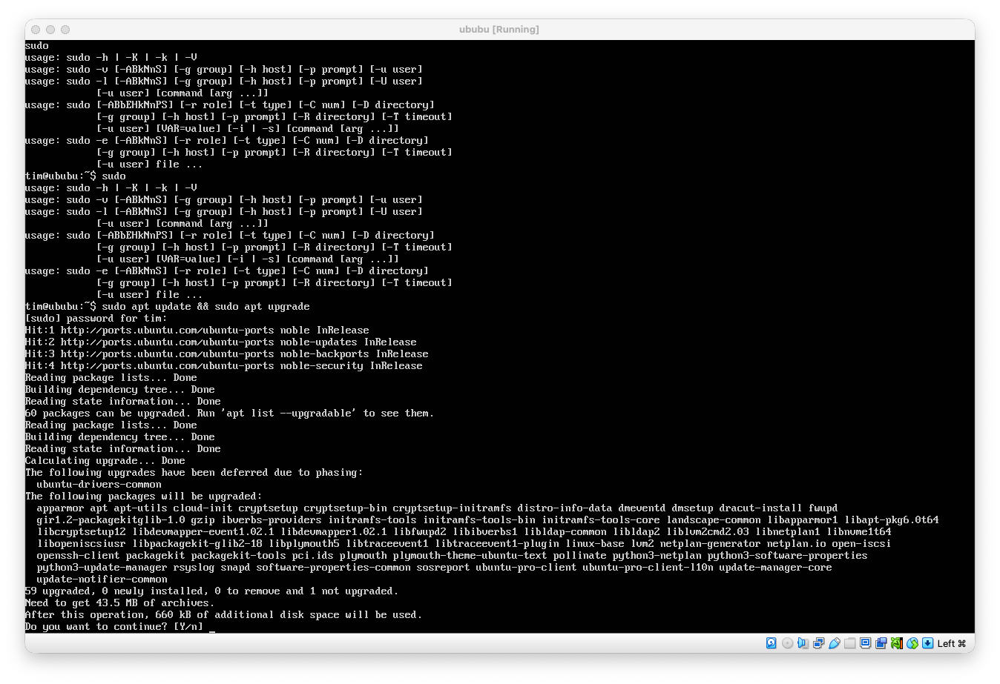
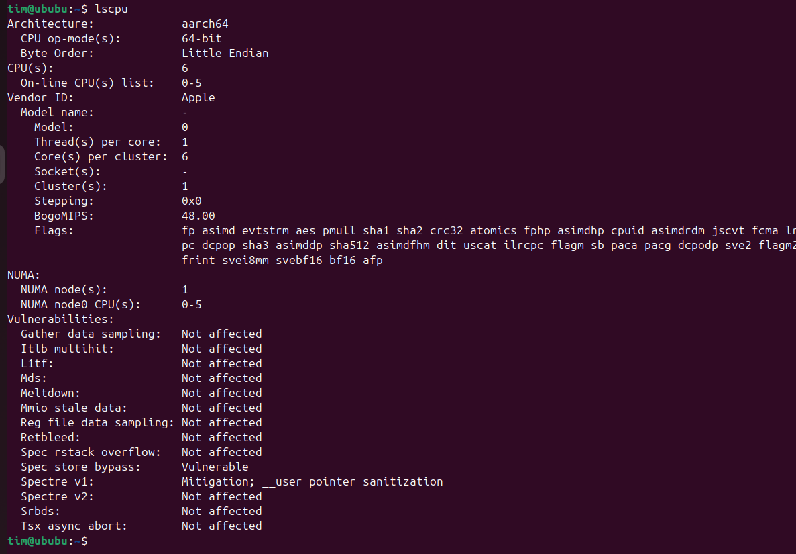
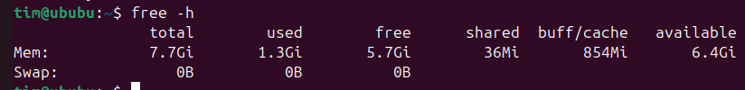
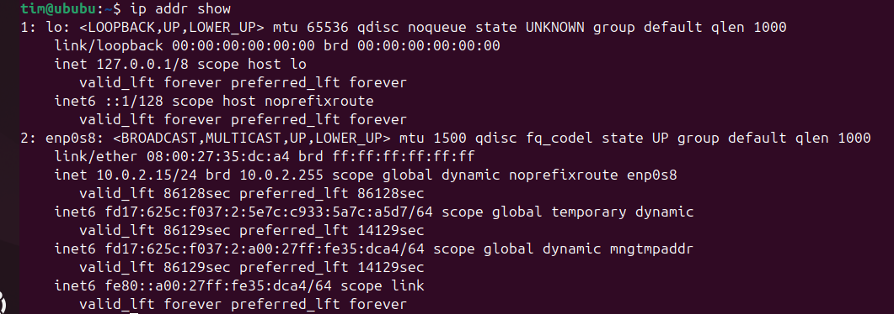
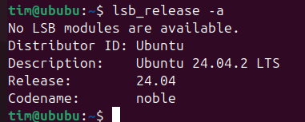

# Lab 5

Timur Nugaev

## task 1

i installed VirtualBox and Ubuntu (had a lot of trouble running it on mac silicon, but in the end i managed to run it on arm acrhitecture)

version: Версия 7.1.10 r169112 (Qt6.5.3)

i gave the machine 8 gigs of RAM, 6 cpu cores.

screenshot of the VM running:

as it was not specified in the assignments, i did not install GUI for the system, so it's live server version of ubuntu (the only one i could find compatible with ARM).

upd: i did get it running by using `sudo apt install ubuntu-desktop` which is not particularly important to the lab solution, but the rest of the screens are in GUI terminal.

## task 2

about processor: `lscpu`

goes preinstalled

output:

this just gives us general information on the CPU, architecture, etc.

---

about ram: `free -h`

goes preinstalled

output:

this shows how much RAM is left, how much is being used, etc.

---

about network: `ip addr show`

goes preinstalled

output:

shows all network interfaces with their IP addresses, netmasks, and MAC addresses.

---

about OS specifications: `lsb_release -a`

to use this one i had to do `sudo apt install lsb-release`

Output:

prints distribution information: Distributor ID, release number, codename, etc.