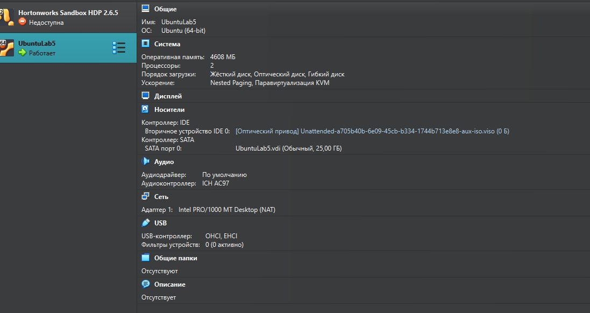
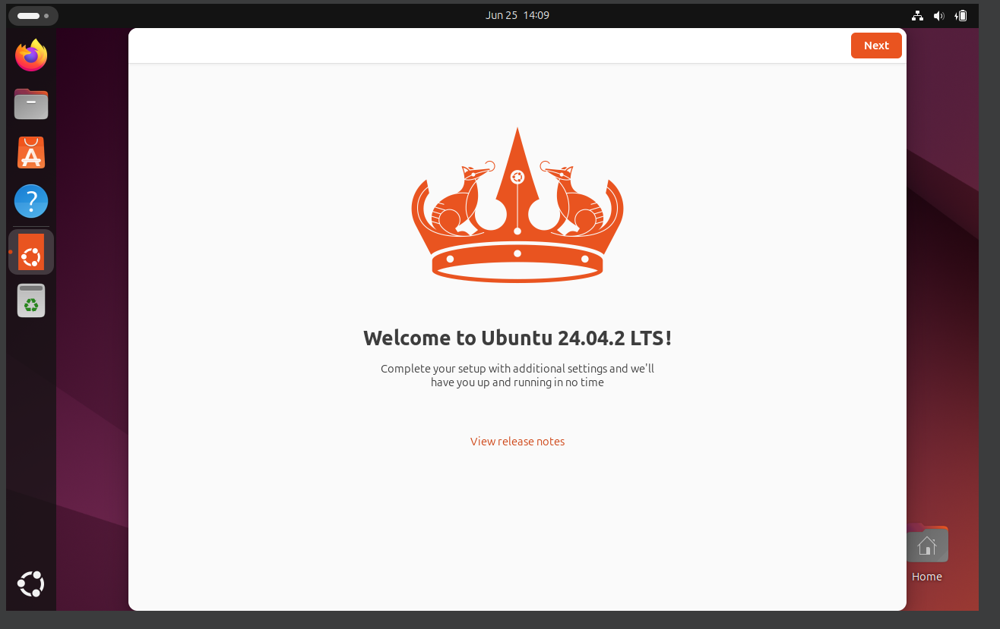

# Task 1 VM Deployment

## 1.1 VirtualBox

VirtualBox version: 7.1.10

## Installation



## Installed VM




# Task 2 System Inforamation Tools


## 2.1 Processor

Command used:

```bash
lscpu
```

Output:


### 2.2 RAM

Command used:

```bash
free -h
```

Output:


### 2.3 Network

Command used:

```bash
ip a
```

Output:


## 2.4 OS specifications

Command used:

```bash
hostnamectl
```

