# Task 0

Size of the original image is 75MB, while the size of the .tar file is 77MB. This is because:

- Docker save packs every layer in full—even if some layers are duplicates of those in other images—whereas Docker’s local storage deduplicates shared layers and counts them only once.
- The TAR format adds about 512 bytes of header data for each file it contains.

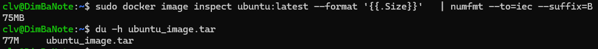

# Task 1

1. List containers

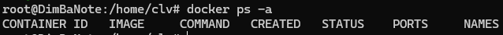

This command shows that there are no running docker images

2. Pull Ubuntu Image

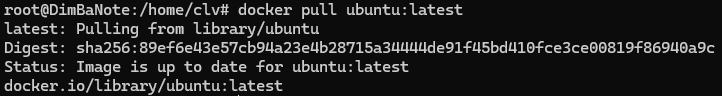

This step was already performed in order to complete Task 0.

The size of the image is 78.1 MB

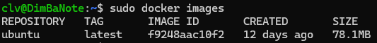

3. Run Interactive Container

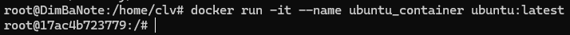

Container is running

4. Remove Image

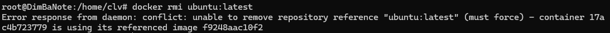

The removal fails because Docker won’t delete an image that’s still in use by a container. Container must be first stopped and removed before the image can be removed. (or it can also be forced)

# Task 2

1. Deploy Nginx

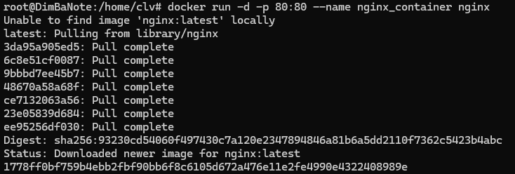
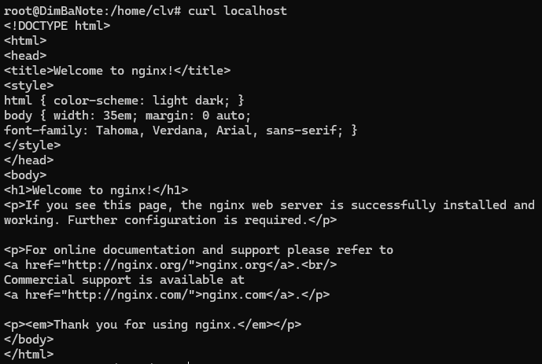

2. Customize Website

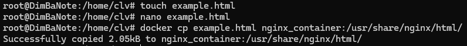

3. Create Custom Image

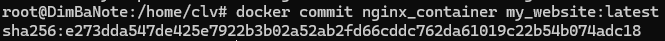

4. Remove Original Container

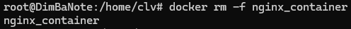
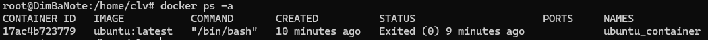

Container successfully removed

5. Create New Container:

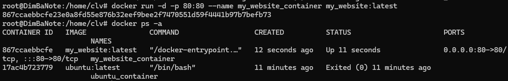

New container successfully created

6. Test Web Server

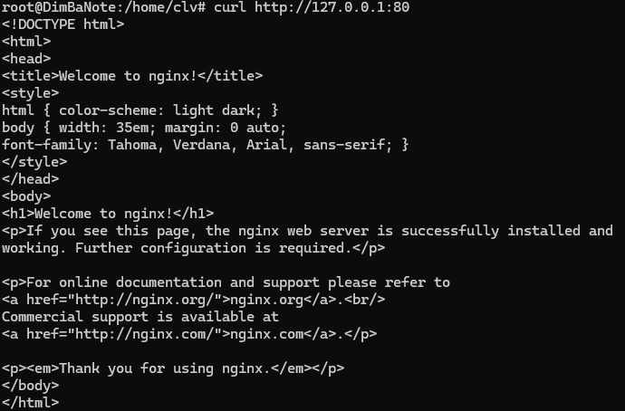

7. Analyze Image Changes

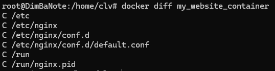

The `docker diff my_website_container` command is showing exactly what’s changed in the container’s filesystem compared to the original image. Each line starts with a code:

A — Added
C — Changed
D — Deleted

Which means that the output is showing that I've made changes in the directories listed.

# Task 3

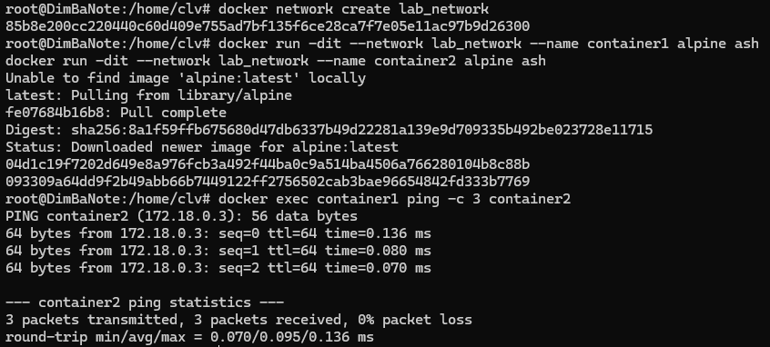

Embedded DNS server
- When a user-defined bridge network is created (here: lab_network), the Docker daemon injects an embedded DNS resolver into every container on that network.
- Inside each container, /etc/resolv.conf points to 127.0.0.11 (the embedded DNS).

Name registration
- As soon as a container is started with --name, Docker registers that name (and any aliases) in the network’s DNS namespace, mapping it to the container’s IP on that network.

Query flow
- When container1 does ping container2, it queries the embedded DNS at 127.0.0.11.
- The embedded DNS returns the IP address of container2 on lab_network (e.g. 172.18.0.3).

Fallback to upstream
- If the embedded DNS has no record, it forwards the query to the Docker daemon’s configured upstream DNS servers (inherited from the host or set in daemon.json).

Network scoping
- Each user-defined network has its own DNS namespace. Two containers with the same name on different networks won’t conflict, because their names are only visible within their own network.

# Task 4

1. Create Volume, Run Container with Volume, Modify Content

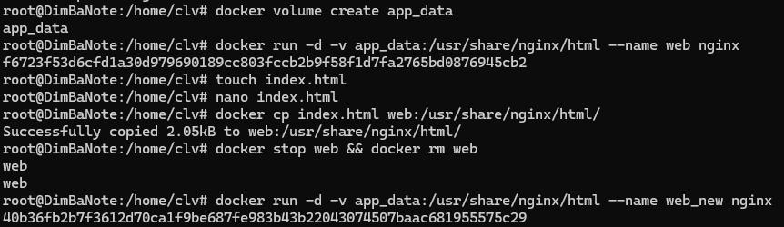

2. Verify Persistence

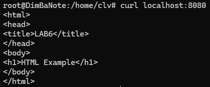

# Task 5

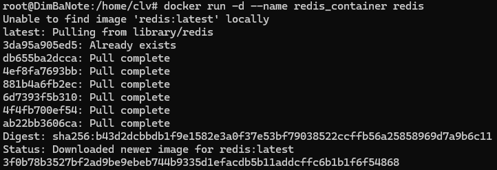
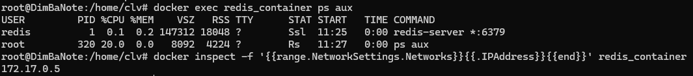

| Aspect              | `docker exec`                                            | `docker attach`                                              |
|---------------------|----------------------------------------------------------|--------------------------------------------------------------|
| What it does        | Starts a _new_ process inside a running container.       | Attaches your terminal to the _main_ process’s stdio streams.|
| Invocation          | `docker exec [options] <container> <command> [args...]`  | `docker attach [options] <container>`                        |
| Isolation           | You get a fresh shell or run a specific command in its own PID context. | You share the PID and stdio of the primary process (PID 1).    |
| Use cases           | - Inspect logs or configuration  - Run diagnostic tools (`ps`, `top`, `bash`, etc.)  - Perform one-off administrative tasks | - Interact directly with the main service’s console (e.g. a REPL)  - Stream realtime output to your terminal (like `docker logs -f` but with stdin) |
| Risk / caveats      | Non-intrusive to the main process; easy to start and exit. | If you detach improperly, you may stop or hang the main process.  Requires knowing the detach key sequence (`Ctrl+P, Ctrl+Q`). |
| Exit behavior       | Exiting your `exec` session does **not** stop the container. | Exiting (without detaching) can send EOF to the main process and shut down the container. |

# Task 6

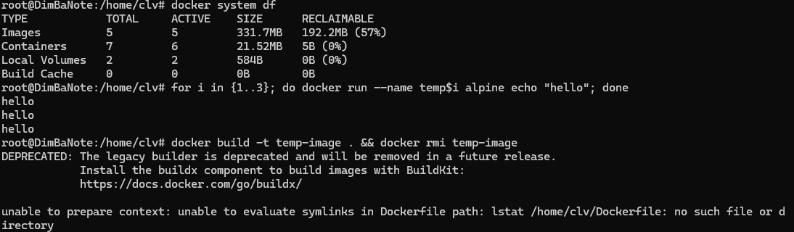
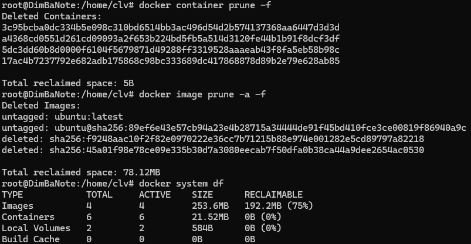

78.12MB of space was freed by clearing out unused images.