# Containers Lab - Docker

Gain practical experience with Docker fundamentals through hands-on container management, image operations, networking, and storage tasks.

```txt
dev@b2b-ip-host:~$ docker --help
Usage:  docker [OPTIONS] COMMAND

A self-sufficient runtime for containers

Common Commands:
  run         Create and run a new container from an image
  exec        Execute a command in a running container
  ps          List containers
  build       Build an image from a Dockerfile
  bake        Build from a file
  pull        Download an image from a registry
  push        Upload an image to a registry
  images      List images
  login       Authenticate to a registry
  logout      Log out from a registry
  search      Search Docker Hub for images
  version     Show the Docker version information
  info        Display system-wide information

Management Commands:
  builder     Manage builds
  buildx*     Docker Buildx
  compose*    Docker Compose
  container   Manage containers
  context     Manage contexts
  image       Manage images
  manifest    Manage Docker image manifests and manifest lists
  network     Manage networks
  plugin      Manage plugins
  system      Manage Docker
  trust       Manage trust on Docker images
  volume      Manage volumes

Swarm Commands:
  swarm       Manage Swarm

Commands:
  attach      Attach local standard input, output, and error streams to a running container
  commit      Create a new image from a container's changes
  cp          Copy files/folders between a container and the local filesystem
  create      Create a new container
  diff        Inspect changes to files or directories on a container's filesystem
  events      Get real time events from the server
  export      Export a container's filesystem as a tar archive
  history     Show the history of an image
  import      Import the contents from a tarball to create a filesystem image
  inspect     Return low-level information on Docker objects
  kill        Kill one or more running containers
  load        Load an image from a tar archive or STDIN
  logs        Fetch the logs of a container
  pause       Pause all processes within one or more containers
  port        List port mappings or a specific mapping for the container
  rename      Rename a container
  restart     Restart one or more containers
  rm          Remove one or more containers
  rmi         Remove one or more images
  save        Save one or more images to a tar archive (streamed to STDOUT by default)
  start       Start one or more stopped containers
  stats       Display a live stream of container(s) resource usage statistics
  stop        Stop one or more running containers
  tag         Create a tag TARGET_IMAGE that refers to SOURCE_IMAGE
  top         Display the running processes of a container
  unpause     Unpause all processes within one or more containers
  update      Update configuration of one or more containers
  wait        Block until one or more containers stop, then print their exit codes

Global Options:
      --config string      Location of client config files (default "/home/dev/.docker")
  -c, --context string     Name of the context to use to connect to the daemon (overrides DOCKER_HOST env var and
                           default context set with "docker context use")
  -D, --debug              Enable debug mode
  -H, --host list          Daemon socket to connect to
  -l, --log-level string   Set the logging level ("debug", "info", "warn", "error", "fatal") (default "info")
      --tls                Use TLS; implied by --tlsverify
      --tlscacert string   Trust certs signed only by this CA (default "/home/dev/.docker/ca.pem")
      --tlscert string     Path to TLS certificate file (default "/home/dev/.docker/cert.pem")
      --tlskey string      Path to TLS key file (default "/home/dev/.docker/key.pem")
      --tlsverify          Use TLS and verify the remote
  -v, --version            Print version information and quit

Run 'docker COMMAND --help' for more information on a command.
```

## Task 0: Image Exporting

**Objective**: Exporting images.

We can search the specified images using:

```bash
    docker search <image_name>
```

Before exporting we need to pull the image from Docker registry.

```bash
    docker pull ubuntu:latest
```

Exporting:

```bash
   docker save -o ubuntu_image.tar ubuntu:latest
```

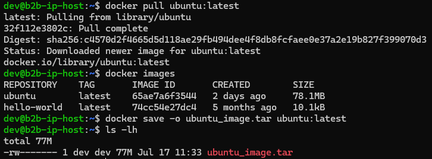

## Task 1: Core Container Operations

**Objective**: Master basic container lifecycle management.

1. **List Containers**

    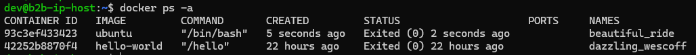

2. **Pull Ubuntu Image**

    > The result in Task 0

3. **Run Interactive Container**

    ```bash
        docker run -it --name ubuntu_container ubuntu:latest
    ```

    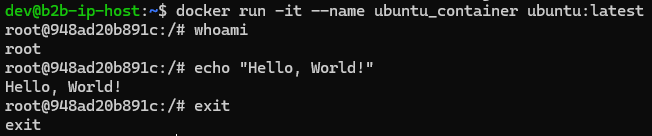

4. **Remove Image**

    ```bash
        docker rmi ubuntu:latest
    ```

    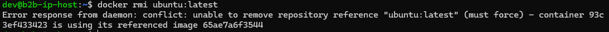

    > I can’t remove the image ubuntu:latest because a containers (93c3ef433423) and (93c3ef433423) are still using it, even if that container is stopped. I must remove or delete the container first.

    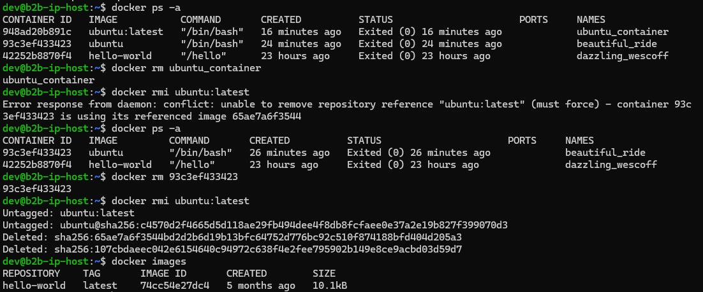

## Task 2: Image Customization

**Objective**: Create and deploy custom images.

1. **Deploy Nginx**

    ```bash
        docker run -d -p 80:80 --name nginx_container nginx
    ```

    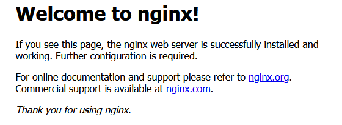

2. **Customize Website**

    - Copy the HTML file to the container:

    ```bash
        docker cp index.html nginx_container:/usr/share/nginx/html/
        docker cp dex.png nginx_container:/usr/share/nginx/html/
    ```

    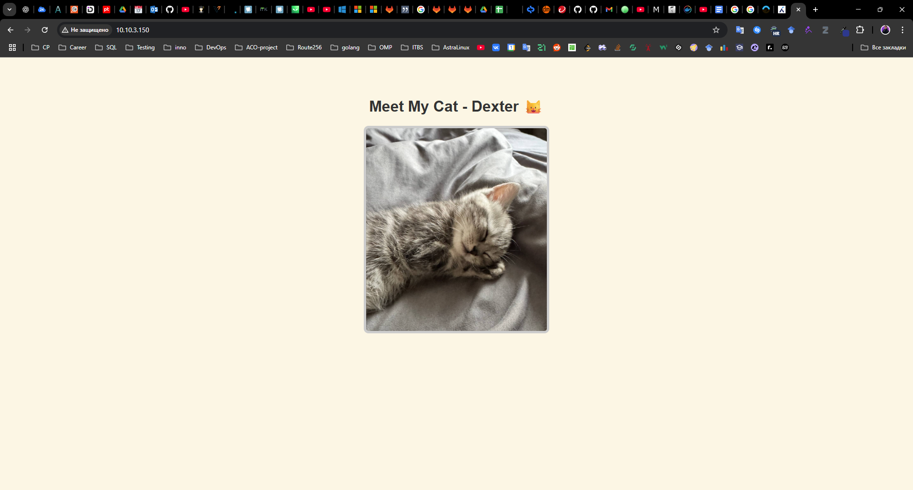

    - I used `cp` and `exec` to manipulate with container contents.

    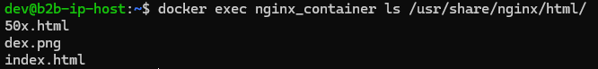

3. **Create Custom Image**

    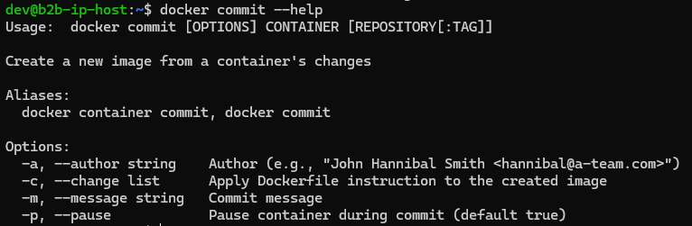

    ```sh
        docker commit nginx_container my_website:latest
    ```

    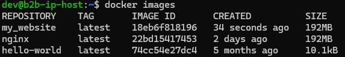

4. **Remove Original Container**

    ```sh
        docker rm -f nginx_container
    ```

    

5. **Create New Container**:
    - Create a new container using the custom image you've created (the same way as the original container).

    ```sh
        docker run -d -p 80:80 --name my_website_container my_website:latest
    ```

6. **Test Web Server**:
    - Use the `curl` command to access the web server at `127.0.0.1:80`.

    ```sh
        curl http://127.0.0.1:80
    ```

    

7. **Analyze Image Changes**:
    - Use the `docker diff` command to analyze the changes made to the new image.

    ```sh
        docker diff my_website_container
    ```

    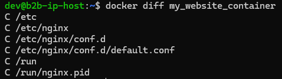

    - Explain the output of the `docker diff` command in the `submission6.md` file.

    The `docker diff` command shows file system changes between the original image and the running container. In my case, it shows that **Nginx** created some runtime files, but **HTML** customization is already committed into the image, so it doesn't show up here.

## Task 3: Container Networking

## Task 4: Volume Persistence

## Task 5: Container Inspection

## Task 6: Cleanup Operations
