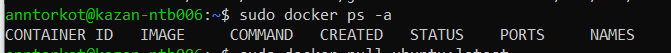
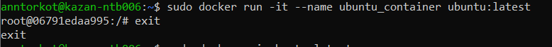

# Lab 6: Containers Lab – Docker

## Task 1: Core Container Operations

1. **List all containers**  
 ```bash
 sudo docker ps -a
```



2. **Pull Ubuntu image**
 ```
 sudo docker pull ubuntu:latest
  ```
  
3. **Run an interactive Ubuntu container**
   ```
   sudo docker run -it --name ubuntu_container ubuntu:latest
   ```
  
4. **Attempt to remove the image**
 ```
 sudo docker rmi ubuntu:latest
  ```
  Error: conflict: unable to remove repository reference "ubuntu:latest" (must force) - container … is using its referenced image

5. **Cleanup**
```
sudo docker rm ubuntu_container
sudo docker rmi ubuntu:latest
```

## Task 2: Image Customization

1.  **Deploy Nginx**
```
sudo docker run -d -p 80:80 --name nginx_container nginx
```

```
curl http://localhost
```
  


2. **Create custom HTML**

  
3. **Copy HTML into the container**
```
sudo docker cp index.html nginx_container:/usr/share/nginx/html/index.html
```
4.  **Commit a new image**
```
sudo docker commit nginx_container my_website:latest
```
5.  **Remove the original container**
```
sudo docker rm -f nginx_container
```
6. **Run the custom image**
```
sudo docker run -d -p 80:80 --name my_website_container my_website:latest
```
```
curl http://localhost
```
7. **Inspect changes**
```
sudo docker diff my_website_container
```
Output:
```
C /run
C /run/nginx.pid
C /etc
C /etc/nginx
C /etc/nginx/conf.d
C /etc/nginx/conf.d/default.conf
```
