# Containers Lab - Docker

## Image Exporting

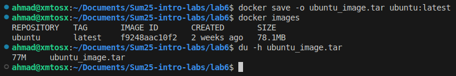

We can notice that the `.tar` is a little smaller than the image, which is expected, `save` produce a tarred repository, and we are using `-o` to save it to a file.

## Core Container Operations

* **List Containers:**

    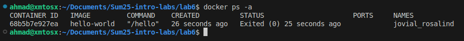

* **Pull Ubuntu Image:**

    

* **Run Interactive Container:**

    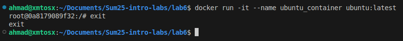

* **Remove Image:**

    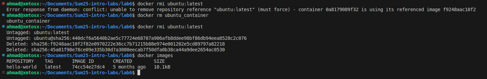

    We notice that we got an error, since we ran a container using this image we can't delete the image unless we delete all running containers based on that image. As we can see after removing the container we manged to delete the image.

## Image Customization

* **Deploy nginx:**

    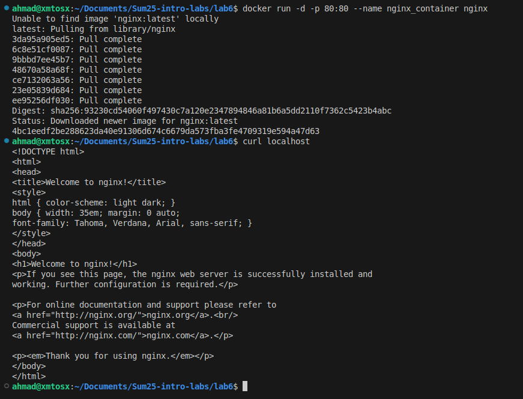

* **Customize Website:**

  * After creating a HTML file we copy it to the nginx container:

    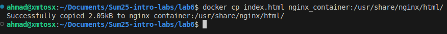

* **Create Custom Image:**

    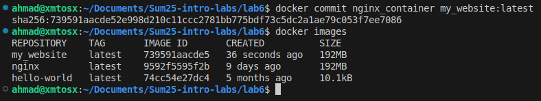

* **Remove Original Container:**

    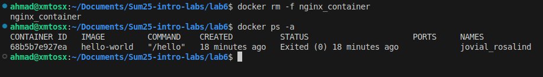

* **Create New Container:**

    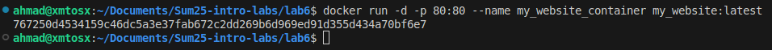

* **Test Web Server:**

    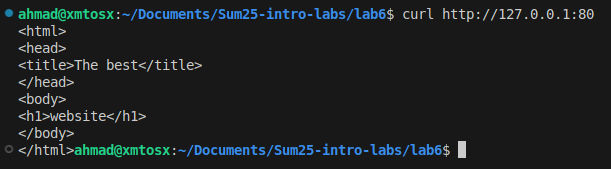

* **Analyze Image Changes:**

    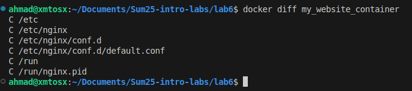

    This shows that files that have been modified since the container started running.\
    According to the [documentation](https://docs.docker.com/reference/cli/docker/container/diff/), `C` means *"A file or directory was changed"*.

## Container Networking

* **Create Network:**

    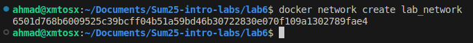

* **Run Connected Containers:**

    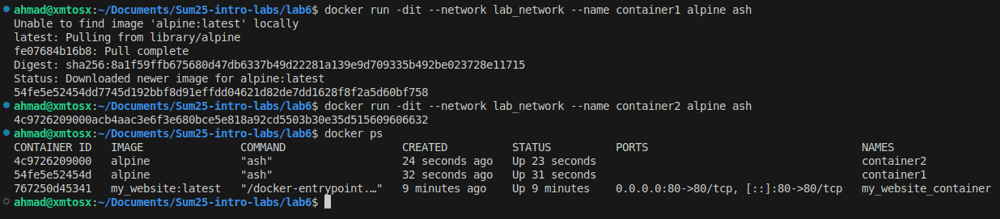

* **Test Connectivity:**

    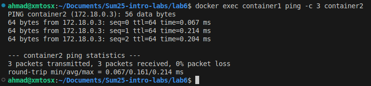

When we create a bridge network like `lab_network`, docker automatically sets up an internal DNS server for that network.

* Each container connected to the same network gets a hostname and an IP address.
* Docker’s internal DNS keeps track of these names and IPs.
* So when we ping `container2` from `container1`, docker’s embedded DNS resolves `container2` to its correct IP address inside `lab_network`.

## Volume Persistence

* **Create Volume:**

    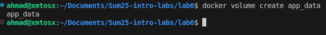

* **Run Container with Volume:**

    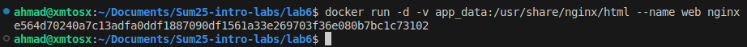

* **Modify Content:**

    ```html
    <html>
    <head>
    <title>Docker Volumes</title>
    </head>
    <body>
    <h1>This is an HTML file to test Docker Volumes</h1>
    </body>
    </html>
    ```

    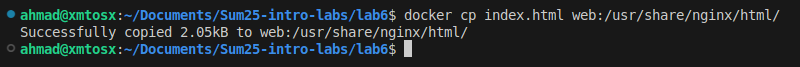

* **Verify Persistence:**

    

## Container Inspection

* **Run Redis Container:**

    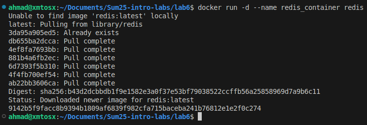

* **Inspect Processes:**

    

    Since the redis container is simple, it doesn't have the packages needed to run `ps`.\
    In cases like this we can use the [`top`](https://docs.docker.com/reference/cli/docker/container/top/) command from docker to display the running processes of the container.

* **Network Inspection:**

    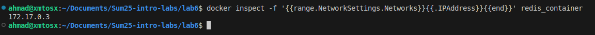

* `docker exec` vs `docker attach`

  * **[`docker exec`](https://docs.docker.com/reference/cli/docker/container/exec/):** Runs a new command in a running container. It's useful for debugging, and gaining access to the containers system, to debug/modify.
  * **[`docker attach`](https://docs.docker.com/reference/cli/docker/container/attach/):** Connects to the container’s **main process**. You see its existing output. Using `Ctrl + C` stops the container.
  It can be useful when we want to check the output of the main process in the container.

## Cleanup Operations

* **Verify Cleanup:**

    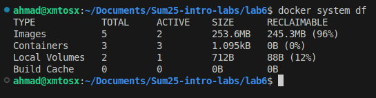

* **Create Test Objects:**

    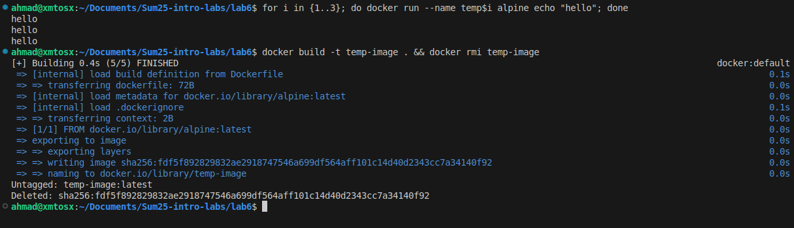

    The images where based on a simple Dockerfile:

    ```dockerfile
    FROM alpine
    CMD ["echo", "Hello!"]
    ```

* **Remove Stopped Containers:**

    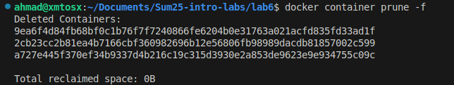

* **Remove Unused Images:**

    

* **Verify Cleanup:**

    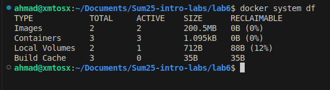

    We notice that we saved some space by deleting the unused images.
    *(I removed all the unused containers before starting this part)*
