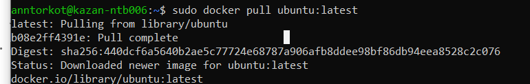
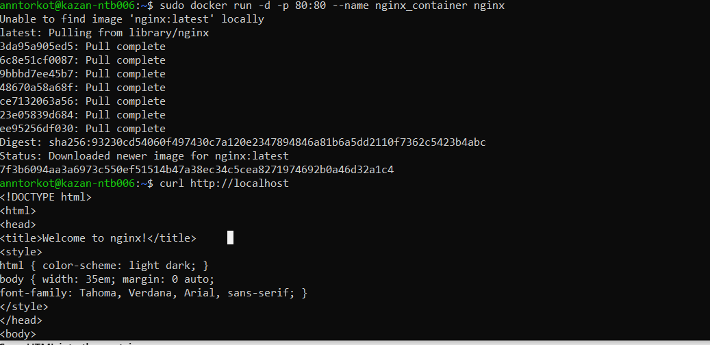

# Lab 6: Containers Lab – Docker

## Task 1: Core Container Operations

1. **List all containers**  
 ```bash
 sudo docker ps -a
```


2. **Pull Ubuntu image**
 ```
 sudo docker pull ubuntu:latest
  ```
  
3. **Run an interactive Ubuntu container**
   ```
   sudo docker run -it --name ubuntu_container ubuntu:latest
   ```
  
4. **Attempt to remove the image**
 ```
 sudo docker rmi ubuntu:latest
  ```
  Error: conflict: unable to remove repository reference "ubuntu:latest" (must force) - container … is using its referenced image

5. **Cleanup**
```
sudo docker rm ubuntu_container
sudo docker rmi ubuntu:latest
```

## Task 2: Image Customization

1.  **Deploy Nginx**
```
sudo docker run -d -p 80:80 --name nginx_container nginx
```

```
curl http://localhost
```
  


2. **Create custom HTML**

  
3. **Copy HTML into the container**
```
sudo docker cp index.html nginx_container:/usr/share/nginx/html/index.html
```
4.  **Commit a new image**
```
sudo docker commit nginx_container my_website:latest
```
5.  **Remove the original container**
```
sudo docker rm -f nginx_container
```
6. **Run the custom image**
```
sudo docker run -d -p 80:80 --name my_website_container my_website:latest
```
```
curl http://localhost
```


7. **Inspect changes**
```
sudo docker diff my_website_container
```
Output:
```
C /run
C /run/nginx.pid
C /etc
C /etc/nginx
C /etc/nginx/conf.d
C /etc/nginx/conf.d/default.conf
```
## Task 3: Container Networking

### 3.1 Create a custom bridge network

**Command:**
```bash
sudo docker network create lab_network
```
Output:
```
60ad3c5f5fd1   lab_network   bridge    local
```

### 3.2 Run two Alpine containers on that network
```
sudo docker run -dit --network lab_network --name container alpine ash
sudo docker run -dit --network lab_network --name container2 alpine ash
```
```
sudo docker ps -a | grep container
```
Output:
```
c61b0f73aeea   alpine   "ash"   Up 2 minutes   container
c61b0f73aeea   alpine   "ash"   Up 13 seconds  container2
```
### 3.3 Test inter-container connectivity
```
sudo docker exec container ping -c 3 container2
```
```
PING container2 (172.18.0.3): 56 data bytes
64 bytes from 172.18.0.3: seq=0 ttl=64 time=0.205 ms
64 bytes from 172.18.0.3: seq=1 ttl=64 time=0.078 ms
64 bytes from 172.18.0.3: seq=2 ttl=64 time=0.063 ms

--- container2 ping statistics ---
3 packets transmitted, 3 packets received, 0% packet loss
round-trip min/avg/max = 0.063/0.115/0.205 ms
```
Docker automatically provides an embedded DNS server (at 127.0.0.11) inside each user-defined network. When a container starts, Docker registers its hostname and IP in that DNS. Thus any container on lab_network can resolve container2 to its IP (172.18.0.3) without additional configuration.
  


