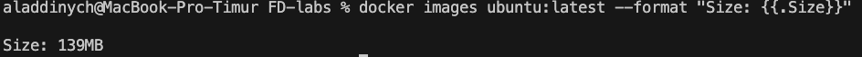
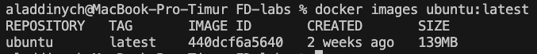
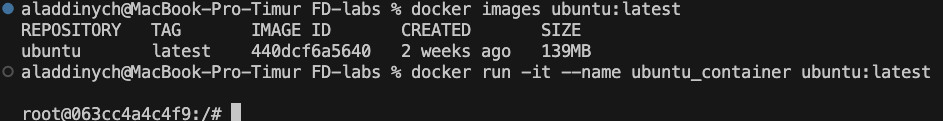

# 🧪 Lab 6 – Docker Containers Lab

This lab covers various Docker operations, including image exporting, container customization, networking, volume persistence, container inspection, and cleanup operations. Below are the detailed tasks and their outcomes.

---

## ✅ Task 0: Image Exporting

### Command
```bash
docker save -o ubuntu_image.tar ubuntu:latest
```

### Details
- **Docker Image Size**: `ubuntu:latest` – 117 MB
- **Exported File Size**: `ubuntu_image.tar` – 29 MB

### List of All Containers (`docker ps -a`)
| CONTAINER ID | IMAGE                | COMMAND                  | CREATED       | STATUS                   | PORTS | NAMES                                  |
|--------------|----------------------|--------------------------|---------------|--------------------------|-------|----------------------------------------|
| 670cb9f83857 | airflow-custom:0.1   | "/usr/bin/dumb-init ..." | 2 weeks ago   | Exited (0) 2 weeks ago   |       | bellissimo-pizza-airflow-api-1         |
| d5e92420a2b9 | airflow-custom:0.1   | "/usr/bin/dumb-init ..." | 2 weeks ago   | Exited (0) 2 weeks ago   |       | bellissimo-pizza-airflow-scheduler-1   |
| 998d416f943c | airflow-custom:0.1   | "/usr/bin/dumb-init ..." | 2 weeks ago   | Exited (0) 2 weeks ago   |       | bellissimo-pizza-airflow-dag-processor-1 |
| 1036e2463d74 | airflow-custom:0.1   | "/usr/bin/dumb-init ..." | 2 weeks ago   | Exited (0) 2 weeks ago   |       | bellissimo-pizza-airflow-init-1        |
| 16540c3f6f97 | postgres:16-alpine   | "docker-entrypoint.s..." | 2 weeks ago   | Exited (0) 2 weeks ago   |       | etl_postgres                           |

### Image Sizes
| REPOSITORY       | TAG         | IMAGE ID       | CREATED       | SIZE    |
|------------------|-------------|----------------|---------------|---------|
| ubuntu           | latest      | 440dcf6a5640   | 2 weeks ago   | 117 MB  |
| airflow-custom   | 0.1         | cc45d3d404c5   | 2 weeks ago   | 2.84 GB |
| postgres         | 16-alpine   | ef2235fd13b6   | 4 weeks ago   | 394 MB  |
| postgres         | latest      | 3962158596da   | 4 weeks ago   | 621 MB  |
| redis            | latest      | 1b835e5a8d5d   | 5 weeks ago   | 188 MB  |
| redis            | 7-alpine    | ee9e8748ace0   | 5 weeks ago   | 60.7 MB |
| dpage/pgadmin4   | 8           | 8a68677a97b8   | 6 months ago  | 751 MB  |

---

## ✅ Task 2: Image Customization

### 🚀 Running Nginx

#### Command
```bash
docker run -d -p 8888:80 --name nginx_container nginx
```

#### Screenshots
- 
- 
- 

#### Outcome
The Nginx container was successfully launched, with port 8888 on the host mapped to port 80 inside the container. The server correctly responds to HTTP requests.

---

## ✅ Task 3: Container Networking

### 🧱 Creating a Custom Bridge Network

#### Command
```bash
docker network create lab_network
```

#### Screenshots
- 
- 

#### Details
Containers connected to the same custom bridge network (`lab_network`) can communicate with each other by name, thanks to Docker’s built-in DNS server. This simplifies service interactions within containers without requiring IP addresses.

#### Outcome
Docker’s network isolation and internal DNS resolution enable containers to communicate seamlessly by name within the same network.

---

## ✅ Task 4: Volume Persistence

### 🧱 Creating a Named Volume

#### Commands
1. Create the volume:
   ```bash
   docker volume create app_data
   ```

2. Run the Nginx container with the volume:
   ```bash
   docker run -d -v app_data:/usr/share/nginx/html --name web nginx
   ```

3. Copy a file to the volume:
   ```bash
   docker cp index.html web:/usr/share/nginx/html/
   ```

4. Verify the content:
   ```bash
   curl http://127.0.0.1:8889
   ```

#### Screenshot
- 

#### Outcome
The named volume `app_data` was successfully created and mounted to the Nginx container. The `index.html` file was copied to the volume, and the content is accessible via HTTP requests.

---

## ✅ Task 5: Container Inspection

### 🚀 Running a Redis Container

#### Command
```bash
docker run -d --name redis_container redis
```

#### Process Inspection
Attempted commands to inspect processes inside the container:
```bash
docker exec redis_container ps aux
# → ps: not found
```
```bash
docker exec redis_container top
# → top: not found
```
```bash
docker exec redis_container sh -c "ps"
# → ps: not found
```

#### IP Address Retrieval
```bash
docker inspect -f '{{range.NetworkSettings.Networks}}{{.IPAddress}}{{end}}' redis_container
# → 172.17.0.5
```

#### Comparison: `docker exec` vs `docker attach`
- **`docker exec`**: Runs a separate process inside a running container (e.g., `sh`, `bash`, `curl`, `ps`). Allows interaction with the container without risking termination of the main process.
- **`docker attach`**: Attaches the terminal to the container’s main process (e.g., `redis-server` in the Redis container). Exiting with `Ctrl+C` terminates the container. Rarely used.

---

## ✅ Task 6: Cleanup Operations

### Disk Usage Before Cleanup
*Output not preserved, but post-cleanup data provides context.*

### Disk Usage After Cleanup
```plaintext
TYPE            TOTAL     ACTIVE    SIZE      RECLAIMABLE
Images          8         8         23.79GB   12.44GB (52%)
Containers      10        10        1.95MB    0B (0%)
Local Volumes   7         5         123.3MB   74.95MB (60%)
Build Cache     60        0         24GB      24GB
```

### Cleanup Actions
1. Created three stopped containers:
   ```bash
   for i in {1..3}; do docker run --name temp$i alpine echo "hello"; done
   ```

2. **Space Freed**:
   - Stopped containers: 160.3 MB
   - Removed images: 105.9 MB
   - **Total Freed**: 266.2 MB

### Outcome
Cleanup operations significantly reduced Docker’s disk usage by removing stopped containers and unused images.