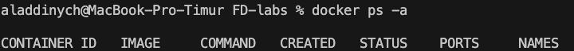
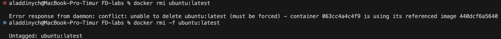
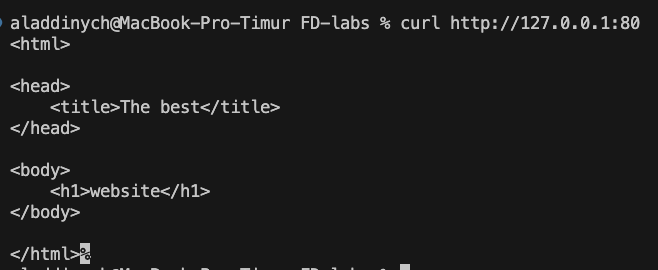

# Lab 6

Timur Nugaev

## task 0

`docker pull ubuntu:latest` first pulls the image

verifying i got the image:

```bash
aladdinych@MacBook-Pro-Timur FD-labs % docker images ubuntu:latest

REPOSITORY   TAG       IMAGE ID       CREATED       SIZE
ubuntu       latest    440dcf6a5640   2 weeks ago   139MB
```

`docker save -o ubuntu_image.tar ubuntu:latest` exports to a tarball

`ls -lh ubuntu_image.tar` to check the size of the tar:

```bash
aladdinych@MacBook-Pro-Timur FD-labs % ls -lh ubuntu_image.tar

-rw-------@ 1 aladdinych  staff    28M Jul  5 22:59 ubuntu_image.tar
```

The 139MB number is how big the image would be actually on disk after Docker unpacks the layers. When you run docker save, it doesn't unpack, it bundles the compressed layer files.

So, the original image size is 139MB, the tar is significantly lower in size because of the compression: 28MB.

## task 1 - core container operations

1. `docker ps -a` output:



2. `docker pull ubuntu:latest`


running this command gives us the image size (139MB):


3. `docker run -it --name ubuntu_container ubuntu:latest`:


4. `docker rmi ubuntu:latest`:



Docker will not delete an image while any container references it. So either i have to delete the container first or just force which will delete it for me (i chose the latter).

## task 2 - image customization


---

verify with `curl localhost`:


success

---

copied the new html to the container:


verify with curl again:


---

create custom image:

`docker commit nginx_container my_website:latest`


---

remove original container:

`docker rm -f nginx_container`

---

create new container:

`docker run -d -p 80:80 --name my_website_container my_website:latest`


---

Use the curl command to access the web server at 127.0.0.1:80.



---

`docker diff my_website_container`


in the diff commands it shows the output with letters:
A for Added, C for changed, D for Deleted.

Everything in my output is with a C so that means everything that the running container modified from image it started:

`/run` and `/run/nginx.pid` were created/updated at runtime by the nginx daemon (it writes its PID file there).

`/etc/nginx/...` and `default.conf` show that nginx touched its configuration files when starting up.

i don't see the index.html yet because i commited it to the iamge itself so it's base for `my_website:latest`, it doesn't show up in the diff, which makes sense.

## task 3 - container networking

1. create network: `docker network create lab_network`


2. Run Connected Containers:

`docker run -dit --network lab_network --name container1 alpine ash`
`docker run -dit --network lab_network --name container2 alpine ash`


3. Test Connectivity:


4. Documentation

Docker sets up its own DNS server on each custom network. Every container's name is auto-registered there, so when you ping "container2" from "container1", Docker's DNS (at 127.0.0.11) turns that name into the right IP address.

## task 4 - volume persistence

```
aladdinych@MacBook-Pro-Timur FD-labs % docker volume create app_data
app_data
```

```
aladdinych@MacBook-Pro-Timur FD-labs % docker run -d -v app_data:/usr/share/nginx/html --name web nginx
ba696e924528d93fbd3506d4feb07a5c20ab723035609a1617b088dde9e69679
```

```
aladdinych@MacBook-Pro-Timur FD-labs % docker cp index.html web:/usr/share/nginx/html/

Successfully copied 2.05kB to web:/usr/share/nginx/html/
```

```
aladdinych@MacBook-Pro-Timur FD-labs % docker stop web && docker rm web
web
web
aladdinych@MacBook-Pro-Timur FD-labs % docker run -d -v app_data:/usr/share/nginx/html --name web_new nginx
8ddec9c07c9128fab45e48063a43fc2edd47d17f1df73c93af6479eaae901f14
```

```
aladdinych@MacBook-Pro-Timur FD-labs % curl localhost          
<html>

<head>
    <title>The best</title>
</head>

<body>
    <h1>website</h1>
</body>

</html>
```

Because the `app_data` volume mounts `/usr/share/nginx/html`, the `index.html` file stayed in that volume and was served by `web_new` even after the original `web` container was removed.


## task 5 - container inspection

```
aladdinych@MacBook-Pro-Timur FD-labs % docker run -d --name redis_container redis
Unable to find image 'redis:latest' locally
latest: Pulling from library/redis
6cdbd38be072: Pull complete 
210bcecec106: Pull complete 
1951cc36241a: Pull complete 
6487d14aef1c: Pull complete 
929c063e7c67: Pull complete 
4f4fb700ef54: Pull complete 
Digest: sha256:b43d2dcbbdb1f9e1582e3a0f37e53bf79038522ccffb56a25858969d7a9b6c11
Status: Downloaded newer image for redis:latest
3340ac369b05d535b98ebebe4e07928121f0ae5834286311d6a2ba3a46292425
```

redis does not include ps so i use docker top instead:

`docker top redis_container`

```
aladdinych@MacBook-Pro-Timur FD-labs % docker top redis_container

UID                 PID                 PPID                C                   STIME               TTY                 TIME                CMD
999                 1410                1387                0                   16:52               ?                   00:00:00            redis-server *:6379
```

```
aladdinych@MacBook-Pro-Timur FD-labs % docker inspect -f '{{range .NetworkSettings.Networks}}{{.IPAddress}}{{end}}' redis_container

172.17.0.4
```

docker exec runs one new command inside the running container and returns its output.

docker attach connects your terminal to the container’s main process stdin/stdout/stderr—useful to view logs, etc.

## task 6 - cleanup

```
aladdinych@MacBook-Pro-Timur FD-labs % docker system df

TYPE            TOTAL     ACTIVE    SIZE      RECLAIMABLE
Images          6         5         3.443GB   3.05GB (88%)
Containers      6         5         151.6kB   12.29kB (8%)
Local Volumes   2         2         593B      0B (0%)
Build Cache     16        0         1.025GB   1.025GB
```

```bash
aladdinych@MacBook-Pro-Timur FD-labs % 
for i in 1 2 3; do
  docker run --name temp$i alpine echo hello
done

echo 'FROM alpine' > Dockerfile
docker build -t temp-image .
docker rmi temp-image
rm Dockerfile

zsh: command not found: #
hello
hello
hello
zsh: unknown file attribute: b
[+] Building 2.2s (5/5) FINISHED                                                                   docker:desktop-linux
 => [internal] load build definition from Dockerfile                                                               0.0s
 => => transferring dockerfile: 86B                                                                                0.0s
 => [internal] load metadata for docker.io/library/alpine:latest                                                   0.1s
 => [internal] load .dockerignore                                                                                  0.0s
 => => transferring context: 2B                                                                                    0.0s
 => [1/1] FROM docker.io/library/alpine:latest@sha256:8a1f59ffb675680d47db6337b49d22281a139e9d709335b492be023728e  2.0s
 => => resolve docker.io/library/alpine:latest@sha256:8a1f59ffb675680d47db6337b49d22281a139e9d709335b492be023728e  2.0s
 => exporting to image                                                                                             0.0s
 => => exporting layers                                                                                            0.0s
 => => exporting manifest sha256:98ea2997ed6cd0441ede8f7b611ae52007cadafe7a273a8864caec158b9144d3                  0.0s
 => => exporting config sha256:4b071331304977d08f6ff896f2ece366bfaa03f0c1729fa2b4331d477405140b                    0.0s
 => => exporting attestation manifest sha256:3c0cafb1756e750e6c3a369a5a5f59e6683f3409a84304d0fe547f5ca1a67f86      0.0s
 => => exporting manifest list sha256:0f28fe9682f9fd695f965df2bfba4f3da03e7cfebcd1fe092cf53f12436c6335             0.0s
 => => naming to docker.io/library/temp-image:latest                                                               0.0s
 => => unpacking to docker.io/library/temp-image:latest                                                            0.0s
Untagged: temp-image:latest
Deleted: sha256:0f28fe9682f9fd695f965df2bfba4f3da03e7cfebcd1fe092cf53f12436c6335
```

```
aladdinych@MacBook-Pro-Timur FD-labs % docker container prune -f
Deleted Containers:
42fb8bd3005a9d6114e3700deb646bcfb2e7c63e02665c021c958f0b31e6411c
fe4863756c956843c8a8714776ed704de1771453664c05a4a8a18d2a99882045
9b7e1f4135bb619eb18b171c4f609c3c151f9062e8e423c6019ca274f5310fee
063cc4a4c4f9350fb96622b9a10999cf91deced2c15cad26618500042e8df95e

Total reclaimed space: 24.58kB
```

```
aladdinych@MacBook-Pro-Timur FD-labs % docker image prune -a -f
Deleted Images:
untagged: iu-alumni-frontend:latest
deleted: sha256:bb1066d846352f2989faf52961cba7d0d7fa76a284831103da3d759a91211ca1
deleted: sha256:4fb4708a384652647b252f5eb295e5293b0567699827583a8052d85dcdd6f3f2
deleted: sha256:fc9fc8e4e8285bb5de159bb826191eb6e8c3dd427016f39d67449f805d51997d
deleted: sha256:4bf1c5a2eabdd190b23bd930876354406a697b5cef1091b4f25bc61cab2487bb
deleted: sha256:d90c5581d16d550104152796f1f0e127a9841fd2e9e95edf2a6f4d5c50a6a4d2
deleted: sha256:16b49dcd1a1e36e01c8e0df36a629551f369a7dd02e8dec5b7e696b1d26e89c8
untagged: sha256:440dcf6a5640b2ae5c77724e68787a906afb8ddee98bf86db94eea8528c2c076
deleted: sha256:440dcf6a5640b2ae5c77724e68787a906afb8ddee98bf86db94eea8528c2c076
deleted: sha256:021ffcf72f04042ab2ca66e678bb614f99c8dc9d5d1c97c6dd8302863078adba
deleted: sha256:70ed52c84b4e4cd5f3b15c6e0edc7003fb4cd559df69dfc093fac029c9efd480
deleted: sha256:3eff7d219313fd6db206bd90410da1ca5af1ba3e5b71b552381cea789c4c6713

Total reclaimed space: 28.88MB
```

```
aladdinych@MacBook-Pro-Timur FD-labs % docker system df
TYPE            TOTAL     ACTIVE    SIZE      RECLAIMABLE
Images          4         4         2.384GB   2.13GB (89%)
Containers      5         5         139.3kB   0B (0%)
Local Volumes   2         2         593B      0B (0%)
Build Cache     19        0         2.346GB   2.346GB
```

Pruning stopped containers freed 24.58 kB

Pruning unused images freed 28.88 MB