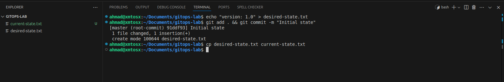
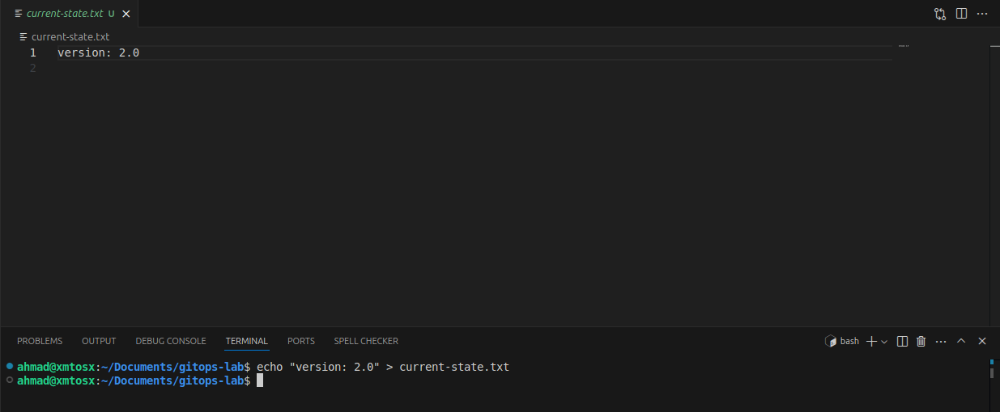
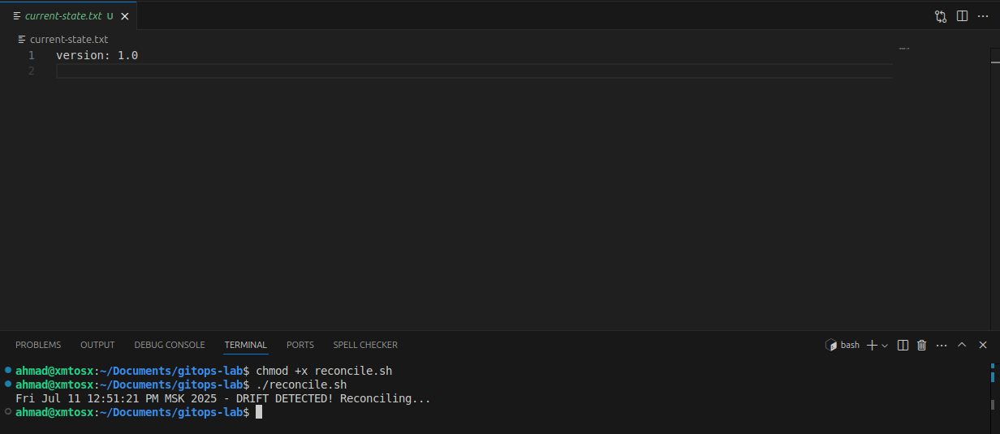
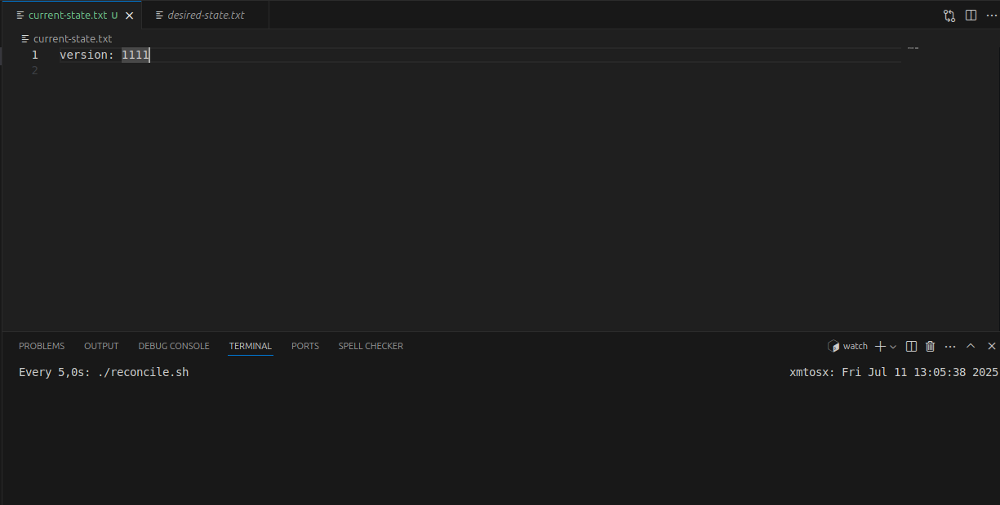
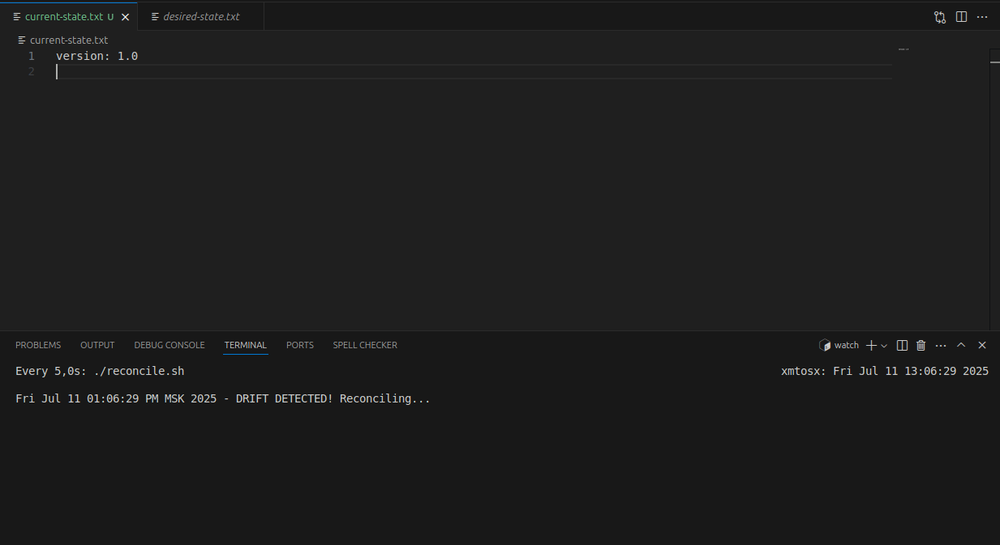
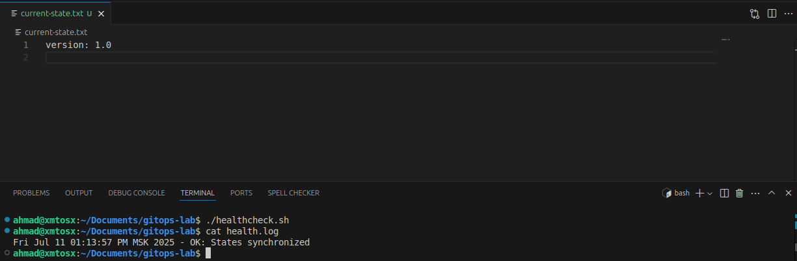

# GitOps Fundamentals Lab

## Git State Reconciliation

* **Creating the desired state & Simulating the cluster:**

    

* **Modifying the current state (manual drift):**

    

* **Reconciliation script output:**

    

* **Automated reconciliation:**

    

    

## GitOps Health Monitoring

* **Simulate healthy state:**

    

* **Modify the current state:**

    
