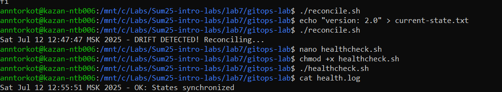
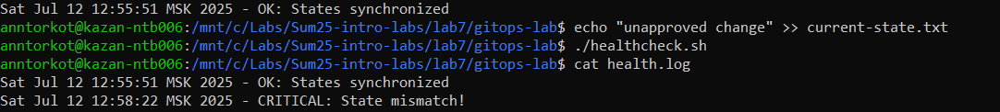

# Lab 7: GitOps Fundamentals Lab

### Task 1: Git State Reconciliation

**Scripts and commands:**

1. Verify the script is executable
ls -l reconcile.sh
Output:
```
-rwxrwxrwx 1 anntorkot anntorkot 211 Jul 12 12:44 reconcile.sh
```

2. Run reconciliation with no drift (no output expected)
```
./reconcile.sh
```
3. Simulate drift and run reconciliation again
```
echo "version: 2.0" > current-state.txt
./reconcile.sh
```
Sample output:
```
Sat Jul 12 12:47:47 MSK 2025 - DRIFT DETECTED! Reconciling..
```
### Task 2: GitOps Health Monitoring

**Scripts and commands:**

1. Create and make executable the health check script  
   ```bash
   chmod +x healthcheck.sh
   ```

2. Simulate healthy state and run check  
   ```bash
   ./healthcheck.sh
   cat health.log
   ```
   **Sample output:**  
   ```bash
   Sat Jul 12 12:55:51 MSK 2025 - OK: States synchronized
   ```
   

3. Simulate drift and run check again  
   ```bash
   echo "unapproved change" >> current-state.txt
   ./healthcheck.sh
   cat health.log
   ```
   **Sample output:**  
   ```bash
   Sat Jul 12 12:55:51 MSK 2025 - OK: States synchronized
   Sat Jul 12 12:58:22 MSK 2025 - CRITICAL: State mismatch!
   ```
   

**Explanation:**  
The health check script computes MD5 hashes of `desired-state.txt` and `current-state.txt`.  
- If the hashes match, it logs an **OK** message.  
- If the hashes differ, it logs a **CRITICAL** alert to `health.log`.

