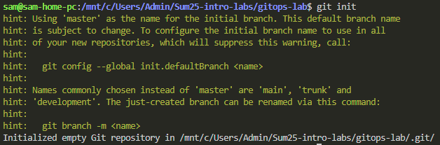
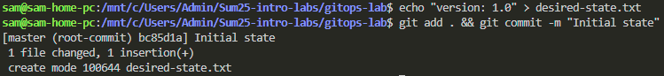
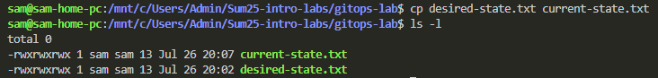
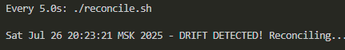
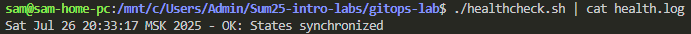
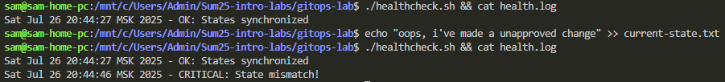

# **GitOps Fundamentals Lab**

This lab teaches core GitOps principles by simulating key workflows using only Linux command-line tools. Students will:

1. Practice **declarative configuration management**
2. Implement **automated reconciliation**
3. Build **self-healing systems**
4. Monitor **state synchronization health**

No Kubernetes or GitOps tools required!

---

## **Task 1: Git State Reconciliation**

**Objective**: Simulate how GitOps operators continuously synchronize cluster state with Git

Why This Matters:

- Understand the core reconciliation loop in GitOps
- Learn why declarative configuration > imperative commands
- See how automation prevents configuration drift

Tools Used:

`git` | `watch` | `diff` | `cp`

> GitOps is a model where Git is the single source of truth for infrastructure and application configuration.
> The system continuously monitors and applies this Git state to the cluster (e.g., Kubernetes).

1. **Initialize repository**:

    ```bash
        mkdir gitops-lab && cd gitops-lab
        git init
    ```

    

2. **Create desired state**:

    ```bash
        echo "version: 1.0" > desired-state.txt
        git add . && git commit -m "Initial state"
    ```

    

3. **Simulate live cluster**:

    ```bash
       cp desired-state.txt current-state.txt
    ```

    

4. **Create reconciliation script**:

    Reconciliation is the core loop in GitOps. It checks:

    >"Does the current state of the cluster match what’s defined in Git?"

    If not, it:
    - Applies changes to reach the Git-defined state
    - Notifies if manual drift was detected

    ```bash
        #!/bin/bash
        # reconcile.sh
        DESIRED=$(cat desired-state.txt)
        CURRENT=$(cat current-state.txt)
        
        if [ "$DESIRED" != "$CURRENT" ]; then
        echo "$(date) - DRIFT DETECTED! Reconciling..."
        cp desired-state.txt current-state.txt
        fi
    ```

5. **Trigger manual drift**:

    ```bash
        echo "version: 2.0" > current-state.txt # Simulate manual cluster change
    ```

6. **Run reconciliation**:

    ```bash
        chmod +x reconcile.sh
        ./reconcile.sh # Should detect and fix drift
    ```

7. **Automate reconciliation**:

    ```bash
        watch -n 5 ./reconcile.sh # Runs every 5 seconds
    ```

    

### Summary

> Why it matters?

- Ensures declarative and repeatable infra
- Detects drift (accidental changes on cluster)
- Improves security (no manual kubectl applies)
- Enables auditable change history via Git commits

| Term                  | Meaning                                            |
| --------------------- | -------------------------------------------------- |
| Reconciliation        | Syncing live infra with Git-declared state         |
| Reconciliation Script | Code or tool that performs the reconciliation loop |
| Tools                 | Flux, ArgoCD, Jenkins (custom), etc.               |

## **Task 2: GitOps Health Monitoring**

**Objective**: Implement health checks for configuration synchronization

Why This Matters:

- Learn to validate system state consistency
- Detect configuration drift before it causes failures
- Build proactive monitoring for GitOps systems

Tools Used:

`md5sum` | `cron` | `echo` | `date`

1. **Create health check script**:

    ```bash
        #!/bin/bash
        # healthcheck.sh
        DESIRED_MD5=$(md5sum desired-state.txt | awk '{print $1}')
        CURRENT_MD5=$(md5sum current-state.txt | awk '{print $1}')
        
        if [ "$DESIRED_MD5" != "$CURRENT_MD5" ]; then
        echo "$(date) - CRITICAL: State mismatch!" >> health.log
        else
        echo "$(date) - OK: States synchronized" >> health.log
        fi
    ```

2. **Make executable**:

    ```bash
        chmod +x healthcheck.sh
    ```

3. **Simulate healthy state**:

    ```bash
        ./healthcheck.sh
        cat health.log# Should show "OK"
    ```

    

4. **Create drift**:

    ```bash
        echo "unapproved change" >> current-state.txt
    ```

5. **Run health check**:

    ```bash
        ./healthcheck.sh
        cat health.log# Now shows "CRITICAL"
    ```

    

## Key Concepts Demonstrated

   | Task | GitOps Principle | Real-World Equivalent |
   |------|------------------|------------------------|
   | 1 | Continuous Reconciliation | Argo CD/Flux sync loops |
   | 2 | Health Monitoring | Kubernetes operator status checks |
