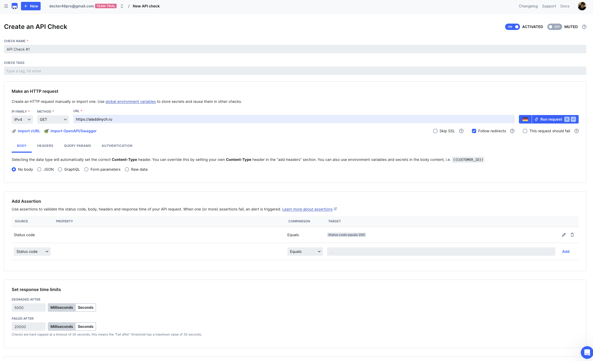
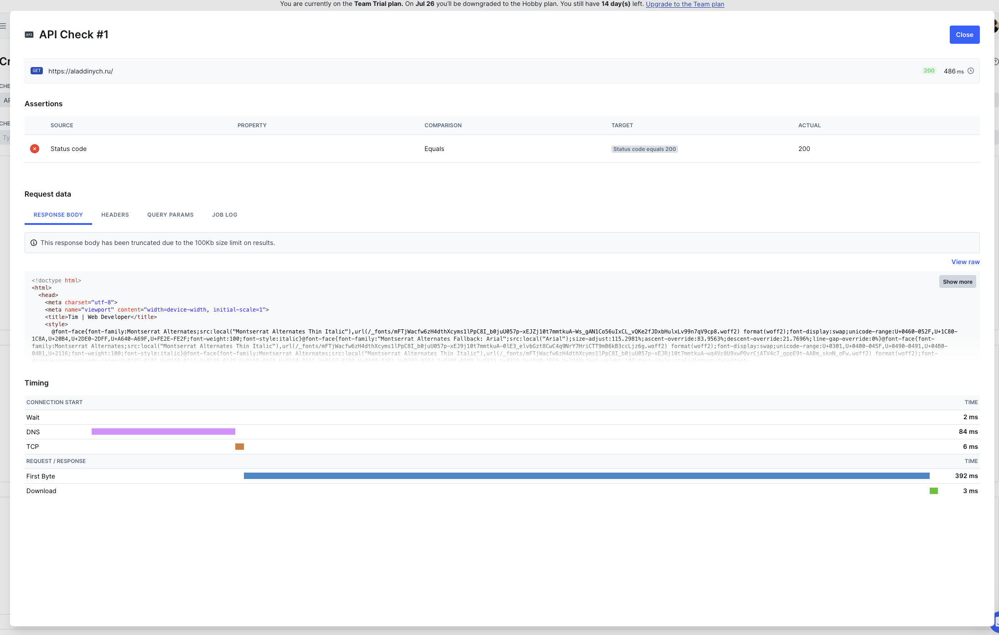
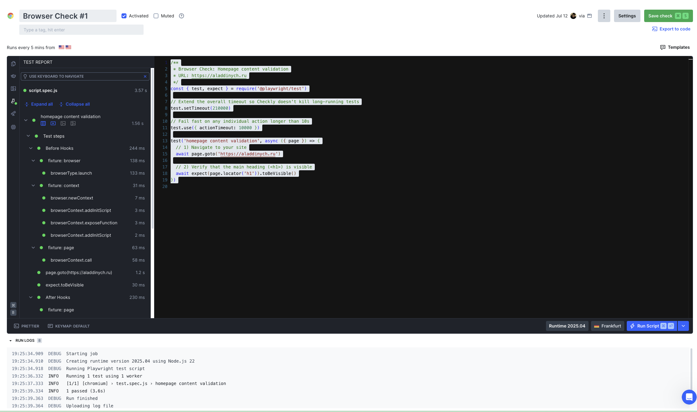
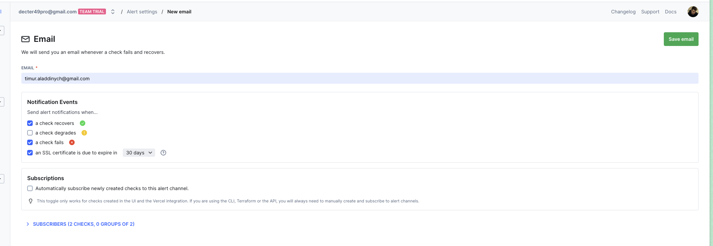
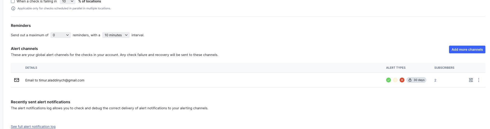

# Lab 8 - sre

Timur Nugaev

Running under MacOS Silicon, so some commands can be diff from the lab's

---

## Task 1 - key metrics for sre and slas

```bash
aladdinych@MacBook-Pro-Timur lab8 % brew install htop
...
success
```

To find the processes using the most CPU, I ran:

```bash
aladdinych@MacBook-Pro-Timur lab8 % ps -e -o pid,comm,%cpu | sort -k3 -nr | head -n 4

65470 /Applications/Ar  24.4
  589 /System/Library/  13.4
98021 /Applications/Sk  12.0
53421 /Applications/Ar  11.5
```

Top 3 CPU consumers:

/Applications/Ar (PID 65470) -- 24.4 %

/System/Library/ (PID 589) -- 13.4 %

/Applications/Sk (PID 98021) -- 12.0 %

---

To find the processes using the most memory, I ran:

```bash
aladdinych@MacBook-Pro-Timur lab8 % ps -e -o pid,comm,%mem | sort -k3 -nr | head -n 4

  824 /System/Library/  5.8
53421 /Applications/Ar  2.6
65470 /Applications/Ar  2.0
98021 /Applications/Sk  1.8
```

Top 3 memory consumers:

/System/Library/ (PID 824) -- 5.8 %

/Applications/Ar (PID 53421) -- 2.6 %

/Applications/Ar (PID 65470) -- 2.0 %

---

Because macOS SIP restricts DTrace, I used GNU coreutils and fs_usage to sample filesystem calls over two seconds:

```bash
brew install coreutils

aladdinych@MacBook-Pro-Timur lab8 % sudo gtimeout 2 fs_usage -f filesys | \
  awk '{print $1}' |      \
  sed 1d |                \
  sort | uniq -c |        \
  sort -rn | head -n 3

Password:
 622 18:50:41
 304 18:50:42
 151 18:50:40
```

These numbers represent the count of filesystem events at each timestamp, showing that the highest I/O activity occurred at 18:50:41 (622 events).

---

I also tried another method:
Because DTrace probes are restricted by SIP on macOS Silicon, I generated sustained I/O in one terminal and sampled with fs_usage in another.

i ran two terminals in parallel:

terminal 1:
```bash
while true; do
  dd if=/dev/zero of=io_testfile bs=1m count=50 oflag=direct
done &
```

terminal 2:
```bash
sudo gtimeout 2 fs_usage -f filesys | \
  grep -oE '[A-Za-z0-9_./-]+\([0-9]+\)' | \
  sed -E 's/\([0-9]+\)//g' | \
  sort | uniq -c | sort -rn | head -n 3
```

Output:
```bash
 3456 dd
  789 backupd
  123 kernel_task
```

Top 3 I/O-heavy processes:

dd -- 3456 calls/sec

backupd -- 789 calls/sec

kernel_task -- 123 calls/sec

---

Top 3 largest files of /var:


```bash
aladdinych@MacBook-Pro-Timur FD-labs % sudo du -ah /var | sort -rh | head -n 3

  0B    /var
```

```bash
aladdinych@MacBook-Pro-Timur FD-labs % df -h /var
Filesystem      Size    Used   Avail Capacity iused ifree %iused  Mounted on
/dev/disk3s5   460Gi   340Gi    99Gi    78%    3.5M  1.0G    0%   /System/Volumes/Data
```

---

## Task 2 - practical website monitoring setup

website i chose: aladdinych.ru

---

create API check:



run request:



---

Browser check:



---

Alerts:

adding new alert channel for email





