# Task 1

## Monitor System Resources

1. `htop` sorted by CPU usage.

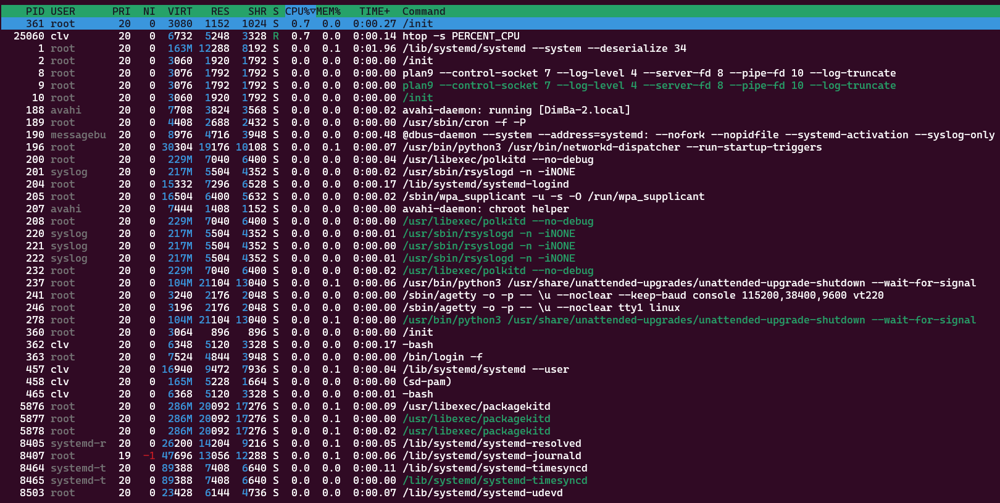

The most consuming processes are `/init` and `htop` itself, all other processes don't use CPU in any meaningful capacity

2. `htop` sorted by memory usage.

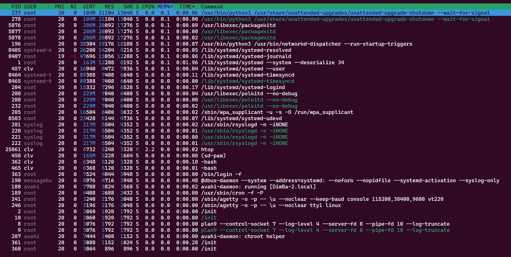

The most heavy processes are two of the the `/usr/bin/python3` processes and the `/usr/libexex/packagekitd`

3. `iotop` to check the I/O usage

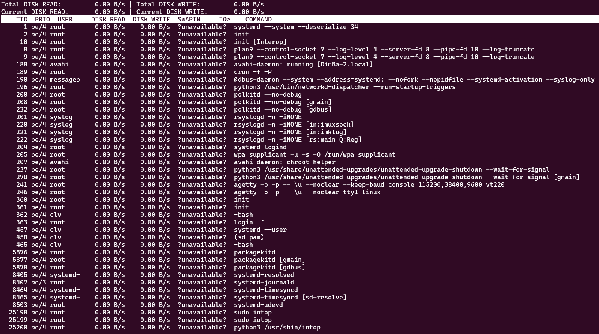

There are no processes that would use I/O in any meaningful capacity

## Disk Space Management

Identified the three largest files in the /var directory 

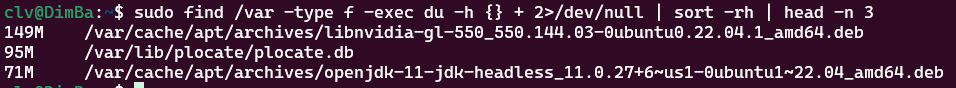

- /var/cache/apt/archives/libnvidia-gl-550_550.144.03-0ubuntu0.22.04.1_amd64.deb — 149MB
- /var/lib/plocate/plocate.db — 95MB
- /var/cache/apt/archives/openjdk-11-jdk-headless_11.0.27+6~us1-0ubuntu1~22.04_amd64.deb — 71MB

# Task 2

## Step 1: Choosing a Website

Chosen site is `hh.ru`

## Step 2: Creating Checks in Checkly

Logged in using Github

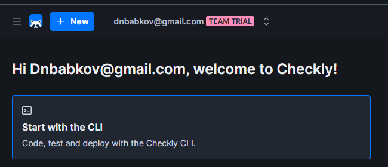

Added a URL and an assertion:

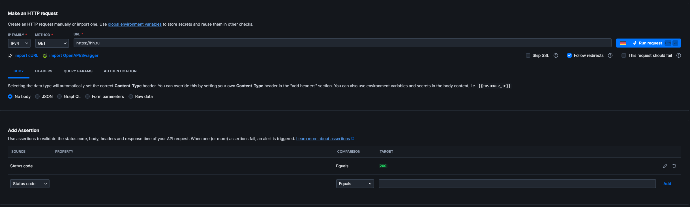

Created a Browser Check:

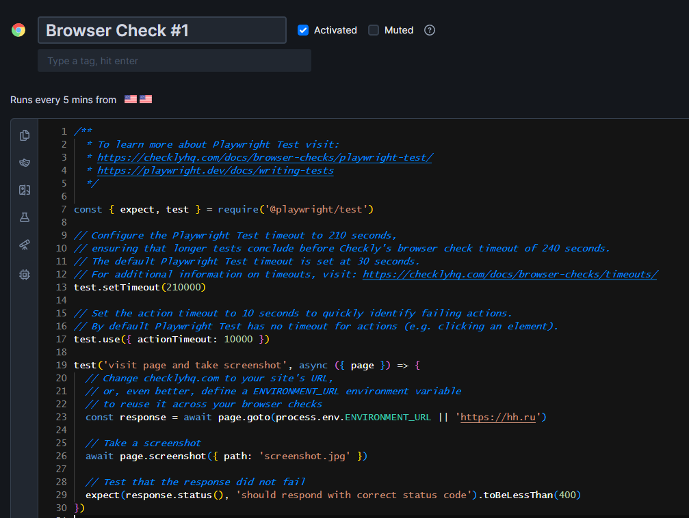

## Step 3: Configuring Alert Settings

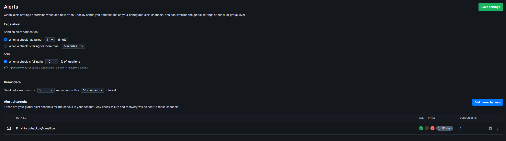

## Step 4: Capturing Proof and Documenting

Browser Check Settings:

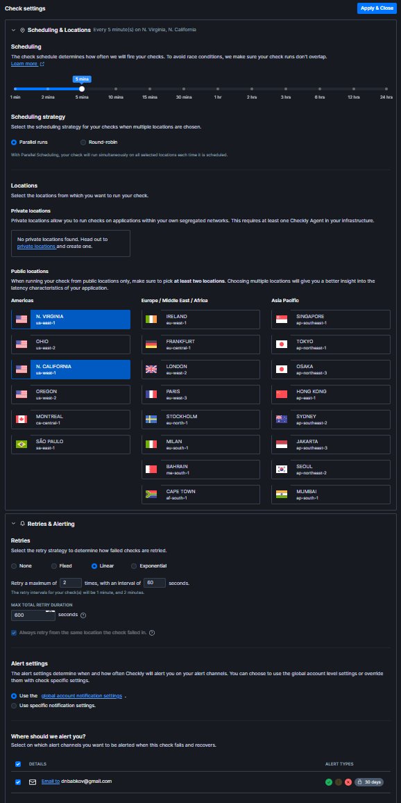

Successful Manual Browser Check:

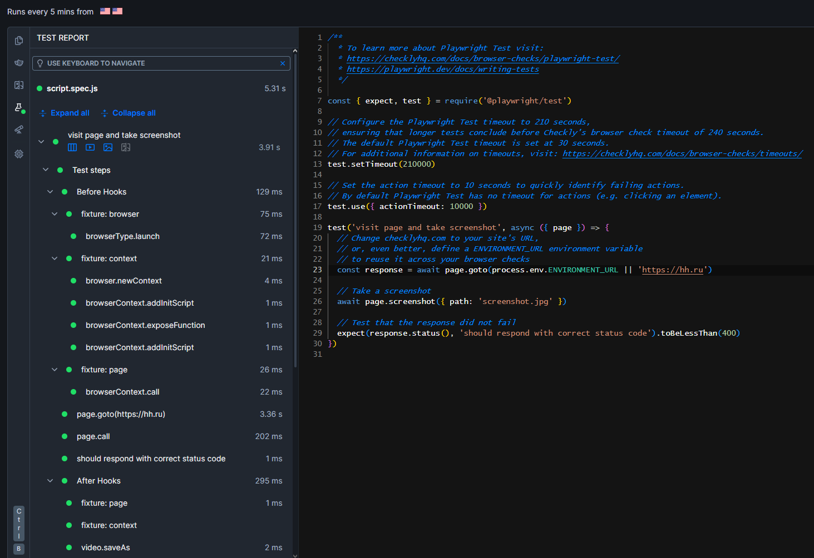

Alert of a failed check:

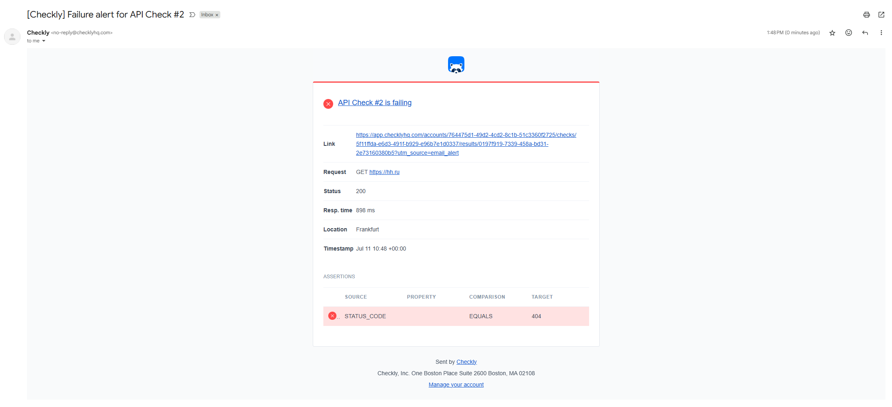
