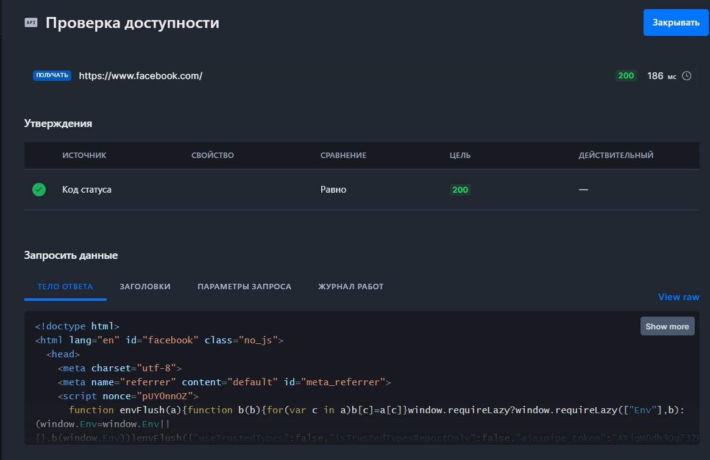
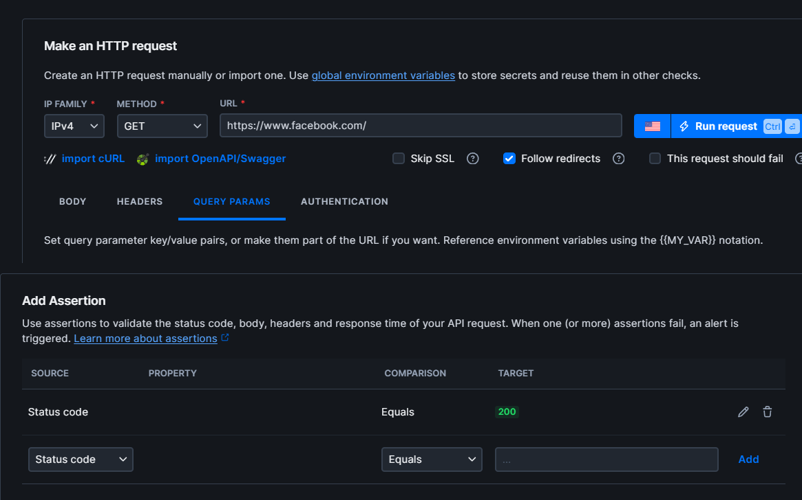
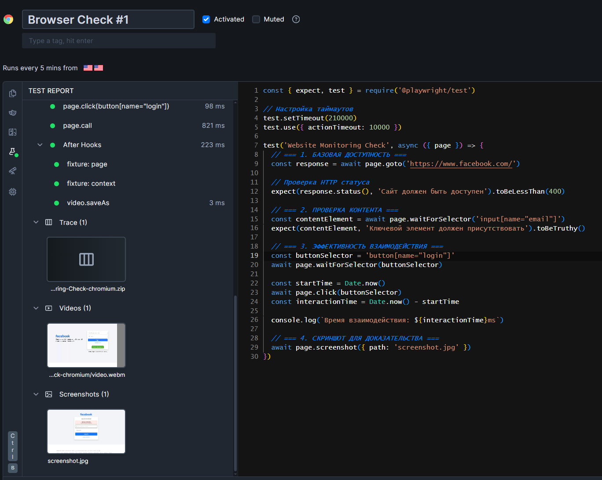
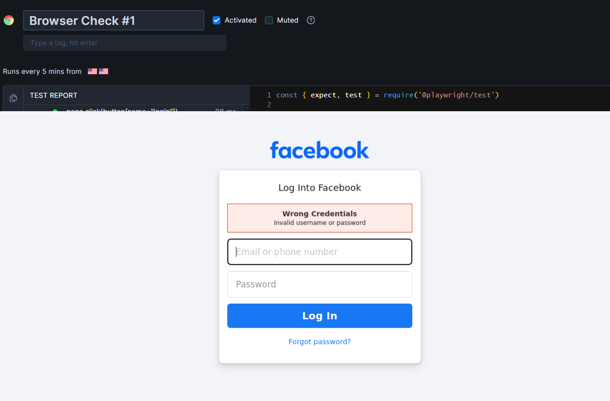

# Лабораторная работа SRE

## Задача 1: Мониторинг ресурсов и управление дисками

### Мониторинг системных ресурсов

**Топ-3 процесса по CPU:**
1. `systemd` - 0.0% CPU
2. `kthreadd` - 0.0% CPU
3. `pool_wo+` - 0.0% CPU

**Топ-3 процесса по памяти:**
1. `gnome-s+` - 3.6% памяти (4341592 KB)
2. `evoluti+` - 1.3% памяти (1074156 KB)
3. `evoluti+` - 1.1% памяти (769424 KB)

**Топ устройств по I/O (iostat):**

sda 54.58 tps, 0.00 %util
sr0 0.06 tps, 0.00 %util

- sda: основное устройство хранения (54.58 операций/сек)
- sr0: CD/DVD устройство (минимальная нагрузка)

### Управление дисковым пространством

**Использование дисков (df):**

Filesystem Size Used Avail Use% Mounted on
tmpfs 795M 1.6M 793M 1% /run
/dev/sda2 25G 13G 11G 56% /
tmpfs 3.9G 0 3.9G 0% /dev/shm

**Топ-3 файлов в /var:**
1. 3.6G - /var
2. 3.2G - /var/lib
3. 1.5G - /var/lib/docker/overlay2

**Анализ:**
- Наибольшее место занимает /var/lib/docker (Docker контейнеры)

## Задача 2: Мониторинг сайта через Checkly

### Конфигурация проверок

**API Check (базовая доступность):**
- URL: https://www.facebook.com/
- Проверка: Status Code 200
- Скриншот конфигурации:
  
- Результат выполнения:
  

**Browser Check (контент и взаимодействия):**
- URL: https://www.facebook.com/
- Проверки: 
  1. Наличие элемента `input[name="email"]`
  2. Замер времени клика по кнопке `button[name="login"]`
- Скриншот конфигурации:
  
- Результат выполнения:
  