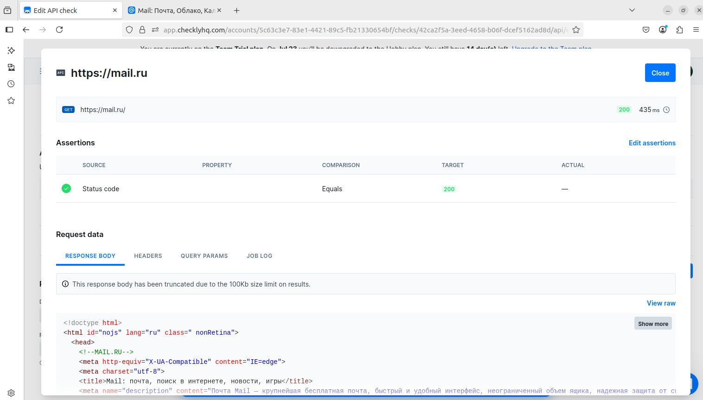
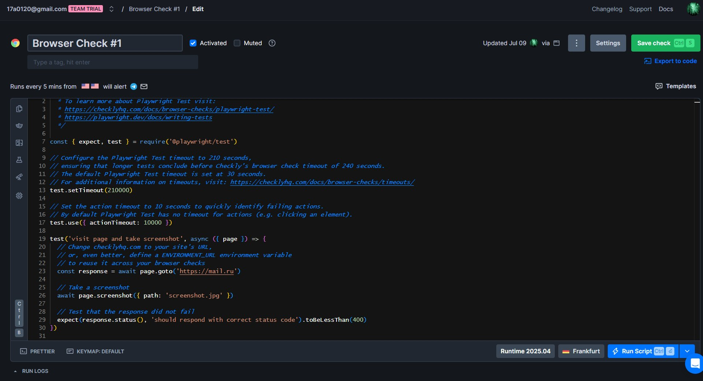
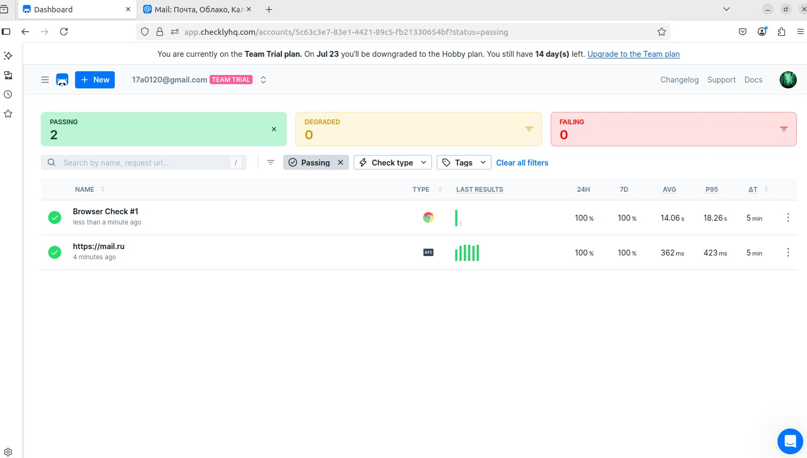

# Лабораторная SRE

## Задание 1: Ключевые метрики SRE и SLA

### Мониторинг системных ресурсов:

- htop

```
user@user-VirtualBox:~$ htop
CPU% Command
1.3  /usr/libexec/gnome-terminal-server
0.7  /usr/bin/containerd
2.0  /usr/bin/gnome-shell


MEM% Command
6.0  /usr/bin/gnome-shell
1.3  /usr/libexec/gsd-xsettings
1.3  /usr/bin/docker -H fd:// --containerd=/run/containerd/containerd.sock
```

- iostat

```
user@user-VirtualBox:~$ iostat -xz 2 3
Linux 6.8.0-60-generic (user-VirtualBox) 	09.07.2025 	_x86_64_	(4 CPU)

avg-cpu:  %user   %nice %system %iowait  %steal   %idle
           0,17    0,01    0,34    0,05    0,00   99,43

Device            r/s     rkB/s   rrqm/s  %rrqm r_await rareq-sz     w/s     wkB/s   wrqm/s  %wrqm w_await wareq-sz     d/s     dkB/s   drqm/s  %drqm d_await dareq-sz     f/s f_await  aqu-sz  %util
loop0            0,00      0,00     0,00   0,00    0,00     1,21    0,00      0,00     0,00   0,00    0,00     0,00    0,00      0,00     0,00   0,00    0,00     0,00    0,00    0,00    0,00   0,00
loop1            0,00      0,09     0,00   0,00    0,95    18,10    0,00      0,00     0,00   0,00    0,00     0,00    0,00      0,00     0,00   0,00    0,00     0,00    0,00    0,00    0,00   0,00
loop10           0,06      2,25     0,00   0,00    0,47    36,88    0,00      0,00     0,00   0,00    0,00     0,00    0,00      0,00     0,00   0,00    0,00     0,00    0,00    0,00    0,00   0,00
loop11           0,00      0,00     0,00   0,00    0,24     2,76    0,00      0,00     0,00   0,00    0,00     0,00    0,00      0,00     0,00   0,00    0,00     0,00    0,00    0,00    0,00   0,00
loop12           0,00      0,03     0,00   0,00    0,26     9,49    0,00      0,00     0,00   0,00    0,00     0,00    0,00      0,00     0,00   0,00    0,00     0,00    0,00    0,00    0,00   0,00
loop13           0,00      0,03     0,00   0,00    0,42     8,12    0,00      0,00     0,00   0,00    0,00     0,00    0,00      0,00     0,00   0,00    0,00     0,00    0,00    0,00    0,00   0,00
loop14           0,00      0,00     0,00   0,00    0,00     1,27    0,00      0,00     0,00   0,00    0,00     0,00    0,00      0,00     0,00   0,00    0,00     0,00    0,00    0,00    0,00   0,00
loop2            0,03      0,39     0,00   0,00    0,37    13,33    0,00      0,00     0,00   0,00    0,00     0,00    0,00      0,00     0,00   0,00    0,00     0,00    0,00    0,00    0,00   0,00
loop3            0,00      0,09     0,00   0,00    0,53    20,45    0,00      0,00     0,00   0,00    0,00     0,00    0,00      0,00     0,00   0,00    0,00     0,00    0,00    0,00    0,00   0,00
loop4            0,00      0,09     0,00   0,00    0,80    19,53    0,00      0,00     0,00   0,00    0,00     0,00    0,00      0,00     0,00   0,00    0,00     0,00    0,00    0,00    0,00   0,00
loop5            0,01      0,10     0,00   0,00    0,45    19,05    0,00      0,00     0,00   0,00    0,00     0,00    0,00      0,00     0,00   0,00    0,00     0,00    0,00    0,00    0,00   0,00
loop6            0,16      1,92     0,00   0,00    0,27    12,16    0,00      0,00     0,00   0,00    0,00     0,00    0,00      0,00     0,00   0,00    0,00     0,00    0,00    0,00    0,00   0,00
loop7            0,15      0,45     0,00   0,00    0,04     3,01    0,00      0,00     0,00   0,00    0,00     0,00    0,00      0,00     0,00   0,00    0,00     0,00    0,00    0,00    0,00   0,00
loop8            0,00      0,03     0,00   0,00    0,39     7,25    0,00      0,00     0,00   0,00    0,00     0,00    0,00      0,00     0,00   0,00    0,00     0,00    0,00    0,00    0,00   0,00
loop9            0,00      0,03     0,00   0,00    0,30     8,09    0,00      0,00     0,00   0,00    0,00     0,00    0,00      0,00     0,00   0,00    0,00     0,00    0,00    0,00    0,00   0,00
sda              2,30    104,75     0,63  21,41    0,49    45,56    6,31    126,50     3,02  32,37    1,29    20,04    0,00      0,00     0,00   0,00    0,00     0,00    0,73    1,22    0,01   0,31


avg-cpu:  %user   %nice %system %iowait  %steal   %idle
           0,51    0,00    0,51    0,00    0,00   98,97

Device            r/s     rkB/s   rrqm/s  %rrqm r_await rareq-sz     w/s     wkB/s   wrqm/s  %wrqm w_await wareq-sz     d/s     dkB/s   drqm/s  %drqm d_await dareq-sz     f/s f_await  aqu-sz  %util
sda              0,00      0,00     0,00   0,00    0,00     0,00    2,50     10,00     0,00   0,00    3,40     4,00    0,00      0,00     0,00   0,00    0,00     0,00    0,00    0,00    0,01   0,20


avg-cpu:  %user   %nice %system %iowait  %steal   %idle
           0,26    0,00    0,77    0,00    0,00   98,98

Device            r/s     rkB/s   rrqm/s  %rrqm r_await rareq-sz     w/s     wkB/s   wrqm/s  %wrqm w_await wareq-sz     d/s     dkB/s   drqm/s  %drqm d_await dareq-sz     f/s f_await  aqu-sz  %util
sda              0,00      0,00     0,00   0,00    0,00     0,00    0,50      2,00     0,00   0,00    1,00     4,00    0,00      0,00     0,00   0,00    0,00     0,00    0,00    0,00    0,00   0,00
```


### Управление дисковым пространством:

- df

```
user@user-VirtualBox:~$ df -h
Filesystem      Size  Used Avail Use% Mounted on
/dev/sda3        24G   15G  8,1G  65% /
```

- du

```
user@user-VirtualBox:~$ sudo du -ah /var | sort -rh | head -n 10
5,6G	/var
5,0G	/var/lib
2,9G	/var/lib/snapd
1,7G	/var/lib/docker/overlay2
```


## Задание 2: Практическая настройка мониторинга веб-сайта


### Алерты не работают (почта, телеграмм)

- API



- Browser



- result



- Настройка алертов почта/телега


