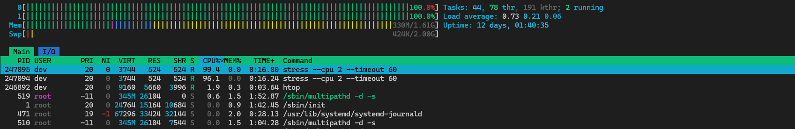
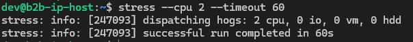
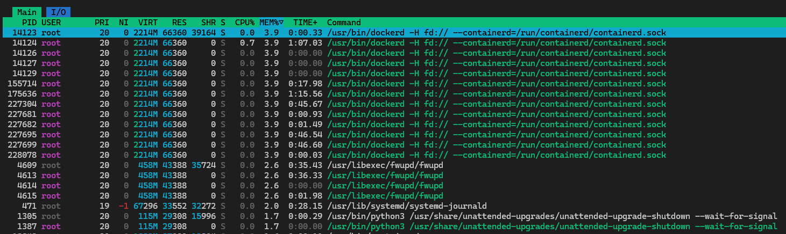
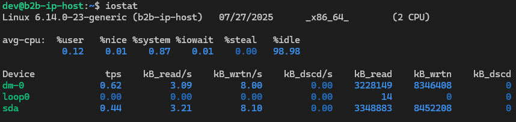

# SRE Lab

In this lab, you will explore the principles of Site Reliability Engineering (SRE). Follow the tasks below to complete the lab assignment.

## Task 1: Key Metrics for SRE and SLAs

**Objective**: Monitor system resources and manage disk space.

1. **Monitor System Resources**:
    - Use commands like `htop` and `iostat` to monitor CPU, memory, and I/O usage.
    - Identify and document the top 3 most consuming applications for CPU, memory, and I/O usage in a `submission8.md` file.

    I download `stress` util to simulate cpu load that i've monotores using `htop`

    

    

    So top 3 most consuming applications for CPU:
    - stress test process on CPU1
    - stress test process on CPU2
    - htop process itself

    Besides stress the 3 most memory consuming apps:

    - `/usr/bin/dockerd`
    - `/usr/lib/systemd/systemd-journald`
    - `/usr/bin/python3`

    

    

    | Category | Status                                                            |
    | -------- | ----------------------------------------------------------------- |
    | **CPU**  | Mostly idle — 99% of the time is idle                             |
    | **Disk** | Low write activity (\~8.1 KB/s), almost no reads                  |
    | **I/O**  | No measurable load or I/O wait — no processes are waiting on disk |

2. **Disk Space Management**:
    - Use `du` and `df` to manage disk space.
    - Identify and log the top 3 largest files in the `/var` directory in the `submission8.md` file.

    >`du` - estimate file space usage
    >
    >`df` - report file system space usage

    

## Task 2: Practical Website Monitoring Setup

**Objective**: Set up real-time monitoring for any website using Checkly. You'll create checks for:

1. Basic availability (is the site loading?)
2. Content validation (is a key element visible?)
3. Interaction performance (how long does a button click take?)
4. Alerting (get notified when something breaks)
