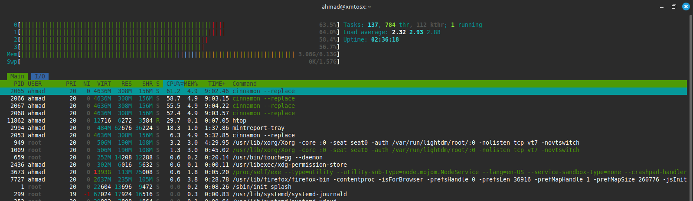
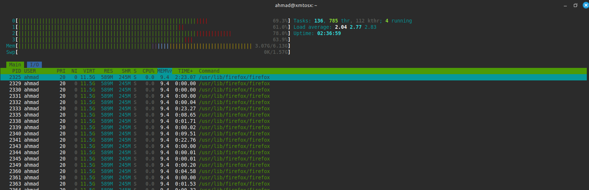
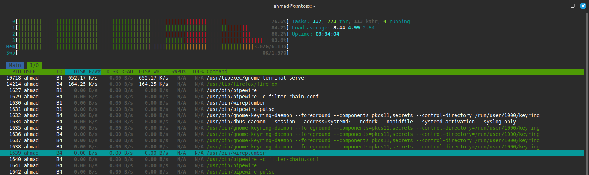
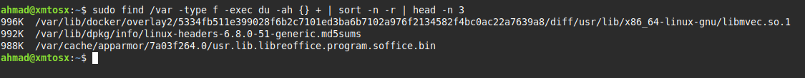
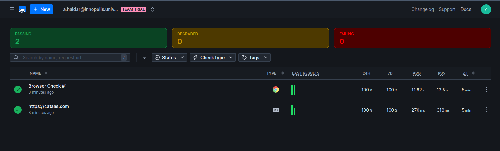
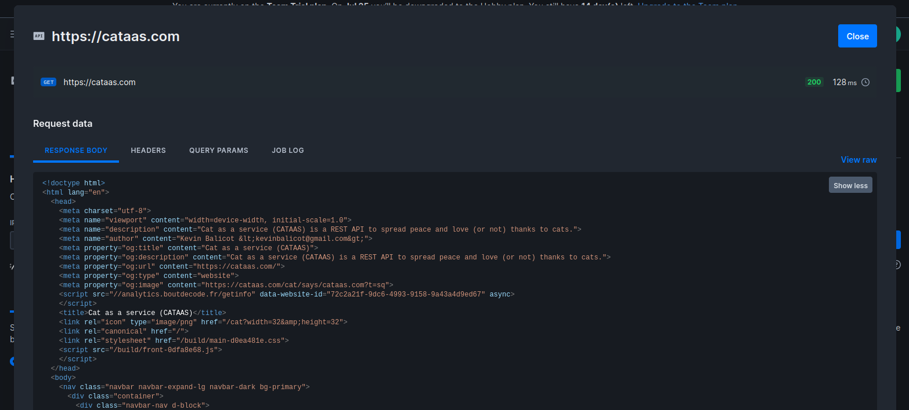
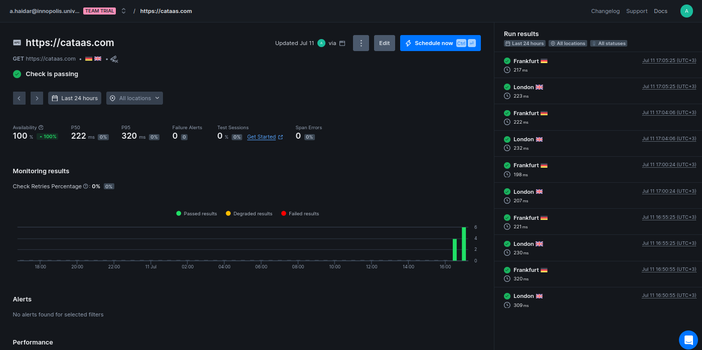
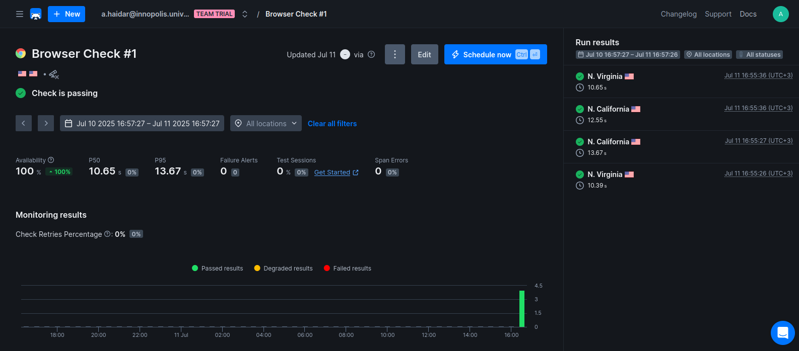
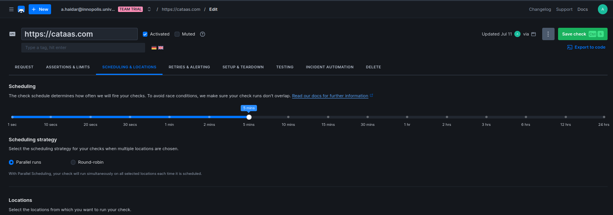
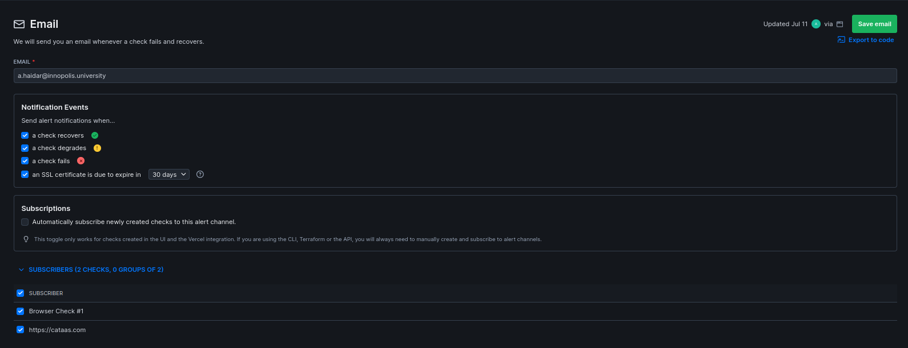

# SRE Lab

## Key Metrics for SRE and SLAs

### Monitor System Resources

* **Top 3 CPU Consuming Processes**

    

    |Command | CPU% |
    |---------|------|
    |cinnamon --replace  | 61.2%-52.4%  |
    |htop    | 29.7%  |
    |mintreport-tray  | 18.3%  |

    We notice that `cinnamon --replace` has multiple processes with most of the heavy use.

* **Top 3 Memory Consuming Processes**

    

    |Command | MEM% |
    |---------|------|
    |/usr/lib/firefox/firefox  | 9.4%  |
    |/proc/self/exe| 7.6%  |
    | /usr/share/code    | 6.5%  |

    Each one of these is spawning multiple processes, each with nearly the same memory usage.

* **Top 3 I/O Consuming Processes**

    

    |Command | I/O% or IOPS |
    |--------|--------------|
    |/usr/libexec/gnome-terminal-server   | 652.17K/s |
    |/usr/lib/firefox/firefox  | 164.25/s  |
    |/usr/bin/pipewire      | 0B/s  |

    Not a lot is happening, since while taking the screen shot there aren't a lot of processes doing I/O operations in the background

### Disk Space Management

* `du` gives the size of files and folders in a directory.
* `find` help us filter out directories and run du on files only.

    [Getting size with du of files only](https://unix.stackexchange.com/questions/22432/getting-size-with-du-of-files-only?utm_source=chatgpt.com)

## Practical Website Monitoring Setup

### Checks

The checks have been done on the domain [catass](https://cataas.com).

* **API Check:**

    

    

* **Browser Check:**

    

    

by default the checks are ran every 5 min, and can be changed along some specific alert settings.

### Alert

I've set an alert to reach my email with the following global alerts settings settings:

Email settings:

