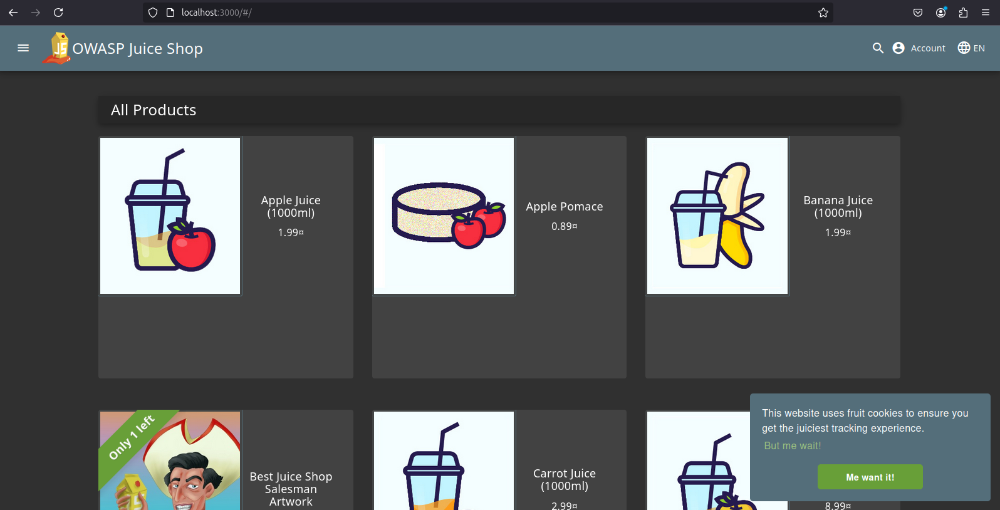
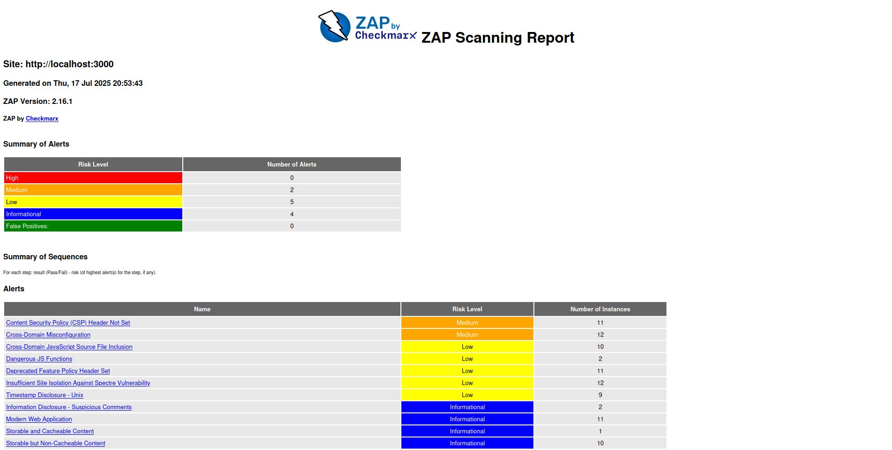
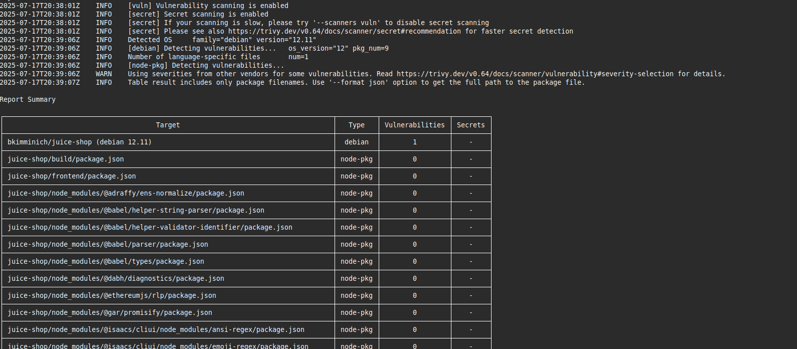
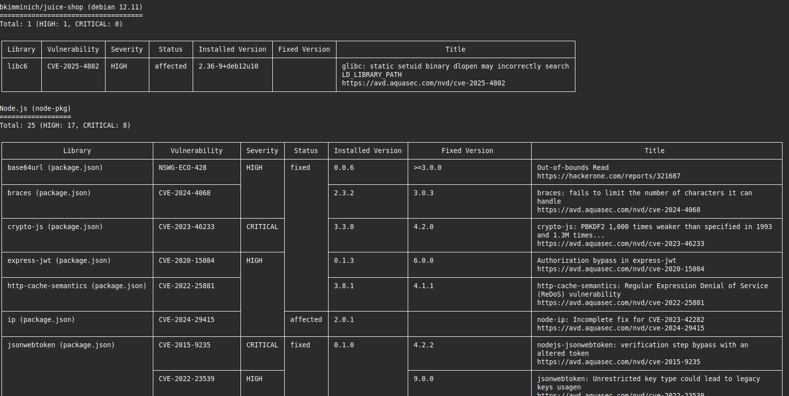

# Introduction to DevSecOps Tools

## Task 1 Results

- **Juice Shop vulnerabilities found (Medium):** 2
- **Most interesting vulnerability found:** Content Security Policy (CSP) Header Not Set
- **Security headers present:** No

## Task 2 Results

- **Critical vulnerabilities in Juice Shop image:** 8
- **Vulnerable packages:**
   1. jsonwebtoken
   2. lodash
- **Dominant vulnerability type:** Insecure Dependencies / Prototype Pollution
